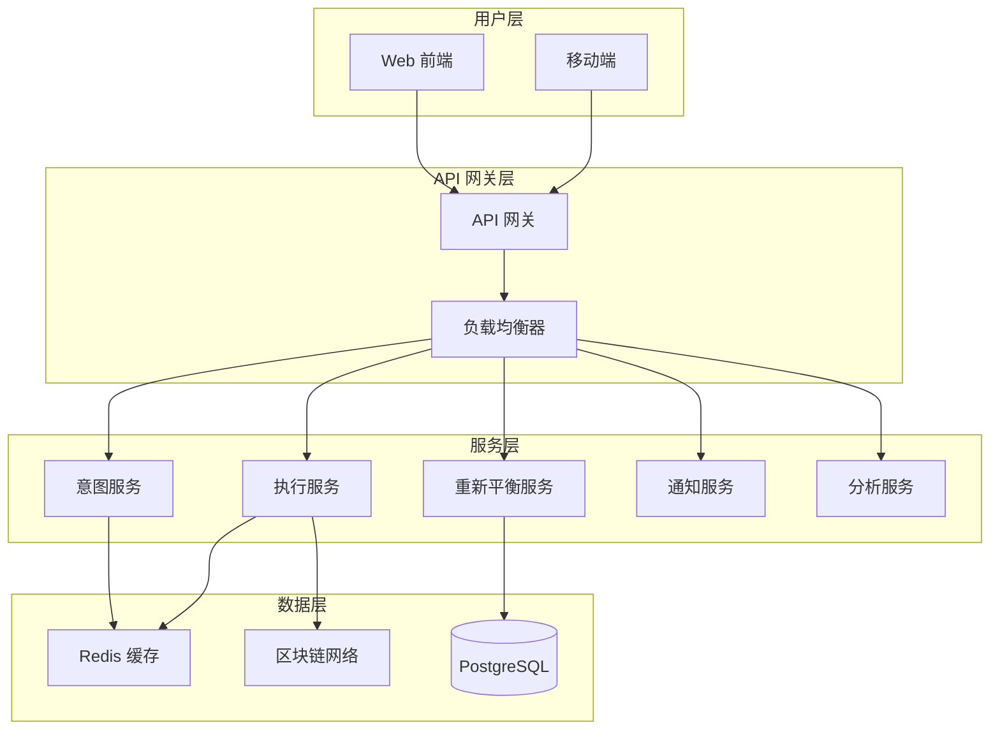

# 系统架构

本文档详细介绍 Zap Pilot 的技术架构，包括各个组件的设计理念、实现细节和交互方式。

## 架构概览

### 微服务架构设计

Zap Pilot 采用微服务架构，确保系统的可扩展性、可维护性和故障隔离：



### 核心设计原则

1. **关注点分离**：每个服务负责特定的业务功能
2. **松耦合**：服务间通过 API 通信，减少依赖
3. **高可用性**：支持水平扩展和故障转移
4. **数据一致性**：使用事件驱动确保数据同步

## 详细组件架构

### 1. 前端应用 (all-weather-frontend/)

#### 技术栈
```typescript
// 核心技术栈
const TECH_STACK = {
  framework: 'Next.js 13',
  ui: 'React 18 + TypeScript',
  styling: 'Tailwind CSS',
  web3: 'ThirdWeb SDK + Ethers.js + Viem',
  state: 'Redux Toolkit + RTK Query',
  testing: 'Vitest + React Testing Library'
} as const;
```

#### 组件架构
```
src/
├── components/           # 可复用UI组件
│   ├── common/          # 通用组件
│   ├── charts/          # 图表组件
│   └── portfolio/       # 投资组合组件
├── pages/               # Next.js 页面
├── hooks/               # 自定义React钩子
├── utils/               # 工具函数
├── lib/                 # 第三方库配置
└── classes/             # 业务逻辑类
    ├── Vaults/         # 金库策略类
    ├── protocols/      # 协议适配器
    └── bridges/        # 跨链桥适配器
```

#### 状态管理
```typescript
// Redux Store 结构
interface RootState {
  auth: AuthState;
  portfolio: PortfolioState;
  transactions: TransactionState;
  strategies: StrategyState;
  ui: UIState;
}

// RTK Query API 分片
const api = createApi({
  reducerPath: 'api',
  baseQuery: fetchBaseQuery({
    baseUrl: '/api/',
    prepareHeaders: (headers, { getState }) => {
      // 添加认证头
      return headers;
    },
  }),
  tagTypes: ['Portfolio', 'Transaction', 'Strategy'],
  endpoints: (builder) => ({
    // API 端点定义
  }),
});
```

### 2. 后端服务 (backend/)

#### 服务架构
```typescript
// Express 应用结构
class BackendApplication {
  private app: Express;
  
  constructor() {
    this.app = express();
    this.setupMiddleware();
    this.setupRoutes();
    this.setupErrorHandling();
  }
  
  private setupRoutes() {
    this.app.use('/api/reports', reportRoutes);
    this.app.use('/api/subscriptions', subscriptionRoutes);
    this.app.use('/api/balances', balanceRoutes);
    this.app.use('/api/referrals', referralRoutes);
  }
}
```

#### 核心服务
```typescript
// 服务层设计
interface ServiceLayer {
  // 报告服务
  reportService: {
    generatePerformanceReport(userId: string): Promise<Report>;
    schedulePeriodicReports(config: ReportConfig): void;
  };
  
  // 通知服务
  notificationService: {
    sendDiscordNotification(message: DiscordMessage): Promise<void>;
    sendEmailNotification(email: EmailMessage): Promise<void>;
  };
  
  // 数据聚合服务
  dataAggregationService: {
    aggregatePortfolioData(address: string): Promise<PortfolioData>;
    syncExternalData(): Promise<void>;
  };
}
```

### 3. 重新平衡引擎 (rebalance_backend/)

#### Python 服务架构
```python
# Flask 应用结构
from flask import Flask
from typing import Protocol

class RebalanceApplication:
    def __init__(self):
        self.app = Flask(__name__)
        self.setup_routes()
        self.setup_services()
    
    def setup_services(self):
        self.portfolio_analyzer = PortfolioAnalyzer()
        self.strategy_engine = StrategyEngine()
        self.risk_manager = RiskManager()
```

#### 核心算法实现
```python
# 投资组合优化算法
class PortfolioOptimizer:
    def __init__(self, risk_model: RiskModel):
        self.risk_model = risk_model
    
    def optimize(self, 
                 returns: pd.DataFrame,
                 constraints: Dict[str, Any]) -> OptimizationResult:
        """
        使用现代投资组合理论优化资产配置
        """
        # 计算期望收益
        expected_returns = self.calculate_expected_returns(returns)
        
        # 计算协方差矩阵
        cov_matrix = self.calculate_covariance_matrix(returns)
        
        # 应用Kelly公式
        optimal_weights = self.kelly_optimization(
            expected_returns, 
            cov_matrix, 
            constraints
        )
        
        return OptimizationResult(
            weights=optimal_weights,
            expected_return=self.calculate_portfolio_return(optimal_weights, expected_returns),
            risk=self.calculate_portfolio_risk(optimal_weights, cov_matrix)
        )
```

### 4. 意图引擎 (intent-engine/)

#### 微服务架构
```typescript
// 意图处理流水线
class IntentProcessingPipeline {
  private stages: ProcessingStage[] = [
    new IntentParsingStage(),
    new ValidationStage(),
    new OptimizationStage(),
    new ExecutionPlanningStage(),
    new RiskAssessmentStage()
  ];
  
  async process(intent: UserIntent): Promise<ExecutionPlan> {
    let context = new ProcessingContext(intent);
    
    for (const stage of this.stages) {
      context = await stage.process(context);
    }
    
    return context.executionPlan;
  }
}
```

#### 执行引擎
```typescript
// 智能执行引擎
class SmartExecutionEngine {
  async executeIntent(plan: ExecutionPlan): Promise<ExecutionResult> {
    const orchestrator = new TransactionOrchestrator();
    
    // 预检查
    await this.preflightCheck(plan);
    
    // 执行交易序列
    const results = await orchestrator.executeSequentially(
      plan.transactions,
      {
        gasOptimization: true,
        failureRecovery: true,
        progressCallback: this.updateProgress.bind(this)
      }
    );
    
    return this.consolidateResults(results);
  }
}
```

## 数据流和通信

### 1. 事件驱动架构

```typescript
// 事件定义
interface DomainEvents {
  'intent.created': IntentCreatedEvent;
  'execution.started': ExecutionStartedEvent;
  'transaction.completed': TransactionCompletedEvent;
  'portfolio.rebalanced': PortfolioRebalancedEvent;
  'risk.alert': RiskAlertEvent;
}

// 事件处理器
class EventBus {
  private handlers: Map<string, EventHandler[]> = new Map();
  
  on<T extends keyof DomainEvents>(
    event: T, 
    handler: (payload: DomainEvents[T]) => Promise<void>
  ): void {
    // 注册事件处理器
  }
  
  async emit<T extends keyof DomainEvents>(
    event: T, 
    payload: DomainEvents[T]
  ): Promise<void> {
    // 发布事件
  }
}
```

### 2. API 设计

#### RESTful API 设计
```typescript
// API 路由定义
const API_ROUTES = {
  // 意图管理
  'POST /api/v1/intents': 'createIntent',
  'GET /api/v1/intents/:id': 'getIntent',
  'PUT /api/v1/intents/:id': 'updateIntent',
  
  // 投资组合
  'GET /api/v1/portfolios/:address': 'getPortfolio',
  'POST /api/v1/portfolios/:address/rebalance': 'triggerRebalance',
  
  // 交易
  'GET /api/v1/transactions': 'getTransactions',
  'POST /api/v1/transactions/simulate': 'simulateTransaction',
  
  // 分析
  'GET /api/v1/analytics/performance': 'getPerformanceAnalytics',
  'GET /api/v1/analytics/risk': 'getRiskAnalytics'
} as const;
```

#### GraphQL Schema
```graphql
# 核心数据类型
type Portfolio {
  id: ID!
  address: String!
  totalValue: BigDecimal!
  assets: [Asset!]!
  strategies: [Strategy!]!
  performance: PerformanceMetrics!
}

type Intent {
  id: ID!
  user: String!
  action: IntentAction!
  parameters: JSON!
  status: IntentStatus!
  executionPlan: ExecutionPlan
  results: ExecutionResult
}

# 查询
type Query {
  portfolio(address: String!): Portfolio
  intent(id: ID!): Intent
  marketData(symbols: [String!]!): [MarketData!]!
}

# 变更
type Mutation {
  createIntent(input: CreateIntentInput!): Intent!
  executeIntent(id: ID!): ExecutionResult!
  rebalancePortfolio(address: String!): RebalanceResult!
}

# 订阅
type Subscription {
  portfolioUpdates(address: String!): Portfolio!
  intentStatusUpdates(id: ID!): Intent!
  marketDataUpdates(symbols: [String!]!): [MarketData!]!
}
```

## 部署和基础设施

### 1. 容器化部署

```dockerfile
# 多阶段构建示例 (前端)
FROM node:18-alpine AS builder
WORKDIR /app
COPY package*.json ./
RUN npm ci --only=production

COPY . .
RUN npm run build

FROM node:18-alpine AS runtime
WORKDIR /app
COPY --from=builder /app/dist ./dist
COPY --from=builder /app/node_modules ./node_modules
EXPOSE 3000
CMD ["npm", "start"]
```

### 2. Kubernetes 部署配置

```yaml
# 服务部署配置
apiVersion: apps/v1
kind: Deployment
metadata:
  name: zap-pilot-frontend
spec:
  replicas: 3
  selector:
    matchLabels:
      app: zap-pilot-frontend
  template:
    metadata:
      labels:
        app: zap-pilot-frontend
    spec:
      containers:
      - name: frontend
        image: zap-pilot/frontend:latest
        ports:
        - containerPort: 3000
        env:
        - name: NODE_ENV
          value: "production"
        resources:
          requests:
            memory: "256Mi"
            cpu: "250m"
          limits:
            memory: "512Mi"
            cpu: "500m"
```

### 3. 监控和可观测性

```typescript
// 监控指标定义
interface SystemMetrics {
  business: {
    totalValueLocked: bigint;
    dailyTransactionVolume: bigint;
    activeUsers: number;
    successfulExecutions: number;
  };
  
  technical: {
    responseTime: number;
    errorRate: number;
    throughput: number;
    systemLoad: number;
  };
  
  blockchain: {
    gasUsageOptimization: number;
    transactionSuccessRate: number;
    blockchainLatency: number;
  };
}

// 告警规则
const ALERT_RULES = {
  highErrorRate: 'error_rate > 0.05',
  highLatency: 'avg_response_time > 5000',
  lowSuccessRate: 'transaction_success_rate < 0.99',
  highGasUsage: 'gas_usage_increase > 0.3'
} as const;
```

## 安全架构

### 1. 多层安全防护

```typescript
// 安全中间件
class SecurityMiddleware {
  // 认证
  async authenticate(req: Request): Promise<User | null> {
    // JWT 验证
    // 钱包签名验证
    // 会话管理
  }
  
  // 授权
  async authorize(user: User, resource: string, action: string): Promise<boolean> {
    // RBAC 权限检查
    // 资源访问控制
  }
  
  // 速率限制
  async rateLimit(req: Request): Promise<boolean> {
    // IP 级别限制
    // 用户级别限制
    // API 端点限制
  }
}
```

### 2. 智能合约安全

```solidity
// 安全模式设计
contract ZapPilotVault {
    using SafeMath for uint256;
    
    modifier onlyAuthorized() {
        require(isAuthorized[msg.sender], "Unauthorized");
        _;
    }
    
    modifier whenNotPaused() {
        require(!paused, "Contract paused");
        _;
    }
    
    modifier nonReentrant() {
        require(_status != _ENTERED, "ReentrancyGuard: reentrant call");
        _status = _ENTERED;
        _;
        _status = _NOT_ENTERED;
    }
    
    // 紧急暂停机制
    function emergencyPause() external onlyOwner {
        paused = true;
        emit EmergencyPause(block.timestamp);
    }
}
```

## 性能优化

### 1. 缓存策略

```typescript
// 多级缓存设计
class CacheManager {
  private l1Cache: Map<string, any> = new Map(); // 内存缓存
  private l2Cache: RedisClient; // Redis 缓存
  private l3Cache: DatabaseClient; // 数据库缓存
  
  async get<T>(key: string): Promise<T | null> {
    // L1 缓存检查
    if (this.l1Cache.has(key)) {
      return this.l1Cache.get(key);
    }
    
    // L2 缓存检查
    const l2Value = await this.l2Cache.get(key);
    if (l2Value) {
      this.l1Cache.set(key, l2Value);
      return l2Value;
    }
    
    // L3 缓存检查
    const l3Value = await this.l3Cache.get(key);
    if (l3Value) {
      await this.l2Cache.set(key, l3Value, 'EX', 3600);
      this.l1Cache.set(key, l3Value);
      return l3Value;
    }
    
    return null;
  }
}
```

### 2. 数据库优化

```sql
-- 关键查询优化
-- 投资组合查询索引
CREATE INDEX idx_portfolio_address_timestamp 
ON portfolios(address, created_at DESC);

-- 交易历史查询索引
CREATE INDEX idx_transactions_user_status 
ON transactions(user_address, status, timestamp DESC);

-- 性能监控视图
CREATE VIEW portfolio_performance AS
SELECT 
    address,
    DATE_TRUNC('day', timestamp) as date,
    AVG(total_value) as avg_value,
    MAX(total_value) as max_value,
    MIN(total_value) as min_value
FROM portfolio_snapshots
GROUP BY address, DATE_TRUNC('day', timestamp);
```

## 扩展性考虑

### 1. 水平扩展

```typescript
// 微服务负载均衡
class ServiceDiscovery {
  private services: Map<string, ServiceInstance[]> = new Map();
  
  registerService(name: string, instance: ServiceInstance): void {
    if (!this.services.has(name)) {
      this.services.set(name, []);
    }
    this.services.get(name)!.push(instance);
  }
  
  getService(name: string): ServiceInstance | null {
    const instances = this.services.get(name);
    if (!instances || instances.length === 0) {
      return null;
    }
    
    // 负载均衡策略：轮询
    return this.roundRobinSelect(instances);
  }
}
```

### 2. 数据分片

```typescript
// 数据分片策略
class DataShardingManager {
  private shards: Map<string, DatabaseConnection> = new Map();
  
  getShardForUser(userAddress: string): DatabaseConnection {
    const hash = this.hashFunction(userAddress);
    const shardId = hash % this.shardCount;
    return this.shards.get(`shard-${shardId}`)!;
  }
  
  async executeQuery(userAddress: string, query: string): Promise<any> {
    const shard = this.getShardForUser(userAddress);
    return await shard.query(query);
  }
}
```

## 下一步

- 🔧 开发环境设置
- 📊 API 文档  
- 🧪 测试策略
- 🚀 部署指南