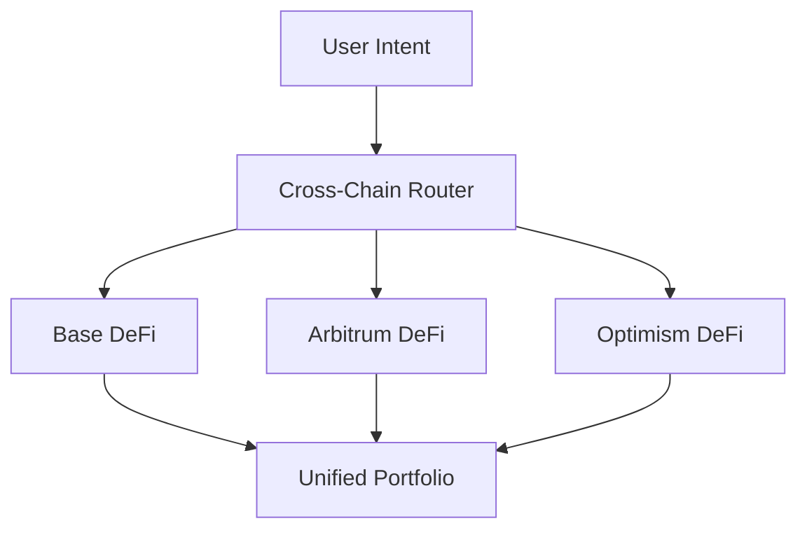

# Cross-Chain Operations

**Seamless DeFi across Base, Arbitrum, and Optimism** 🌐

Zap Pilot's cross-chain capabilities allow you to access the best DeFi opportunities across various
Layer 2 networks, as well as Ethereum and Solana, without the complexity of managing different
wallets, tokens, or bridges.

## 🔗 Multi-Chain Architecture

### Native Cross-Chain Design

Unlike other platforms that treat cross-chain as an afterthought, Zap Pilot is built from the ground
up to operate natively across our supported Layer 2 networks.

#### **Unified Liquidity Pool**

Your investment automatically spreads across our supported networks to find the best opportunities
while appearing as a single, unified portfolio.

#### **Intelligent Chain Selection**

Our system automatically chooses the optimal blockchain for each operation based on:

- **Yield Opportunities**: Highest APY for your risk profile
- **Liquidity Depth**: Sufficient liquidity for your transaction size
- **Gas Costs**: Lowest total execution costs
- **Security Level**: Appropriate security for transaction value
- **Speed Requirements**: Fastest execution for time-sensitive operations

## 🌐 Supported Networks

Zap Pilot operates on a growing number of networks, including leading Layer 2s, Ethereum, and
Solana. Our intelligent routing system automatically selects the best network for any given
operation based on a combination of factors including security, transaction costs, liquidity, and
speed.

## ⚡ Cross-Chain Execution Engine

### Intelligent Routing

#### **Multi-Path Optimization**

When you invest $10,000 in an Index Fund strategy, our system might:

1. **Deploy $4,000** on Arbitrum for established DeFi protocols and leveraged positions
2. **Deploy $3,500** on Base for emerging opportunities and institutional-grade protocols
3. **Deploy $2,500** on Optimism for governance tokens and experimental strategies
4. **Keep $1,000** liquid for rebalancing across networks

#### **Real-Time Optimization**

The routing engine considers:

- **Gas Price Differentials**: Execute when gas is cheapest
- **Yield Rate Changes**: Move to chains with better opportunities
- **Liquidity Conditions**: Avoid chains with insufficient liquidity
- **Network Congestion**: Route around congested networks
- **Bridge Availability**: Ensure reliable cross-chain transfers

### Bridge Integration

#### **Across Protocol - Our Bridge Partner**

We use Across Protocol for all cross-chain operations, providing optimal security, speed, and
cost-efficiency:

| Bridge Feature       | Across Protocol Benefits                                |
| -------------------- | ------------------------------------------------------- |
| **Supported Routes** | Seamless transfers between Base, Arbitrum, and Optimism |
| **Security Model**   | Optimistic verification with economic guarantees        |
| **Speed**            | 1-4 minutes average completion time                     |
| **Cost**             | Lowest fees among major bridge providers                |
| **Reliability**      | Proven track record with minimal downtime               |

#### **Why Across Protocol**

- **Optimistic Security**: Uses optimistic verification with economic incentives for honest behavior
- **Capital Efficiency**: Minimal liquidity requirements reduce costs
- **Fast Settlement**: Quick finality with UMA's oracle system
- **Proven Reliability**: Battle-tested infrastructure with strong security track record
- **Cost Effective**: Competitive fees optimized for frequent rebalancing

## 🎯 Cross-Chain Strategy Benefits

### Yield Optimization

#### **Network-Specific Opportunities**

Each of our supported networks excels in different areas:

**Base**:

- Coinbase ecosystem benefits and institutional trust
- Regulatory-friendly protocols and compliance
- Growing institutional DeFi adoption
- Traditional finance integration opportunities
- Emerging high-quality protocols

**Arbitrum**:

- Mature DeFi ecosystem with proven protocols
- Advanced trading infrastructure (GMX, Camelot)
- Established liquidity pools and yield opportunities
- Lower costs than Ethereum with same security
- Sophisticated leveraged strategies

**Optimism**:

- Innovation hub for new DeFi experiments
- Strong governance token ecosystems
- Developer-friendly environment
- Growing institutional adoption
- Unique protocol opportunities (Velodrome, Synthetix)

#### **Yield Arbitrage**

Our system continuously identifies and captures arbitrage opportunities:

- **Protocol Rate Differences**: Same protocol, different chains
- **Token Price Discrepancies**: Bridge premium/discount arbitrage
- **Incentive Farming**: Chain-specific liquidity incentives
- **Gas Efficiency**: Execute where it's most cost-effective

### Risk Diversification

#### **Technology Risk Distribution**

Spreading across chains reduces:

- **Single Chain Risk**: Not dependent on one chain's uptime
- **Bridge Risk**: Multiple bridge providers reduce counterparty risk
- **Consensus Risk**: Different consensus mechanisms
- **Governance Risk**: Not subject to one chain's governance decisions

#### **Regulatory Risk Mitigation**

- **Jurisdiction Diversification**: Protocols across different regulatory environments
- **Compliance Optionality**: Move to compliant chains as regulations evolve
- **Censorship Resistance**: Multiple chains reduce censorship risk
- **Operational Continuity**: Continue operations even if one chain faces issues

## 🔄 Cross-Chain Rebalancing

### Intelligent Rebalancing

#### **Cross-Chain Portfolio Management**

When rebalancing a strategy, we consider:

- **Current Allocations**: Where assets currently sit
- **Target Allocations**: Optimal distribution across chains
- **Rebalancing Costs**: Bridge fees vs optimization benefits
- **Market Conditions**: Which chains offer best opportunities

#### **Example: Index Fund Rebalancing**

**Current State:**

- Arbitrum: 50% of portfolio
- Base: 30% of portfolio
- Optimism: 20% of portfolio

**Market Change:** New high-yield opportunity emerges on Base **Action:** Gradually shift 15% from
Arbitrum to Base over 2 days using Across Protocol **Consideration:** Balance bridge costs with
yield benefits and maintain diversification

### Cost Optimization

#### **Rebalancing Efficiency**

- **Batch Operations**: Combine multiple rebalancing actions
- **Gas Timing**: Execute during optimal gas price windows
- **Path Optimization**: Minimize number of bridges required
- **Threshold Management**: Only rebalance when benefits exceed costs

#### **User Cost Savings**

Compared to manual cross-chain management:

- **80% Lower Gas Costs**: Through batching and optimization
- **90% Less Complexity**: Automated bridge selection and execution
- **100% Less Time**: Set-and-forget cross-chain operations
- **Better Yields**: Access to opportunities you might miss

## 📊 Cross-Chain Analytics

### Unified Portfolio View

#### **Chain-Agnostic Reporting**

Your dashboard shows:

- **Total Portfolio Value**: USD value across all chains
- **Chain Allocation**: How much value is on each chain
- **Performance Attribution**: Which chains contributed to returns
- **Risk Exposure**: Concentration and diversification metrics

#### **Cross-Chain Performance Tracking**

- **Yield Comparison**: APY earned on each chain
- **Cost Analysis**: Bridge and gas costs by chain
- **Efficiency Metrics**: Return per dollar of fees paid
- **Opportunity Cost**: What you might have missed on other chains

### Bridge Cost Tracking

#### **Complete Cost Transparency**

Track all cross-chain costs:

- **Bridge Fees**: Explicit fees charged by bridge protocols
- **Gas Costs**: L1 and L2 gas fees for bridge transactions
- **Slippage**: Price impact from bridging operations
- **Opportunity Cost**: Time value of money during bridges

#### **ROI Analysis**

For each cross-chain operation:

- **Cost Justification**: Why the move was profitable
- **Time to Breakeven**: How long to recover bridge costs
- **Alternative Analysis**: What would have happened without the move
- **Optimization Score**: How well the routing performed

## 🛡️ Cross-Chain Security

### Security Model

#### **Multi-Layer Security**

- **Bridge Security**: Only use audited, proven bridges
- **Chain Security**: Preference for more secure chains for larger amounts
- **Diversification**: Spread risk across multiple chains and bridges
- **Monitoring**: Real-time security monitoring across all chains

#### **Bridge Risk Management**

- **Bridge Limits**: Maximum exposure per bridge provider
- **Security Scoring**: Real-time assessment of bridge health
- **Incident Response**: Immediate action on bridge security events
- **Insurance Coverage**: Protection against bridge failures where available

### Emergency Procedures

#### **Cross-Chain Emergency Response**

In case of security issues:

1. **Immediate Pause**: Stop all cross-chain operations
2. **Asset Assessment**: Identify safe vs at-risk positions
3. **Emergency Exits**: Rapid withdrawal to safe chains
4. **User Communication**: Clear updates on situation and actions
5. **Recovery Planning**: Systematic recovery and resumption

---

Cross-chain operations are what make Zap Pilot truly powerful - accessing the entire DeFi universe
while maintaining simplicity for users. You get the benefits of all chains without the complexity of
managing them individually.

👉 **[Learn More →](../strategies)** 👉 **[View Supported Networks →](../security)**
