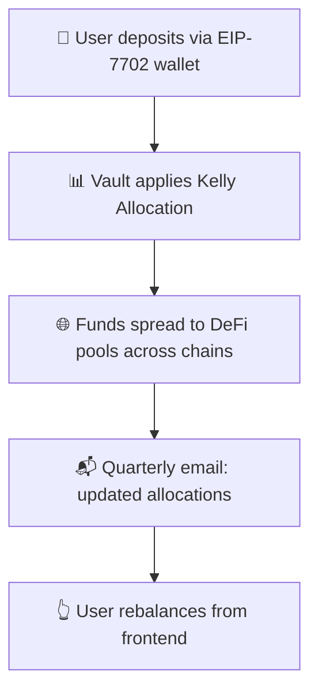

# 🚀 How Zap Pilot Works

## 🧠 Protocol Mechanism

Zap Pilot is a **non-custodial, algorithmic portfolio autopilot** ✨  
You stay in full control of your funds via your own **Smart EOA wallet** powered by EIP-7702.  
We help you **optimize**, **rebalance**, and **route funds** with one click —  
No custody. No lock-ins. Just strategic suggestions and execution.

### Key Principles

- **Full User Control**: Your wallet, your keys
- **Advanced Allocation**: Mathematically optimized strategies
- **Transparent Execution**: One-click optimization

---

## 1️⃣ User Deposit

👜 You deposit directly from your **Smart EOA wallet** (powered by EIP-7702).  
💡 Funds go into a **strategy vault** — a bundle of handpicked DeFi opportunities across chains.

**See Also:** [Getting Started Guide](../getting-started)

---

## 2️⃣ Vault Strategy

Each vault represents a specific investment strategy, such as:

- 💵 **Stablecoin yield farming**
- 🔗 **Liquid staking**
- 🌉 **Cross-chain yield hunting**

Your funds are spread across pools inside the vault,  
with **weights adjusted dynamically** based on performance and risk. 📊

**Learn More:** [Investment Strategies Overview](../strategies)

---

## 3️⃣ 📐 Kelly Allocation Strategy

### What is the Kelly Criterion?

The Kelly Criterion is a mathematical formula used to determine the optimal size of a series of
bets. In our context, it helps us allocate funds across different DeFi protocols to maximize
long-term growth while managing risk.

#### Simplified Formula:

`allocation ∝ expected return / variance`

🧮 Key Benefits:

- 📈 Higher weights for low-volatility, high-reward pools
- 🛡️ Reduced risk from overexposure to any single protocol
- 🔄 Quarterly recalculation to reflect market changes

**Detailed Explanation:** [Kelly Criterion in Depth](../strategies/kelly-criterion)

---

## 4️⃣ ♻️ Rebalancing (User-Driven)

Since your assets **never leave your wallet**,  
we can't automatically rebalance — but we make it **super easy**:

- 📬 **Quarterly**: Personalized rebalancing recommendations
- 👆 **One-Click Rebalance**: Execute strategy updates from your wallet

**Why User-Driven?** We prioritize your control and transparency.

---

## 5️⃣ 🗺️ Asset Flow Overview

---

## 🔒 Security & Transparency

- **Non-Custodial**: Your funds always remain in your wallet
- **On-Chain Execution**: All transactions are transparent
- **User-Controlled**: You approve every move

**Security Details:** [Security Incidents & Transparency](../security)

Zap, rebalance, optimize — in under 30 seconds. Your crypto, your keys, our strategy.

👉 **[Get Started →](https://app.zap-pilot.org/)**

### Related Resources

- [Getting Started Guide](../getting-started)
- [Investment Strategies](../strategies)
- [Kelly Criterion Explained](../strategies/kelly-criterion)
