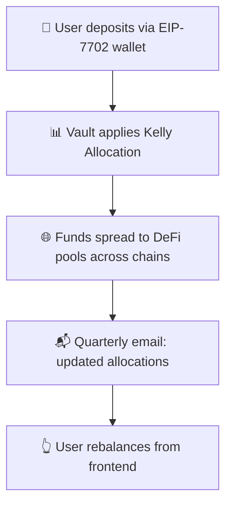

# 🚀 How Zap Pilot Works

## 🧠 Protocol Mechanism

Zap Pilot is a **non-custodial, algorithmic portfolio autopilot** ✨  
You stay in full control of your funds via your own smart wallet (**EIP-7702**).  
We just help you **optimize**, **rebalance**, and **route funds** with one click —  
No custody. No lock-ins. Just ✋ suggestions + ✅ execution.

---

## 1️⃣ User Deposit

👜 You deposit directly from your **smart EOA wallet** (EIP-7702).  
💡 Funds go into a **strategy vault** — a bundle of handpicked DeFi opportunities across chains.

---

## 2️⃣ Vault Strategy

Each vault = one strategy, like:

- 💵 **Stablecoin yield farming**
- 🔗 **Liquid staking**
- 🌉 **Cross-chain yield hunting**

Your funds are spread across pools inside the vault,  
with **weights adjusted dynamically** based on performance + risk. 📊

---

## 3️⃣ 📐 Kelly Allocation

We use the **Kelly Criterion** to calculate how much to put in each pool:

`weight = expected return / variance`

🧮 This method helps **maximize long-term growth** 📈 while managing volatility.  
(Think: smarter bets, not just bigger ones.)

---

## 4️⃣ ♻️ Rebalancing (User-Driven)

Since your assets **never leave your wallet**,  
we can’t rebalance for you — but we make it **super easy**:

- 📬 **Every quarter**: We email you updated Kelly weights
- 👆 **One click**: You hit rebalance in the app — all txns execute from your wallet

---

## 5️⃣ 🗺️ Asset Flow Overview

---

Zap, rebalance, optimize — in under 30 seconds. Your crypto, your keys, our strategy.

👉 **[Get Started →](https://app.zap-pilot.org/)**
