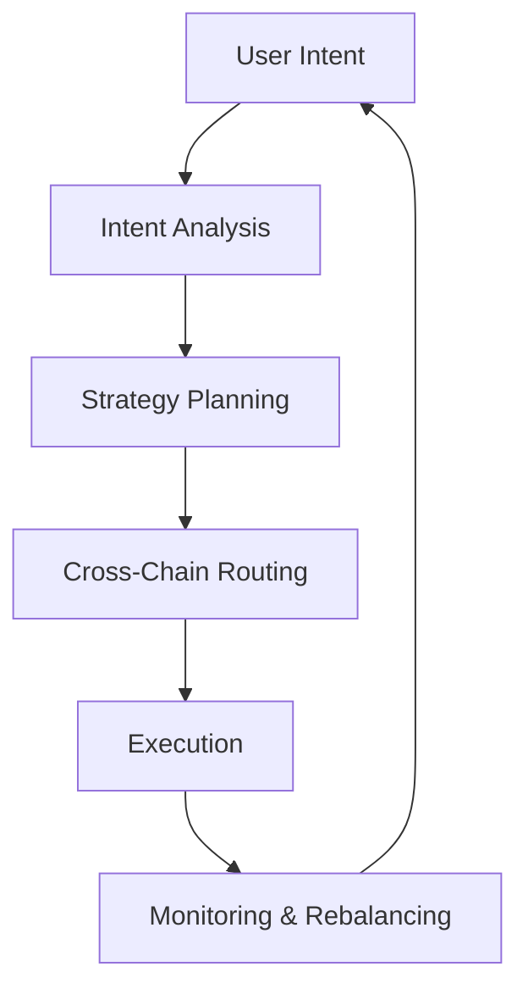

# How Zap Pilot Works

Zap Pilot transforms complex DeFi operations into simple, one-click experiences through our
intent-based execution engine. Here's how the magic happens:

## 🧠 Intent-Based Execution

### What Are Intents?

Instead of specifying **how** to execute transactions, you simply tell us **what** you want to
achieve:

```
Intent: "Invest $500 in a conservative stablecoin strategy"

Traditional DeFi: 12+ transactions across 3 chains
Zap Pilot: 1 click, fully automated
```

### The Intent Lifecycle



## ⚡ The 3-Step Process

### 1. **Express Your Intent**

- Choose investment amount
- Select strategy type
- Set risk preferences
- Define time horizon

### 2. **AI-Powered Planning**

- Analyze current market conditions
- Identify optimal protocols and chains
- Calculate best execution paths
- Plan gas-efficient transactions

### 3. **Automated Execution**

- Execute across multiple chains simultaneously
- Optimize for lowest fees and best rates
- Monitor in real-time
- Auto-rebalance as needed

## 🔗 Cross-Chain Intelligence

### Native Multi-Chain Support

Zap Pilot doesn't just bridge assets — we natively understand and operate on multiple chains:

- **Ethereum**: DeFi's home base
- **Layer 2s**: Arbitrum, Optimism, Base, Polygon
- **Alt L1s**: Avalanche, BSC, Solana (coming soon)

### Intelligent Routing

Our routing engine considers:

- **Gas costs** across all chains
- **Liquidity depth** in different pools
- **Yield opportunities** on each network
- **Bridge security** and speed
- **Current network congestion**

## 🎯 Strategy Execution

### Automated Portfolio Management

Once your strategy is live, Zap Pilot continuously:

#### **Monitors Performance**

- Track yields across all positions
- Monitor risk metrics in real-time
- Watch for strategy drift

#### **Optimizes Allocation**

- Rebalance when targets drift >5%
- Automatically compound rewards
- Move assets to higher-yield opportunities

#### **Manages Risk**

- Implement stop-losses if configured
- Diversify across protocols automatically
- Exit positions if risk thresholds exceeded

### Smart Rebalancing

Our Kelly Criterion-based allocation system:

- Calculates optimal position sizes
- Accounts for correlation between assets
- Minimizes transaction costs
- Maximizes risk-adjusted returns

## 🛡️ Account Abstraction Integration

### Gasless Transactions (Coming Soon)

Through Account Abstraction wallets:

- **No ETH needed for gas** on any chain
- **Batch multiple operations** into single transaction
- **Automatic transaction retries** if failed
- **Sponsored transactions** for small investors

### Enhanced Security

- **Multi-signature support** for institutional users
- **Social recovery** options
- **Spending limits** and controls
- **Session keys** for automated strategies

## 📊 Real-Time Intelligence

### Market Analysis

- **24/7 yield monitoring** across 100+ protocols
- **Risk assessment** of DeFi protocols
- **Liquidity analysis** for optimal execution
- **Gas price prediction** for timing optimization

### Portfolio Analytics

- **Performance attribution** - know what's driving returns
- **Risk decomposition** - understand your exposure
- **Scenario analysis** - stress test your portfolio
- **Tax optimization** - minimize taxable events

## 🔄 Continuous Optimization

### Dynamic Strategy Adjustment

Your strategy evolves with market conditions:

#### **Market Regime Detection**

- Bull market: Increase risk exposure
- Bear market: Preserve capital
- Sideways: Focus on yield generation

#### **Protocol Health Monitoring**

- Track TVL changes
- Monitor governance risks
- Watch for exploit warnings
- Automatic risk-off when needed

## 🏗️ Infrastructure

### Built for Scale

- **Modular architecture** for rapid protocol integration
- **Event-driven system** for real-time responsiveness
- **Redundant execution** to prevent failed transactions
- **High availability** with 99.9% uptime SLA

### Integration Partners

- **20+ DEX aggregators** for best swap rates
- **50+ yield protocols** for diverse opportunities
- **10+ bridge providers** for reliable cross-chain
- **5+ insurance providers** for risk coverage

---

Ready to see it in action?

👉 **[Get Started →](../getting-started)** 👉 **[View Strategies →](../strategies)**
