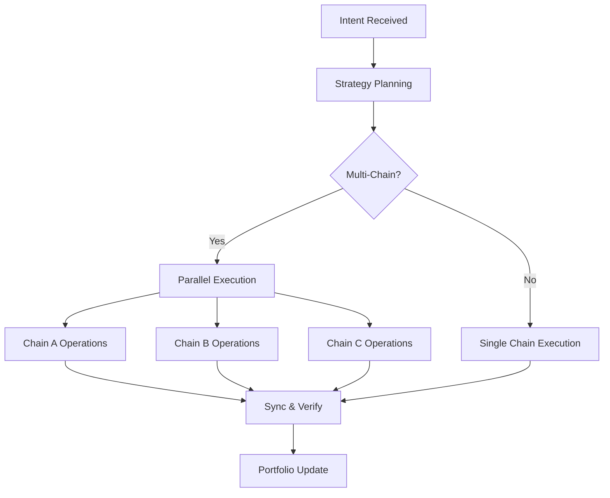

# Intent Execution Engine

**Translating investment intentions into optimal execution paths** 🎯

Zap Pilot's intent execution engine interprets user objectives and autonomously determines optimal
execution strategies across decentralized finance.

## 🎯 Understanding Intents

### What Makes an Intent?

An intent is a high-level expression of what you want to achieve, not how to achieve it:

#### **Traditional DeFi Approach:**

```
1. Bridge USDC from Ethereum to Arbitrum
2. Swap 50% USDC to ETH on Uniswap V3
3. Add USDC/ETH liquidity to pool
4. Stake LP tokens in Convex
5. Claim rewards and compound
```

#### **Intent-Based Approach:**

```
Intent: "Allocate $1,000 to conservative stablecoin yield"
Result: Automated strategy selection, routing, and execution
```

### Intent Components

Every intent contains:

- **Objective**: What you want to achieve
- **Constraints**: Risk limits, time preferences
- **Preferences**: Chain preferences, gas tolerance
- **Context**: Current portfolio, market conditions

## ⚙️ The Execution Pipeline

### 1. Intent Parsing & Validation (Example)

```typescript
interface UserIntent {
  objective: 'invest' | 'withdraw' | 'rebalance';
  amount: string;
  strategy: 'stablecoin' | 'index' | 'btc' | 'eth' | 'custom';
  riskTolerance: 'low' | 'medium' | 'high';
  timeHorizon: 'short' | 'medium' | 'long';
  constraints: {
    maxSlippage: number;
    gasLimit: string;
    chainPreferences: string[];
  };
}
```

### 2. Strategy Resolution

Our execution engine analyzes your intent against:

- **Current market conditions**
- **Available yield opportunities**
- **Your existing portfolio**
- **Risk-return optimization via Kelly Criterion**

### 3. Execution Planning

The planner creates an optimal execution sequence:

#### **Intelligent Route Optimization**

Our execution engine employs:

- **Multi-DEX aggregation** via 1inch, Paraswap, and 0x protocols
- **Cross-chain route optimization** for minimal fees and slippage
- **Gas cost analysis** across execution paths
- **Liquidity depth assessment** for optimal price impact

#### **Autonomous Execution Pipeline**

1. **Intent Analysis**: Parse investment objective and constraints
2. **Strategy Resolution**: Map intent to optimal protocol combinations
3. **Route Planning**: Calculate multi-hop execution paths
4. **Execution Orchestration**: Deploy capital across selected protocols
5. **Continuous Optimization**: Monitor and rebalance based on Kelly Criterion

### 4. Cross-Chain Orchestration

Execute operations across multiple chains simultaneously:



## 🧠 Advanced Intent Features

### Portfolio-Level Intents

- **"Rebalance to target allocation"** → Automated multi-protocol rebalancing
- **"Optimize yield across positions"** → Dynamic capital redeployment
- **"Reduce risk exposure"** → Intelligent position scaling

### Cross-Chain Intent Resolution

- **Native multi-chain execution** without manual bridging
- **Optimal chain selection** based on yield opportunities
- **Unified liquidity aggregation** across Layer 2 ecosystems

### Market Intelligence

Our system continuously analyzes:

- **Historical yield data** across all protocols
- **Gas price patterns** on different chains
- **Liquidity depth** changes over time
- **Protocol risk events** and responses

## 🔄 Continuous Monitoring

### Real-Time Portfolio Tracking

Once executed, we monitor:

- **Position performance** across all protocols
- **Risk metric changes** (correlation, volatility)
- **Yield optimization** opportunities
- **Rebalancing trigger** conditions

### Proactive Management

Automatic actions include:

- **Reward claiming** and auto-compounding
- **Rebalancing** when allocations drift >5%
- **Risk-off** moves during market stress
- **Yield optimization** switches to better rates

### Alert System

Get notified about:

- **Significant gains/losses** in positions
- **New yield opportunities** matching your profile
- **Risk warnings** for protocols you're using
- **Rebalancing** operations completed

## 🛠️ Advanced Features

### Custom Intent Scripting

Power users can create custom intents (Example):

```javascript
// Example: Dollar-cost averaging intent
const dcaIntent = {
  objective: 'recurring_invest',
  amount: '500',
  frequency: 'weekly',
  strategy: 'index',
  duration: '12_months',
  conditions: {
    pauseIf: 'portfolio_loss > 20%',
    increaseIf: 'btc_price < 40000',
  },
};
```

### Batch Intent Processing

Submit multiple intents at once:

- **Portfolio rebalancing** across strategies
- **Multi-strategy allocation** for diversification
- **Scheduled operations** for DCA and rebalancing

### Intent Templates

Pre-built templates for common strategies:

- **Index Fund**: Market Cap weighted strategys, S&P-500 liked strategy.
- **Conservative Income**: Stablecoin yield focus
- **Aggressive Growth**: High-risk, high-reward strategies
- **Market Neutral**: Delta-neutral strategies

---

---

_Traditional DeFi requires 12+ manual transactions. Zap Pilot executes complex strategies through
single intent expressions._

👉 **[Learn about Cross-Chain Operations →](./cross-chain-operations)** 👉
**[Explore Rebalancing →](./rebalancing)**
