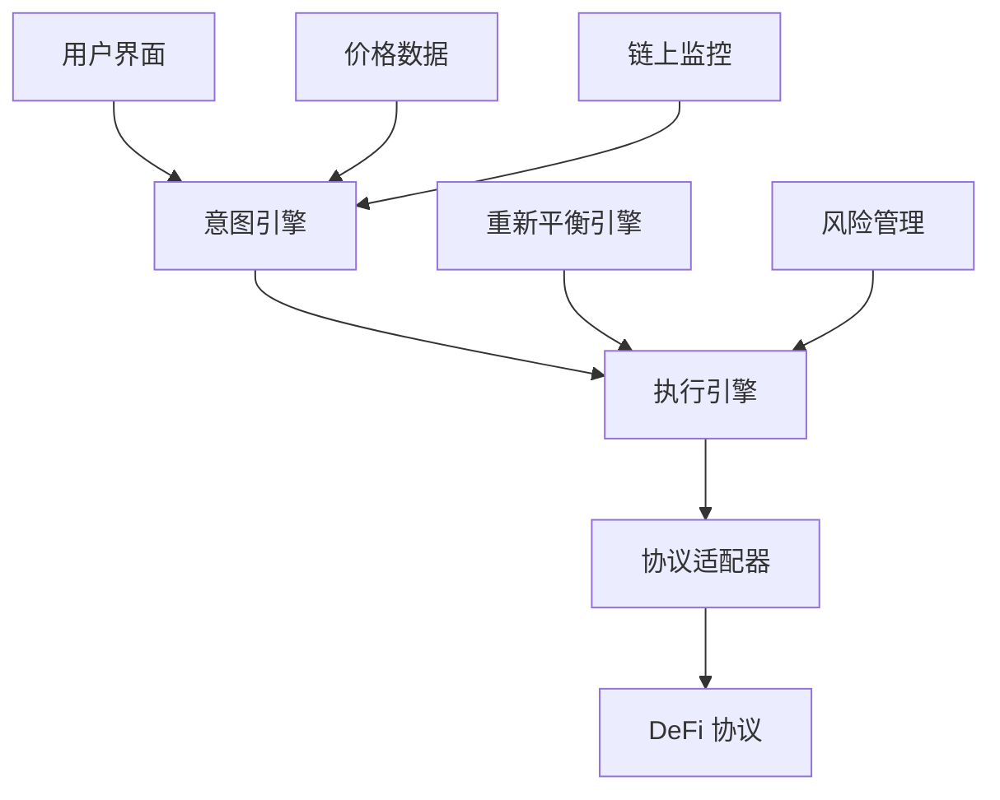

# 系统概述

Zap Pilot 是一个革新性的基于意图的 DeFi 执行引擎，旨在简化复杂的去中心化金融操作，让用户专注于投资意图而非技术实现。

## 核心理念

### 意图驱动的设计哲学

传统的 DeFi 操作要求用户：
- 了解复杂的协议接口
- 手动执行多步骤交易
- 监控和优化投资组合
- 处理跨链复杂性

Zap Pilot 改变了这一切：
```
用户意图 → 智能解析 → 自动执行 → 持续优化
```

### 核心价值主张

1. **简化复杂性**：将复杂的 DeFi 操作抽象为简单的意图表达
2. **自动化执行**：智能路由和执行跨协议交易
3. **持续优化**：基于数学模型的投资组合管理
4. **风险管理**：内置风险控制和监控机制

## 系统架构

### 高层架构图



### 核心组件

#### 1. 前端应用 (all-weather-frontend/)
```typescript
// 主要职责
interface Frontend {
  userInterface: '用户交互界面';
  walletIntegration: 'Web3 钱包集成';
  strategyVisualization: '策略可视化';
  portfolioTracking: '投资组合跟踪';
}
```

**技术栈：**
- Next.js 13 + React 18
- TypeScript + Tailwind CSS
- ThirdWeb SDK + Ethers.js
- Vitest 测试框架

#### 2. 后端服务 (backend/)
```typescript
interface Backend {
  userManagement: '用户数据管理';
  reportGeneration: '报告生成';
  notifications: 'Discord/邮件通知';
  dataAggregation: '数据聚合';
}
```

**技术栈：**
- Node.js + Express.js
- Google Sheets API
- DeBank API 集成
- Jest 测试框架

#### 3. 重新平衡引擎 (rebalance_backend/)
```python
# 主要功能
class RebalanceEngine:
    def analyze_portfolio(self):
        """分析投资组合表现"""
        pass
    
    def calculate_optimal_allocation(self):
        """计算最优资产配置"""
        pass
    
    def execute_rebalance(self):
        """执行重新平衡操作"""
        pass
```

**技术栈：**
- Python + Flask
- Pandas 数据分析
- Web3.py 区块链交互
- Pytest 测试框架

#### 4. 意图引擎 (intent-engine/)
```typescript
interface IntentEngine {
  intentParsing: '意图解析';
  pathOptimization: '路径优化';
  executionOrchestration: '执行编排';
  transactionMonitoring: '交易监控';
}
```

**技术栈：**
- Node.js + TypeScript
- Redis 缓存
- 微服务架构
- Jest 测试框架

## 意图处理流程

### 1. 意图捕获
```typescript
interface UserIntent {
  action: 'invest' | 'withdraw' | 'rebalance';
  strategy: 'stablecoin' | 'index500' | 'btc' | 'eth' | 'custom';
  amount: string;
  riskProfile: 'low' | 'medium' | 'high';
  preferences: {
    maxSlippage: number;
    deadline: number;
    gasOptimization: boolean;
  };
}
```

### 2. 智能解析
系统分析用户意图并生成执行计划：
- 评估当前市场条件
- 分析最优执行路径
- 计算预期收益和风险
- 优化 Gas 使用

### 3. 执行编排
```typescript
interface ExecutionPlan {
  steps: TransactionStep[];
  estimatedGas: string;
  expectedSlippage: number;
  timeEstimate: number;
  contingencyPlans: ContingencyPlan[];
}
```

### 4. 持续监控
- 实时交易状态追踪
- 异常情况处理
- 自动重试机制
- 失败回滚策略

## 支持的协议和网络

### DeFi 协议集成

| 协议类型 | 具体协议 | 功能 |
|---------|---------|------|
| **DEX** | Uniswap V3, Camelot, Velodrome | 代币交换 |
| **借贷** | Aave, Moonwell, Venus | 借贷收益 |
| **收益农场** | Convex, Aura | 流动性挖矿 |
| **衍生品** | Pendle | 收益代币化 |
| **跨链** | Across, Squid | 跨链桥接 |

### 支持的区块链网络

```typescript
const SUPPORTED_CHAINS = {
  ethereum: 1,
  arbitrum: 42161,
  polygon: 137,
  base: 8453,
  optimism: 10,
  bsc: 56,
  avalanche: 43114,
  // ... 更多网络
} as const;
```

## 核心算法

### 1. 投资组合优化
使用现代投资组合理论 (MPT) 和 Kelly 公式：

```python
def optimize_portfolio(returns, risk_tolerance):
    """
    基于历史收益和风险承受能力优化投资组合
    """
    mean_returns = calculate_expected_returns(returns)
    cov_matrix = calculate_covariance_matrix(returns)
    
    # Kelly 公式应用
    optimal_weights = kelly_criterion(mean_returns, cov_matrix, risk_tolerance)
    
    return optimal_weights
```

### 2. 风险管理
多层次风险控制机制：

```typescript
interface RiskControls {
  positionLimits: {
    maxSingleAsset: number;    // 单一资产最大比例
    maxProtocolExposure: number; // 单一协议最大敞口
  };
  dynamicStopLoss: {
    trailing: boolean;         // 跟踪止损
    threshold: number;         // 止损阈值
  };
  liquidityRequirements: {
    minLiquidity: number;      // 最小流动性要求
    emergencyBuffer: number;   // 紧急缓冲资金
  };
}
```

### 3. Gas 优化
智能 Gas 管理策略：

```typescript
class GasOptimizer {
  async optimizeGasUsage(transactions: Transaction[]): Promise<OptimizedPlan> {
    // 批量交易打包
    const batched = this.batchTransactions(transactions);
    
    // Gas 价格预测
    const gasPrice = await this.predictOptimalGasPrice();
    
    // 执行时机优化
    const timing = this.optimizeExecutionTiming(batched);
    
    return { batched, gasPrice, timing };
  }
}
```

## 性能指标

### 系统性能目标
- **响应时间**：< 2 秒（意图到执行计划）
- **执行效率**：Gas 使用优化 20-30%
- **成功率**：> 99.5% 交易成功率
- **可用性**：99.9% 系统正常运行时间

### 监控和指标
```typescript
interface SystemMetrics {
  performance: {
    avgResponseTime: number;
    transactionSuccessRate: number;
    gasEfficiencyImprovement: number;
  };
  usage: {
    dailyActiveUsers: number;
    totalValueLocked: string;
    transactionVolume: string;
  };
  health: {
    systemUptime: number;
    errorRate: number;
    alertsTriggered: number;
  };
}
```

## 安全考虑

### 多层安全防护
1. **智能合约安全**：经过审计的合约代码
2. **交易验证**：多重签名验证机制
3. **风险隔离**：资金隔离和权限分离
4. **监控告警**：实时异常检测

### 审计和合规
- 定期安全审计
- 代码开源透明
- 合规性检查
- 保险覆盖

## 下一步

- 🚀 [快速开始](./quick-start) - 立即开始使用
- 🏗️ [系统架构](./architecture) - 深入了解技术架构
- 📋 [金库策略](./vaults) - 探索投资策略
- 🔧 [开发者指南](./development) - 开发者资源