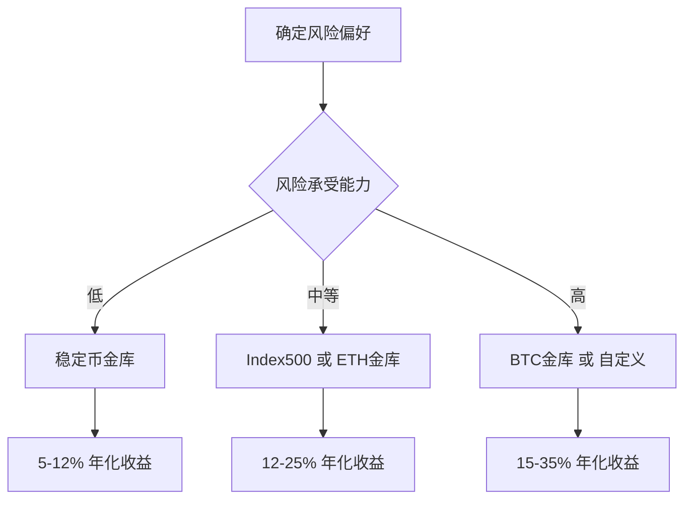

# 金库策略详解

Zap Pilot 提供多种金库策略，每种策略都针对不同的风险偏好和投资目标进行优化。本文档详细介绍各种金库的工作原理、风险特征和预期收益。

## 金库策略概览

| 策略类型 | 风险等级 | 预期年化收益 | 最低投资 | 流动性 |
|---------|---------|-------------|---------|-------|
| 🏦 稳定币金库 | 低 | 5-12% | $50 | 高 |
| 📈 Index500 | 中 | 15-25% | $100 | 中 |
| ₿ BTC 金库 | 中高 | 10-30% | $100 | 中 |
| Ξ ETH 金库 | 中高 | 12-35% | $100 | 中 |
| ⚙️ 自定义金库 | 可配置 | 可变 | $200 | 可配置 |

## 1. 稳定币金库 🏦

### 策略概述
稳定币金库专注于使用稳定币（USDC、USDT、DAI等）进行低风险收益生成，通过多种 DeFi 协议的组合来最大化收益同时控制风险。

### 工作原理
```typescript
interface StablecoinVaultStrategy {
  protocols: {
    lending: ['Aave', 'Compound', 'Moonwell'];
    liquidity: ['Curve', 'Uniswap V3'];
    yield: ['Convex', 'Yearn'];
  };
  
  allocation: {
    lending: '40-60%';    // 借贷协议
    liquidity: '20-30%';  // 流动性提供
    yield: '20-30%';      // 收益农场
    reserve: '5-10%';     // 储备资金
  };
}
```

### 风险控制机制
1. **多协议分散**：资金分布在多个经过审计的协议中
2. **稳定币对冲**：使用多种稳定币降低单一资产风险
3. **动态再平衡**：根据收益率变化自动调整配置
4. **流动性管理**：保持足够的流动性应对提取需求

### 收益来源
- **借贷利息**：向借款人提供资金获得利息收入
- **交易手续费**：在 DEX 上提供流动性获得交易费分成
- **协议代币奖励**：参与流动性挖矿获得治理代币奖励
- **复利效应**：自动复投增强收益

### 适用人群
- 保守型投资者
- 寻求稳定收益的用户
- 对波动性敏感的投资者
- 希望跑赢传统储蓄的用户

## 2. Index500 金库 📈

### 策略概述
Index500 金库模仿传统股市的标普500指数，构建一个包含加密市场主要代币的指数基金，通过分散投资和定期重新平衡来跟踪整体市场表现。

### 指数构成
```typescript
interface Index500Composition {
  topTier: {
    BTC: '25-30%';    // 比特币
    ETH: '20-25%';    // 以太坊
  };
  
  largeCap: {
    BNB: '3-5%';      // 币安币
    SOL: '3-5%';      // Solana
    ADA: '2-4%';      // Cardano
    AVAX: '2-4%';     // Avalanche
    DOT: '2-3%';      // Polkadot
  };
  
  midCap: {
    LINK: '2-3%';     // Chainlink
    UNI: '2-3%';      // Uniswap
    MATIC: '2-3%';    // Polygon
    ATOM: '1-2%';     // Cosmos
    // 更多中等市值代币
  };
  
  defi: {
    AAVE: '1-2%';     // Aave
    CRV: '1-2%';      // Curve
    SUSHI: '1-2%';    // SushiSwap
    // 其他 DeFi 代币
  };
}
```

### 重新平衡机制
```python
class Index500Rebalancer:
    def __init__(self):
        self.rebalance_frequency = 'monthly'
        self.deviation_threshold = 0.05  # 5% 偏差触发重新平衡
    
    def calculate_target_weights(self) -> Dict[str, float]:
        """基于市值和流动性计算目标权重"""
        market_data = self.fetch_market_data()
        
        # 市值加权
        market_cap_weights = self.calculate_market_cap_weights(market_data)
        
        # 流动性调整
        liquidity_adjusted = self.adjust_for_liquidity(market_cap_weights)
        
        # 应用约束条件
        final_weights = self.apply_constraints(liquidity_adjusted)
        
        return final_weights
    
    def execute_rebalance(self, current_portfolio: Portfolio) -> RebalanceResult:
        """执行重新平衡操作"""
        target_weights = self.calculate_target_weights()
        current_weights = self.calculate_current_weights(current_portfolio)
        
        trades = self.calculate_required_trades(current_weights, target_weights)
        
        return self.execute_trades(trades)
```

### 智能优化特性
1. **动态权重调整**：根据市场条件调整权重分配
2. **Gas 优化执行**：批量交易减少手续费
3. **流动性分析**：考虑代币流动性避免滑点
4. **税务优化**：最小化税务影响的交易策略

### 风险管理
- **多元化分散**：投资多个不同类型的代币
- **市值过滤**：只投资大中市值代币
- **流动性要求**：确保足够的交易流动性
- **下行保护**：熊市中的保护机制

## 3. BTC 金库 ₿

### 策略概述
BTC 金库专注于比特币生态系统，通过多种策略在保持 BTC 敞口的同时获得额外收益。

### 收益策略
```typescript
interface BTCVaultStrategies {
  wrappedBTC: {
    protocols: ['Wrapped Bitcoin (WBTC)', 'Bitcoin on Ethereum'];
    strategies: ['Lending on Aave', 'Curve LP', 'Convex Farming'];
    allocation: '40-50%';
  };
  
  bitcoinDefi: {
    protocols: ['Lightning Network', 'Liquid Network', 'RSK'];
    strategies: ['Lightning liquidity', 'Liquid bonds', 'RSK DeFi'];
    allocation: '20-30%';
  };
  
  derivatives: {
    instruments: ['BTC futures', 'Options', 'Perpetual swaps'];
    strategies: ['Basis trading', 'Covered calls', 'Funding arbitrage'];
    allocation: '20-30%';
  };
  
  native: {
    holding: 'Pure Bitcoin holding';
    allocation: '10-20%';
  };
}
```

### 创新特性
1. **跨链比特币**：利用多个网络上的比特币表示
2. **闪电网络集成**：参与闪电网络流动性提供
3. **机构级策略**：采用机构投资者使用的高级策略
4. **比特币挖矿**：参与去中心化挖矿池

### 风险考量
- **智能合约风险**：跨链桥和包装代币的智能合约风险
- **流动性风险**：某些 BTC 衍生品的流动性限制
- **技术风险**：新兴比特币 DeFi 协议的技术风险

## 4. ETH 金库 Ξ

### 策略概述
ETH 金库专为以太坊生态设计，结合 ETH 2.0 质押、DeFi 协议参与和 MEV 机会捕获。

### 多层收益结构
```typescript
interface ETHVaultStructure {
  staking: {
    eth2Validators: '30-40%';     // ETH 2.0 质押
    liquidStaking: '20-30%';     // 流动性质押 (Lido, Rocket Pool)
    stakingDerivatives: '10-15%'; // 质押衍生品
  };
  
  defiParticipation: {
    lending: '15-20%';           // 借贷协议
    ammLiquidity: '10-15%';      // AMM 流动性提供
    yieldFarming: '5-10%';       // 收益农场
  };
  
  mevCapture: {
    flashloans: '2-5%';          // 闪电贷套利
    arbitrage: '2-5%';           // 跨协议套利
    liquidation: '1-3%';         // 清算机会
  };
}
```

### ETH 2.0 质押集成
```solidity
// 质押策略智能合约
contract ETHStakingStrategy {
    using SafeMath for uint256;
    
    // 验证者管理
    mapping(bytes => Validator) public validators;
    
    // 质押池管理
    struct StakingPool {
        uint256 totalStaked;
        uint256 rewards;
        uint256 penalties;
        bool active;
    }
    
    function stakeETH(uint256 amount) external payable {
        require(msg.value == amount, "Amount mismatch");
        require(amount >= 32 ether, "Minimum stake required");
        
        // 创建验证者
        bytes memory pubkey = generateValidator();
        validators[pubkey] = Validator({
            stake: amount,
            rewards: 0,
            active: true
        });
        
        emit ValidatorCreated(pubkey, amount);
    }
    
    function claimRewards() external {
        uint256 rewards = calculateRewards(msg.sender);
        require(rewards > 0, "No rewards available");
        
        payable(msg.sender).transfer(rewards);
        emit RewardsClaimed(msg.sender, rewards);
    }
}
```

### 高级策略
1. **MEV 优化**：捕获最大可提取价值机会
2. **Layer 2 参与**：在 Arbitrum、Optimism 等 Layer 2 上的策略
3. **DeFi 收益堆叠**：多层收益策略组合
4. **ETH 衍生品**：使用期货和期权优化收益

## 5. 自定义金库 ⚙️

### 灵活配置
自定义金库允许高级用户根据个人偏好和市场观点创建定制化的投资策略。

```typescript
interface CustomVaultConfig {
  assets: {
    tokens: string[];           // 代币列表
    weights: number[];          // 权重分配
    constraints: {
      maxAllocation: number;    // 单一资产最大配置
      minAllocation: number;    // 单一资产最小配置
    };
  };
  
  strategies: {
    rebalanceFreq: 'daily' | 'weekly' | 'monthly';
    riskLevel: 'conservative' | 'moderate' | 'aggressive';
    yieldFocus: 'income' | 'growth' | 'balanced';
  };
  
  riskManagement: {
    stopLoss: number;           // 止损线
    takeProfint: number;        // 止盈线
    maxDrawdown: number;        // 最大回撤
  };
}
```

### 策略构建器
```typescript
class CustomStrategyBuilder {
  private config: CustomVaultConfig;
  
  addAsset(token: string, weight: number): this {
    this.config.assets.tokens.push(token);
    this.config.assets.weights.push(weight);
    return this;
  }
  
  setRiskLevel(level: RiskLevel): this {
    this.config.strategies.riskLevel = level;
    return this;
  }
  
  addRiskControl(type: RiskControlType, value: number): this {
    this.config.riskManagement[type] = value;
    return this;
  }
  
  build(): CustomVault {
    this.validateConfig();
    return new CustomVault(this.config);
  }
}
```

## 跨策略特性

### 1. 智能重新平衡
所有金库都采用智能重新平衡机制：

```python
class UniversalRebalancer:
    def __init__(self, strategy_type: str):
        self.strategy = self.load_strategy(strategy_type)
        self.risk_model = RiskModel()
        self.optimizer = PortfolioOptimizer()
    
    def should_rebalance(self, portfolio: Portfolio) -> bool:
        """判断是否需要重新平衡"""
        current_weights = self.calculate_weights(portfolio)
        target_weights = self.strategy.target_weights
        
        # 检查偏差
        max_deviation = max(
            abs(current - target) 
            for current, target in zip(current_weights, target_weights)
        )
        
        return max_deviation > self.strategy.deviation_threshold
    
    def execute_rebalance(self, portfolio: Portfolio) -> RebalanceResult:
        """执行重新平衡"""
        # 计算最优交易路径
        trades = self.optimizer.calculate_optimal_trades(
            portfolio, 
            self.strategy.target_weights
        )
        
        # 考虑交易成本和滑点
        optimized_trades = self.optimize_execution(trades)
        
        # 执行交易
        return self.execute_trades(optimized_trades)
```

### 2. 风险监控系统
```typescript
interface RiskMonitoringSystem {
  realTimeMetrics: {
    portfolioValue: bigint;
    drawdown: number;
    volatility: number;
    sharpeRatio: number;
    var: number;              // Value at Risk
    cvar: number;             // Conditional Value at Risk
  };
  
  alertThresholds: {
    maxDrawdown: number;
    highVolatility: number;
    lowSharpe: number;
    liquidityRisk: number;
  };
  
  automaticActions: {
    emergencyExit: boolean;   // 紧急退出
    riskReduction: boolean;   // 风险降低
    hedging: boolean;         // 对冲操作
  };
}
```

### 3. 收益优化引擎
```typescript
class YieldOptimizationEngine {
  async findBestYieldOpportunities(): Promise<YieldOpportunity[]> {
    const opportunities = await Promise.all([
      this.scanLendingRates(),
      this.scanLiquidityPools(),
      this.scanYieldFarms(),
      this.scanArbitrageOpportunities()
    ]);
    
    return this.rankByRiskAdjustedReturn(opportunities.flat());
  }
  
  private async scanLendingRates(): Promise<LendingOpportunity[]> {
    const protocols = ['Aave', 'Compound', 'Moonwell', 'Venus'];
    const rates = await Promise.all(
      protocols.map(protocol => this.fetchLendingRates(protocol))
    );
    
    return this.convertToOpportunities(rates);
  }
}
```

## 性能指标和报告

### 关键绩效指标 (KPIs)
```typescript
interface VaultPerformanceMetrics {
  returns: {
    daily: number;
    weekly: number;
    monthly: number;
    yearly: number;
    sinceInception: number;
  };
  
  risk: {
    volatility: number;
    maxDrawdown: number;
    sharpeRatio: number;
    sortinoRatio: number;
    calmarRatio: number;
  };
  
  efficiency: {
    gasOptimization: number;
    executionTime: number;
    slippageImpact: number;
    rebalanceFrequency: number;
  };
}
```

### 报告生成
所有金库都提供详细的性能报告：
- 📊 **实时仪表板**：投资组合价值、收益率、风险指标
- 📈 **历史分析**：长期表现趋势和策略效果
- 💰 **收益分解**：各种收益来源的详细分析
- ⚠️ **风险报告**：风险暴露和控制措施效果

## 选择指南

### 根据风险偏好选择


### 投资期限考虑
- **短期（< 6个月）**：稳定币金库，高流动性
- **中期（6个月-2年）**：Index500 或 ETH 金库
- **长期（> 2年）**：BTC 金库或自定义策略

### 资金规模建议
- **小额投资（< $1,000）**：稳定币金库或 Index500
- **中等投资（$1,000-$10,000）**：任意策略，建议分散
- **大额投资（> $10,000）**：自定义金库，专业策略

## 下一步

- 🚀 [开始投资](./quick-start) - 选择适合的金库开始投资
- 📊 监控投资 - 学习如何监控和管理投资
- 🔧 自定义策略 - 创建个人定制策略
- 💡 [最佳实践](./guides/best-practices) - 投资最佳实践指南