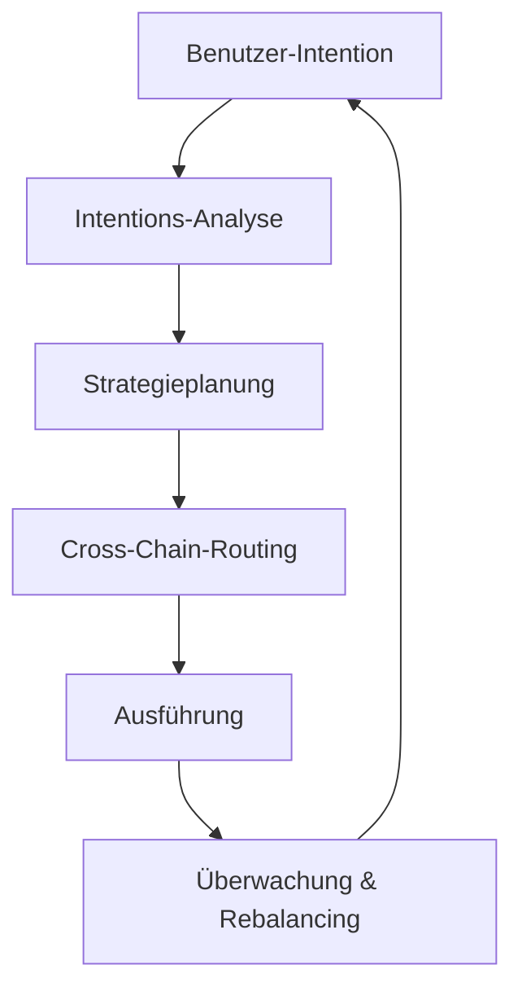

# Wie Zap Pilot Funktioniert

Zap Pilot verwandelt komplexe DeFi-Operationen in einfache Ein-Klick-Erfahrungen durch unsere
intentionsbasierte Ausführungsengine. So geschieht die Magie:

## 🧠 Intentionsbasierte Ausführung

### Was ist eine Intention?

Anstatt zu spezifizieren **wie** Transaktionen ausgeführt werden, sagen Sie uns einfach **was** Sie
erreichen möchten:

```
Intention: "500$ in eine konservative Stablecoin-Strategie investieren"

Traditionelles DeFi: 12+ Transaktionen über 3 Chains
Zap Pilot: 1 Klick, vollständig automatisiert
```

### Intentions-Lebenszyklus



## ⚡ 3-Schritt-Prozess

### 1. **Ihre Intention Ausdrücken**

- Investitionsbetrag wählen
- Strategietyp auswählen
- Risikopräferenz festlegen
- Zeitrahmen definieren

### 2. **KI-Gesteuerte Planung**

- Aktuelle Marktbedingungen analysieren
- Beste Protokolle und Chains identifizieren
- Optimalen Ausführungspfad berechnen
- Gas-effiziente Transaktionen planen

### 3. **Automatisierte Ausführung**

- Gleichzeitig über mehrere Chains ausführen
- Für niedrigste Gebühren und beste Raten optimieren
- Echtzeit-Überwachung
- Automatisches Rebalancing nach Bedarf

## 🔗 Cross-Chain-Intelligenz

### Native Multi-Chain-Unterstützung

Zap Pilot verbindet nicht nur Assets — wir verstehen und operieren nativ über mehrere Chains,
einschließlich führender Layer 2s, Ethereum und Solana.

### Intelligentes Routing

Unsere Routing-Engine berücksichtigt:

- **Gaskosten** über alle Chains
- **Liquiditätstiefe** in verschiedenen Pools
- **Yield-Gelegenheiten** in jedem Netzwerk
- **Bridge-Sicherheit** und Geschwindigkeit
- **Aktuelle Netzwerküberlastung**

## 🎯 Strategieausführung

### Automatisiertes Portfolio-Management

Sobald Ihre Strategie live ist, überwacht Zap Pilot kontinuierlich:

#### **Performance-Überwachung**

- Verfolgt Yields über alle Positionen
- Überwacht Risikometriken in Echtzeit
- Beobachtet Strategieabweichung

#### **Allokationsoptimierung**

- Rebalanciert wenn Zielabweichung >5%
- Verschiebt Assets zu höheren Yield-Gelegenheiten

#### **Risikomanagement**

- Diversifiziert automatisch über Protokolle

### Intelligentes Rebalancing

Unser Kelly-Kriterium-basiertes Allokationssystem:

- Berechnet optimale Positionsgrößen
- Berücksichtigt Korrelationen zwischen Assets
- Minimiert Handelskosten
- Maximiert risikoadjustierte Renditen

## 🛡️ Account-Abstraction-Integration

### Gaslose Erfahrung mit Account Abstraction

Über ThirdWebs Smart-Wallet-Infrastruktur:

- **Gas-Sponsoring** für qualifizierte Transaktionen über Paymaster
- **Vereinfachtes Onboarding** mit Social-Wallet-Optionen
- **Batch-Operationen** zur Reduzierung der Transaktionsanzahl
- **Multi-Chain-Unterstützung** mit einheitlicher Erfahrung

### Verbesserte Sicherheit

- **Multi-Sig-Unterstützung** für institutionelle Nutzer
- **Social Recovery**-Optionen
- **Ausgabenlimits** und Kontrollen
- **Session Keys** für automatisierte Strategien

## 📊 Echtzeit-Intelligenz

### Marktanalyse

- **24/7 Yield-Überwachung** über 100+ Protokolle
- **Risikobewertung** von DeFi-Protokollen
- **Liquiditätsanalyse** für optimale Ausführung

### Portfolio-Analyse

- **Performance-Attribution** - verstehen was Renditen antreibt (demnächst)
- **Risiko-Breakdown** - Ihre Exposition kennen
- **Szenario-Analyse** - Ihr Portfolio stresstesten
- **Steueroptimierung** - steuerpflichtige Ereignisse minimieren

## 🔄 Kontinuierliche Optimierung

### Dynamische Strategieanpassungen

Ihre Strategie entwickelt sich mit den Marktbedingungen:

#### **Marktregime-Erkennung**

- Bullenmarkt: Risikoexposition erhöhen
- Bärenmarkt: Wert bewahren
- Seitwärtsmarkt: Auf Yield-Generierung fokussieren

#### **Protokoll-Gesundheitsüberwachung**

- TVL-Änderungen verfolgen
- Governance-Risiken überwachen
- Exploit-Warnungen beobachten
- Automatische Risikoreduktion wenn nötig

## 🏗️ Infrastruktur

### Für Skalierung Gebaut

- **Modulare Architektur** für schnelle Protokoll-Integration
- **Event-gesteuertes System** für Echtzeit-Reaktion
- **Redundante Ausführung** zur Verhinderung von Transaktionsfehlern
- **Hohe Verfügbarkeit** mit 99,9% Uptime-SLA

### Integrationspartner

- **20+ DEX-Aggregatoren** für beste Wechselkurse
- **50+ Yield-Protokolle** für diversifizierte Gelegenheiten
- **10+ Bridge-Anbieter** für zuverlässiges Cross-Chain
- **5+ Versicherungsanbieter** für Risikoabdeckung

---

Bereit, es selbst zu erleben?

👉 **[Erste Schritte →](../getting-started)** 👉 **[Strategien Ansehen →](../strategies)**
