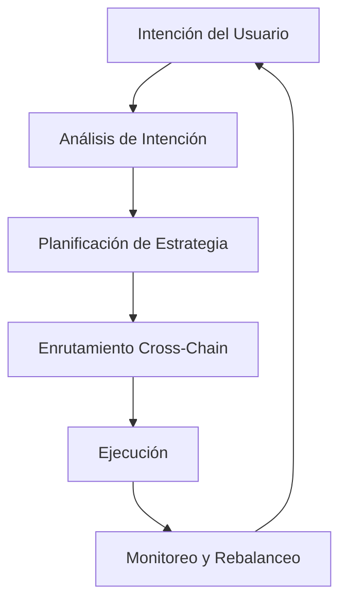

# Cómo Funciona Zap Pilot

Zap Pilot transforma operaciones complejas de DeFi en experiencias simples de un clic a través de
nuestro motor de ejecución basado en intenciones. Así es como ocurre la magia:

## 🧠 Ejecución Basada en Intenciones

### ¿Qué es una Intención?

En lugar de especificar **cómo** ejecutar transacciones, simplemente nos dices **qué** quieres
lograr:

```
Intención: "Invertir $500 en una estrategia conservadora de stablecoins"

DeFi Tradicional: 12+ transacciones en 3 cadenas
Zap Pilot: 1 clic, completamente automatizado
```

### Ciclo de Vida de la Intención



## ⚡ Proceso de 3 Pasos

### 1. **Expresa Tu Intención**

- Elige cantidad de inversión
- Selecciona tipo de estrategia
- Establece preferencia de riesgo
- Define marco temporal

### 2. **Planificación Impulsada por IA**

- Analiza condiciones actuales del mercado
- Identifica mejores protocolos y cadenas
- Calcula ruta de ejecución óptima
- Planifica transacciones eficientes en gas

### 3. **Ejecución Automatizada**

- Ejecuta simultáneamente en múltiples cadenas
- Optimiza para comisiones más bajas y mejores tasas
- Monitorea en tiempo real
- Rebalancea automáticamente según sea necesario

## 🔗 Inteligencia Cross-Chain

### Soporte Multi-Chain Nativo

Zap Pilot no solo conecta activos — entendemos y operamos nativamente en múltiples cadenas,
incluyendo Layer 2s líderes, Ethereum y Solana.

### Enrutamiento Inteligente

Nuestro motor de enrutamiento considera:

- **Costos de gas** en todas las cadenas
- **Profundidad de liquidez** en diferentes pools
- **Oportunidades de rendimiento** en cada red
- **Seguridad de puentes** y velocidad
- **Congestión actual de la red**

## 🎯 Ejecución de Estrategia

### Gestión Automatizada de Carteras

Una vez que tu estrategia está en vivo, Zap Pilot continuamente:

#### **Monitorea Rendimiento**

- Rastrea rendimientos en todas las posiciones
- Monitorea métricas de riesgo en tiempo real
- Observa deriva de estrategia

#### **Optimiza Asignaciones**

- Rebalancea cuando deriva objetivo >5%
- Mueve activos a oportunidades de mayor rendimiento

#### **Gestiona Riesgo**

- Diversifica automáticamente entre protocolos

### Rebalanceo Inteligente

Nuestro sistema de asignación basado en Criterio de Kelly:

- Calcula tamaños óptimos de posición
- Considera correlaciones entre activos
- Minimiza costos de trading
- Maximiza retornos ajustados al riesgo

## 🛡️ Integración de Account Abstraction

### Experiencia Sin Gas con Account Abstraction

A través de la infraestructura de smart wallets de ThirdWeb:

- **Patrocinio de gas** para transacciones elegibles a través de paymaster
- **Onboarding simplificado** con opciones de wallets sociales
- **Operaciones en lote** para reducir número de transacciones
- **Soporte multi-chain** con experiencia unificada

### Seguridad Mejorada

- **Soporte multi-sig** para usuarios institucionales
- Opciones de **recuperación social**
- **Límites de gasto** y controles
- **Claves de sesión** para estrategias automatizadas

## 📊 Inteligencia en Tiempo Real

### Análisis de Mercado

- **Monitoreo de rendimiento 24/7** en 100+ protocolos
- **Evaluación de riesgo** de protocolos DeFi
- **Análisis de liquidez** para ejecución óptima

### Análisis de Cartera

- **Atribución de rendimiento** - entender qué impulsa los retornos (próximamente)
- **Desglose de riesgo** - conocer tu exposición
- **Análisis de escenarios** - prueba de estrés de tu cartera
- **Optimización fiscal** - minimizar eventos gravables

## 🔄 Optimización Continua

### Ajustes Dinámicos de Estrategia

Tu estrategia evoluciona con las condiciones del mercado:

#### **Detección de Régimen de Mercado**

- Mercado alcista: Aumentar exposición al riesgo
- Mercado bajista: Preservar valor
- Mercado lateral: Enfocarse en generación de rendimiento

#### **Monitoreo de Salud del Protocolo**

- Rastrear cambios en TVL
- Monitorear riesgos de gobernanza
- Observar alertas de exploits
- Reducción automática de riesgo cuando sea necesario

## 🏗️ Infraestructura

### Construido para Escala

- **Arquitectura modular** para integración rápida de protocolos
- **Sistema impulsado por eventos** para respuesta en tiempo real
- **Ejecución redundante** para prevenir fallas de transacciones
- **Alta disponibilidad** con SLA de 99.9% de uptime

### Socios de Integración

- **20+ agregadores DEX** para mejores tasas de intercambio
- **50+ protocolos de rendimiento** para oportunidades diversificadas
- **10+ proveedores de puentes** para cross-chain confiable
- **5+ proveedores de seguros** para cobertura de riesgo

---

¿Listo para experimentarlo por ti mismo?

👉 **[Empezar →](../getting-started)** 👉 **[Ver Estrategias →](../strategies)**
