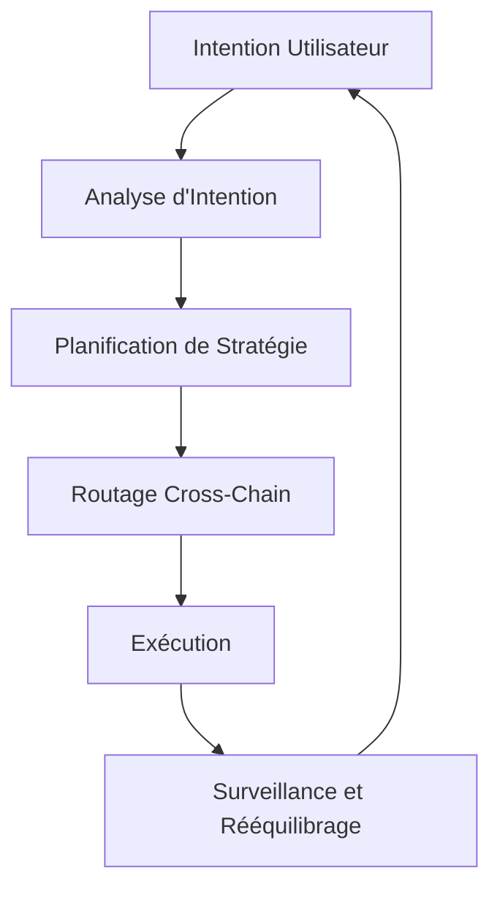

# Comment Fonctionne Zap Pilot

Zap Pilot transforme les opérations DeFi complexes en expériences simples d'un clic grâce à notre
moteur d'exécution basé sur les intentions. Voici comment la magie opère :

## 🧠 Exécution Basée sur les Intentions

### Qu'est-ce qu'une Intention ?

Plutôt que de spécifier **comment** exécuter les transactions, dites-nous simplement **ce que** vous
voulez accomplir :

```
Intention : "Investir 500$ dans une stratégie conservative de stablecoins"

DeFi Traditionnel : 12+ transactions sur 3 chaînes
Zap Pilot : 1 clic, entièrement automatisé
```

### Cycle de Vie de l'Intention



## ⚡ Processus en 3 Étapes

### 1. **Exprimez Votre Intention**

- Choisissez le montant d'investissement
- Sélectionnez le type de stratégie
- Définissez la préférence de risque
- Définissez l'horizon temporel

### 2. **Planification Pilotée par IA**

- Analyse les conditions actuelles du marché
- Identifie les meilleurs protocoles et chaînes
- Calcule le chemin d'exécution optimal
- Planifie des transactions efficaces en gas

### 3. **Exécution Automatisée**

- Exécute simultanément sur plusieurs chaînes
- Optimise pour les frais les plus bas et les meilleurs taux
- Surveille en temps réel
- Rééquilibre automatiquement selon les besoins

## 🔗 Intelligence Cross-Chain

### Support Multi-Chain Natif

Zap Pilot ne fait pas que connecter les actifs — nous comprenons et opérons nativement sur plusieurs
chaînes, incluant les Layer 2 leaders, Ethereum et Solana.

### Routage Intelligent

Notre moteur de routage considère :

- **Coûts de gas** sur toutes les chaînes
- **Profondeur de liquidité** dans différents pools
- **Opportunités de rendement** sur chaque réseau
- **Sécurité des ponts** et vitesse
- **Congestion actuelle du réseau**

## 🎯 Exécution de Stratégie

### Gestion Automatisée de Portefeuille

Une fois votre stratégie en direct, Zap Pilot surveille continuellement :

#### **Surveillance de Performance**

- Suit les rendements sur toutes les positions
- Surveille les métriques de risque en temps réel
- Observe la dérive de stratégie

#### **Optimisation d'Allocations**

- Rééquilibre quand la dérive cible >5%
- Déplace les actifs vers des opportunités de rendement plus élevé

#### **Gestion des Risques**

- Diversifie automatiquement entre protocoles

### Rééquilibrage Intelligent

Notre système d'allocation basé sur le Critère de Kelly :

- Calcule les tailles de position optimales
- Considère les corrélations entre actifs
- Minimise les coûts de trading
- Maximise les retours ajustés au risque

## 🛡️ Intégration d'Abstraction de Compte

### Expérience Sans Gas avec Abstraction de Compte

Via l'infrastructure de portefeuilles intelligents de ThirdWeb :

- **Parrainage de gas** pour les transactions éligibles via paymaster
- **Onboarding simplifié** avec options de portefeuilles sociaux
- **Opérations groupées** pour réduire le nombre de transactions
- **Support multi-chaîne** avec expérience unifiée

### Sécurité Renforcée

- **Support multi-sig** pour utilisateurs institutionnels
- Options de **récupération sociale**
- **Limites de dépenses** et contrôles
- **Clés de session** pour stratégies automatisées

## 📊 Intelligence en Temps Réel

### Analyse de Marché

- **Surveillance de rendement 24/7** sur 100+ protocoles
- **Évaluation de risque** des protocoles DeFi
- **Analyse de liquidité** pour exécution optimale

### Analyse de Portefeuille

- **Attribution de performance** - comprendre ce qui génère les retours (bientôt)
- **Décomposition de risque** - connaître votre exposition
- **Analyse de scénarios** - tester votre portefeuille sous stress
- **Optimisation fiscale** - minimiser les événements taxables

## 🔄 Optimisation Continue

### Ajustements Dynamiques de Stratégie

Votre stratégie évolue avec les conditions de marché :

#### **Détection de Régime de Marché**

- Marché haussier : Augmenter l'exposition au risque
- Marché baissier : Préserver la valeur
- Marché latéral : Se concentrer sur la génération de rendement

#### **Surveillance de Santé des Protocoles**

- Suivre les changements de TVL
- Surveiller les risques de gouvernance
- Observer les alertes d'exploits
- Réduction automatique des risques quand nécessaire

## 🏗️ Infrastructure

### Conçu pour l'Échelle

- **Architecture modulaire** pour intégration rapide de protocoles
- **Système piloté par événements** pour réponse en temps réel
- **Exécution redondante** pour prévenir les échecs de transactions
- **Haute disponibilité** avec SLA de 99,9% d'uptime

### Partenaires d'Intégration

- **20+ agrégateurs DEX** pour les meilleurs taux d'échange
- **50+ protocoles de rendement** pour opportunités diversifiées
- **10+ fournisseurs de ponts** pour cross-chain fiable
- **5+ fournisseurs d'assurance** pour couverture de risque

---

Prêt à l'expérimenter par vous-même ?

👉 **[Commencer →](../getting-started)** 👉 **[Voir les Stratégies →](../strategies)**
