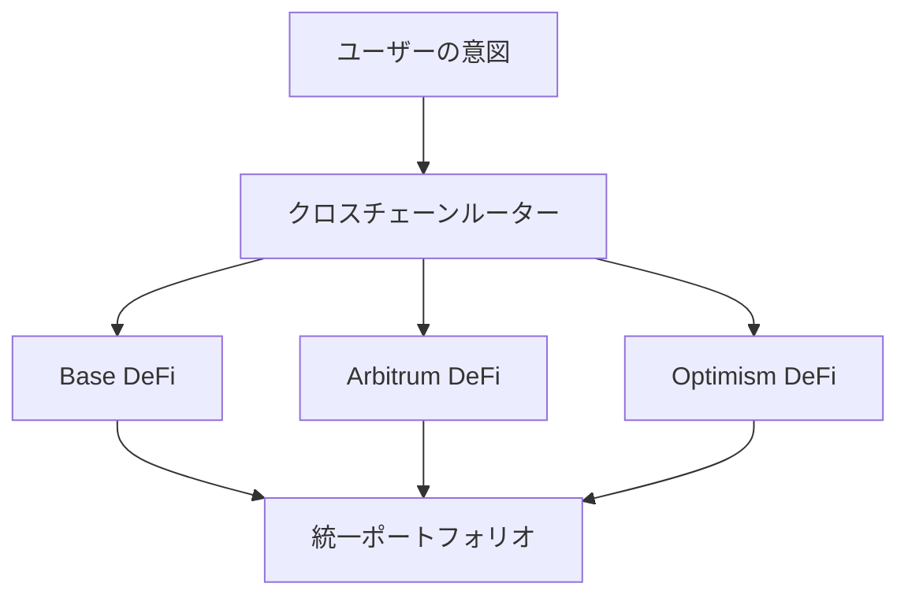

# クロスチェーンオペレーション

**主要なLayer 2、イーサリアム、ソラナ間でのシームレスなDeFi** 🌐

Zap
Pilotのクロスチェーン機能により、異なるウォレット、トークン、ブリッジを管理する複雑さなしに、さまざまなLayer
2ネットワーク、およびイーサリアムとソラナで最高のDeFi機会にアクセスできます。

## 🔗 マルチチェーンアーキテクチャ

### ネイティブクロスチェーン設計

クロスチェーンを後付けとして扱う他のプラットフォームとは異なり、Zap Pilotは、サポートされているLayer
2ネットワークでネイティブに動作するようにゼロから構築されています。

#### **統一された流動性プール**

あなたの投資は、最高の機会を見つけるためにサポートされているネットワークに自動的に分散され、単一の統一されたポートフォリオとして表示されます。

#### **インテリジェントなチェーン選択**

私たちのシステムは、各操作に最適なブロックチェーンを自動的に選択します。これには、セキュリティ、取引コスト、流動性、速度などの要因の組み合わせに基づいています。

## 🌐 サポートされているネットワーク

Zap Pilotは、主要なLayer
2、イーサリアム、ソラナを含む、ますます多くのネットワークで動作します。私たちのインテリジェントなルーティングシステムは、セキュリティ、取引コスト、流動性、速度などの要因の組み合わせに基づいて、特定の操作に最適なネットワークを自動的に選択します。

## ⚡ クロスチェーン実行エンジン

### インテリジェントルーティング

#### **マルチパス最適化**

インデックスファンド戦略に10,000ドルを投資すると、私たちのシステムは次のようになる可能性があります：

1. **Arbitrumに4,000ドルを展開**し、確立されたDeFiプロトコルとレバレッジポジションに
2. **Baseに3,500ドルを展開**し、新たな機会と機関投資家向けのプロトコルに
3. **Optimismに2,500ドルを展開**し、ガバナンストークンと実験的な戦略に
4. **1,000ドルを流動性として保持**し、ネットワーク間のリバランスに

#### **リアルタイム最適化**

ルーティングエンジンは以下を考慮します：

- **ガス価格の差**：ガスが最も安いときに実行
- **利回り率の変更**：より良い機会のあるチェーンに移動
- **流動性の状況**：流動性が不十分なチェーンを回避
- **ネットワークの混雑**：混雑したネットワークを回避
- **ブリッジの可用性**：信頼性の高いクロスチェーン転送を確保

### ブリッジ統合

#### **Across Protocol - 私たちのブリッジパートナー**

すべてのクロスチェーン操作にAcross
Protocolを使用し、最適なセキュリティ、速度、コスト効率を提供します：

| ブリッジ機能                 | Across Protocolの利点                          |
| ---------------------------- | ---------------------------------------------- |
| **サポートされているルート** | Base、Arbitrum、Optimism間のシームレスな転送   |
| **セキュリティモデル**       | 経済的保証付きの楽観的検証                     |
| **速度**                     | 平均完了時間1〜4分                             |
| **コスト**                   | 主要なブリッジプロバイダーの中で最も低い手数料 |
| **信頼性**                   | 最小限のダウンタイムで実績のある実績           |

#### **なぜAcross Protocolなのか**

- **楽観的なセキュリティ**：正直な行動に対する経済的インセンティブを備えた楽観的な検証を使用します
- **資本効率**：最小限の流動性要件によりコストが削減されます
- **迅速な決済**：UMAのオラクルシステムによる迅速なファイナリティ
- **実績のある信頼性**：強力なセキュリティ実績を持つ戦闘テスト済みのインフラストラクチャ
- **コスト効率**：頻繁なリバランスに最適化された競争力のある手数料

## 🎯 クロスチェーン戦略の利点

### 利回りの最適化

#### **ネットワーク固有の機会**

サポートされている各ネットワークは、さまざまな分野で優れています：

**Base**：

- Coinbaseエコシステムの利点と機関投資家の信頼
- 規制に準拠したプロトコルとコンプライアンス
- 機関投資家向けDeFiの採用拡大
- 従来の金融統合の機会
- 新興の高品質プロトコル

**Arbitrum**：

- 実績のあるプロトコルを備えた成熟したDeFiエコシステム
- 高度な取引インフラストラクチャ（GMX、Camelot）
- 確立された流動性プールと利回りの機会
- 同じセキュリティでイーサリアムよりも低コスト
- 高度なレバレッジ戦略

**Optimism**：

- 新しいDeFi実験のイノベーションハブ
- 強力なガバナンストークンエコシステム
- 開発者に優しい環境
- 機関投資家の採用拡大
- ユニークなプロトコルの機会（Velodrome、Synthetix）

#### **利回りアービトラージ**

私たちのシステムは、裁定取引の機会を継続的に特定して捉えます：

- **プロトコルレートの違い**：同じプロトコル、異なるチェーン
- **トークン価格の不一致**：ブリッジプレミアム/ディスカウントアービトラージ
- **インセンティブファーミング**：チェーン固有の流動性インセンティブ
- **ガス効率**：最も費用対効果の高い場所で実行

### リスク分散

#### **技術リスクの分散**

チェーン間で分散することにより、以下が削減されます：

- **単一チェーンのリスク**：1つのチェーンの稼働時間に依存しない
- **ブリッジのリスク**：複数のブリッジプロバイダーがカウンターパーティリスクを軽減
- **コンセンサスのリスク**：異なるコンセンサスメカニズム
- **ガバナンスのリスク**：1つのチェーンのガバナンス決定に左右されない

#### **規制リスクの軽減**

- **管轄区域の多様化**：さまざまな規制環境にまたがるプロトコル
- **コンプライアンスのオプション**：規制の進化に伴い、準拠したチェーンに移行
- **検閲耐性**：複数のチェーンが検閲リスクを軽減
- **運用の継続性**：1つのチェーンが問題に直面しても運用を継続

## 🔄 クロスチェーンリバランス

### インテリジェントなリバランス

#### **クロスチェーンポートフォリオ管理**

戦略をリバランスする際、私たちは以下を考慮します：

- **現在の配分**：資産が現在どこにあるか
- **目標配分**：チェーン間の最適な配分
- **リバランスコスト**：ブリッジ手数料と最適化の利点
- **市場の状況**：どのチェーンが最高の機会を提供するか

#### **例：インデックスファンドのリバランス**

**現在の状態：**

- Arbitrum：ポートフォリオの50％
- Base：ポートフォリオの30％
- Optimism：ポートフォリオの20％

**市場の変化：** Baseで新しい高利回りの機会が出現 **アクション：** Across
Protocolを使用して、2日間でArbitrumからBaseに15％を徐々にシフト **考慮事項：**
ブリッジコストと利回りの利点のバランスを取り、多様化を維持する

### コスト最適化

#### **リバランス効率**

- **バッチ操作**：複数のリバランスアクションを組み合わせる
- **ガスタイミング**：最適なガス価格ウィンドウ中に実行
- **パス最適化**：必要なブリッジの数を最小限に抑える
- **しきい値管理**：利点がコストを上回る場合にのみリバランスする

#### **ユーザーコストの節約**

手動のクロスチェーン管理と比較して：

- **80％低いガス料金**：バッチ処理と最適化による
- **90％少ない複雑さ**：自動化されたブリッジの選択と実行
- **100％少ない時間**：設定すればあとはお任せのクロスチェーン操作
- **より良い利回り**：見逃す可能性のある機会へのアクセス

## 📊 クロスチェーン分析

### 統一されたポートフォリオビュー

#### **チェーンにとらわれないレポート**

あなたのダッシュボードには以下が表示されます：

- **ポートフォリオ総額**：すべてのチェーンにわたる米ドル価値
- **チェーン配分**：各チェーンにどれだけの価値があるか
- **パフォーマンスの帰属**：どのチェーンがリターンに貢献したか
- **リスクエクスポージャー**：集中度と分散度のメトリクス

#### **クロスチェーンパフォーマンストラッキング**

- **利回り比較**：各チェーンで得られたAPY
- **コスト分析**：チェーン別のブリッジおよびガス料金
- **効率メトリクス**：支払われた手数料1ドルあたりのリターン
- **機会費用**：他のチェーンで見逃した可能性のあるもの

### ブリッジコスト追跡

#### **完全なコストの透明性**

すべてのクロスチェーンコストを追跡します：

- **ブリッジ手数料**：ブリッジプロトコルによって請求される明示的な手数料
- **ガス料金**：ブリッジトランザクションのL1およびL2ガス料金
- **スリッページ**：ブリッジ操作による価格への影響
- **機会費用**：ブリッジ中の資金の時間的価値

#### **ROI分析**

各クロスチェーン操作について：

- **コストの正当化**：なぜその動きが有益だったのか
- **損益分岐点までの時間**：ブリッジコストを回収するのにかかる時間
- **代替分析**：その動きがなかった場合に何が起こったか
- **最適化スコア**：ルーティングがどの程度うまく機能したか

## 🛡️ クロスチェーンセキュリティ

### セキュリティモデル

#### **多層セキュリティ**

- **ブリッジセキュリティ**：監査済みで実績のあるブリッジのみを使用
- **チェーンセキュリティ**：多額の場合はより安全なチェーンを優先
- **多様化**：複数のチェーンとブリッジにリスクを分散
- **監視**：すべてのチェーンでリアルタイムのセキュリティ監視

#### **ブリッジリスク管理**

- **ブリッジ制限**：ブリッジプロバイダーごとの最大エクスポージャー
- **セキュリティスコアリング**：ブリッジの健全性のリアルタイム評価
- **インシデント対応**：ブリッジのセキュリティイベントに即座に対応
- **保険適用**：利用可能な場合はブリッジの障害に対する保護

### 緊急手順

#### **クロスチェーン緊急対応**

セキュリティ問題が発生した場合：

1. **即時一時停止**：すべてのクロスチェーン操作を停止
2. **資産評価**：安全なポジションとリスクのあるポジションを特定
3. **緊急出口**：安全なチェーンへの迅速な引き出し
4. **ユーザーコミュニケーション**：状況とアクションに関する明確な更新
5. **回復計画**：体系的な回復と再開

---

クロスチェーン操作は、Zap
Pilotを真に強力なものにします。ユーザーにとってのシンプルさを維持しながら、DeFiユニバース全体にアクセスできます。個別に管理する複雑さなしに、すべてのチェーンの利点を得ることができます。

👉 **[リバランスについて学ぶ→](./rebalancing)** 👉 **[戦略の実行を探る→](./intent-execution)** 👉
**[サポートされているネットワークを見る→](../security)**
