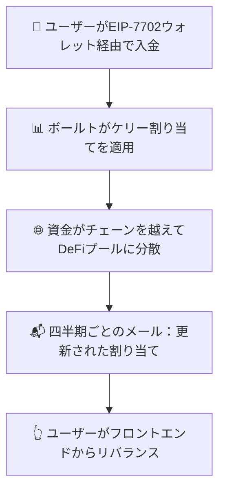

# 🚀 Zap Pilotの仕組み

## 🧠 プロトコルのメカニズム

Zap Pilotは、**非管理型のアルゴリズムによるポートフォリオ自動操縦**です ✨
EIP-7702を搭載した独自の**スマートEOAウォレット**を介して、資金を完全に管理できます。ワンクリックで**資金の最適化**、**リバランス**、**ルーティング**を支援します —管理権の委譲なし。ロックインなし。戦略的な提案と実行のみ。

### 主要な原則

- **完全なユーザーコントロール**：あなたのウォレット、あなたのキー
- **高度な割り当て**：数学的に最適化された戦略
- **透明な実行**：ワンクリックでの最適化

---

## 1️⃣ ユーザーの入金

👜
EIP-7702を搭載した**スマートEOAウォレット**から直接入金します。💡 資金は**戦略ボールト**に入ります — チェーンを越えて厳選されたDeFiの機会のバンドルです。

**参照：** [入門ガイド](../getting-started)

---

## 2️⃣ ボールト戦略

各ボールトは、次のような特定の投資戦略を表します：

- 💵 **ステーブルコインのイールドファーミング**
- 🔗 **リキッドステーキング**
- 🌉 **クロスチェーンのイールドハンティング**

資金はボールト内のプールに分散され、パフォーマンスとリスクに基づいて**重みが動的に調整されます**。📊

**詳細：** [投資戦略の概要](../strategies)

---

## 3️⃣ 📐 ケリー割り当て戦略

### ケリー基準とは？

ケリー基準は、一連の賭けの最適なサイズを決定するために使用される数式です。私たちの文脈では、リスクを管理しながら長期的な成長を最大化するために、さまざまなDeFiプロトコルに資金を割り当てるのに役立ちます。

#### 簡略化された式：

`割り当て ∝ 期待リターン / 分散`

🧮 主な利点：

- 📈 低ボラティリティ、高リワードのプールに高い重み付け
- 🛡️ 単一のプロトコルへの過度のエクスポージャーによるリスクの低減
- 🔄 市場の変化を反映するための四半期ごとの再計算

**詳細な説明：** [ケリー基準の詳細](../strategies/kelly-criterion)

---

## 4️⃣ ♻️ リバランス（ユーザー主導）

資産は**決してあなたのウォレットを離れない**ため、自動的にリバランスすることはできませんが、**非常に簡単に**行えます：

- 📬 **四半期ごと**：パーソナライズされたリバランスの推奨事項
- 👆 **ワンクリックリバランス**：ウォレットから戦略の更新を実行

**なぜユーザー主導なのか？** 私たちはあなたのコントロールと透明性を優先します。

---

## 5️⃣ 🗺️ 資産フローの概要

---

## 🔒 セキュリティと透明性

- **非管理型**：資金は常にあなたのウォレットに残ります
- **オンチェーン実行**：すべてのトランザクションは透明です
- **ユーザーコントロール**：すべての動きを承認します

**セキュリティの詳細：** [セキュリティインシデントと透明性](../security)

ザップ、リバランス、最適化 — 30秒未満で。あなたの暗号資産、あなたのキー、私たちの戦略。

👉 **[始める →](https://app.zap-pilot.org/)**

### 関連リソース

- [入門ガイド](../getting-started)
- [投資戦略](../strategies)
- [ケリー基準の説明](../strategies/kelly-criterion)
