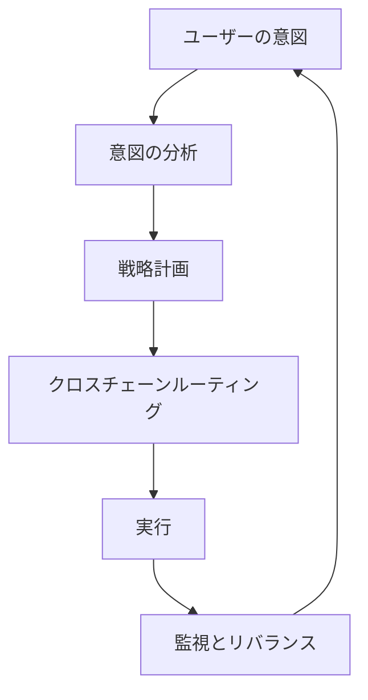

# Zap Pilotの仕組み

Zap
Pilotは、意図ベースの実行エンジンを通じて、複雑なDeFi操作をシンプルなワンクリック体験に変えます。魔法がどのように起こるかを次に示します。

## 🧠 意図ベースの実行

### 意図とは何ですか？

トランザクションを**どのように**実行するかを指定する代わりに、**何を**達成したいかを伝えるだけです：

```
意図：「500ドルを保守的なステーブルコイン戦略に投資する」

従来のDeFi：3つのチェーンで12以上のトランザクション
Zap Pilot：1クリック、完全に承認ベース
```

### 意図のライフサイクル



## ⚡ 3ステップのプロセス

### 1. **意図を表現する**

- 投資額を選択
- 戦略タイプを選択
- リスク設定
- 時間軸を定義

### 2. **AIによる計画**

- 現在の市場状況を分析
- 最適なプロトコルとチェーンを特定
- 最適な実行パスを計算
- ガス効率の高いトランザクションを計画

### 3. **承認による実行**

- 複数のチェーンで同時に実行
- 最低料金と最高レートに最適化
- リアルタイムで監視
- 必要に応じてリバランスを提案し、承認を得る

## 🔗 クロスチェーンインテリジェンス

### ネイティブマルチチェーンサポート

Zap Pilotは資産をブリッジするだけでなく、主要なLayer
2、イーサリアム、ソラナを含む複数のチェーンをネイティブに理解し、操作します。

### インテリジェントルーティング

私たちのルーティングエンジンは以下を考慮します：

- すべてのチェーンの**ガス料金**
- さまざまなプールの**流動性の深さ**
- 各ネットワークの**利回りの機会**
- **ブリッジのセキュリティ**と速度
- **現在のネットワークの混雑状況**

## 🎯 戦略の実行

### 自動化されたポートフォリオ管理

戦略が開始されると、Zap Pilotは継続的に：

#### **パフォーマンスの監視**

- すべてのポジションの利回りを追跡
- リアルタイムでリスクメトリクスを監視
- 戦略のドリフトを監視

#### **配分の最適化**

- 目標が5％以上ずれたときにリバランスを提案
- より高い利回りの機会に資産を移動

#### **リスク管理**

- プロトコル間で自動的に分散

### スマートリバランス

ケリー基準に基づく配分システム：

- 最適なポジションサイズを計算
- 資産間の相関を考慮
- 取引コストを最小化
- リスク調整後リターンを最大化

## 🛡️ スマートEOAウォレット統合

### スマートウォレットによる効率的な体験

ThirdWebのスマートウォレットインフラストラクチャを通じて：

- ペイマスター経由での対象取引に対する**ガススポンサーシップ**
- ソーシャルウォレットオプションによる**簡略化されたオンボーディング**
- 取引数を減らすための**バッチ操作**
- 統一された体験を提供する**マルチチェーンサポート**

### 強化されたセキュリティ

- 機関投資家向けの**マルチシグサポート**
- **ソーシャルリカバリー**オプション
- **支出制限**とコントロール
- 自動化戦略のための**セッションキー**

## 📊 リアルタイムインテリジェンス

### 市場分析

- 100以上のプロトコルで**24時間年中無休の利回り監視**
- DeFiプロトコルの**リスク評価**
- 最適な実行のための**流動性分析**

### ポートフォリオ分析

- **パフォーマンスの帰属** - リターンを牽引しているものを知る（近日公開）
- **リスクの分解** - エクスポージャーを理解する
- **シナリオ分析** - ポートフォリオのストレステスト
- **税金の最適化** - 課税対象イベントを最小化

## 🔄 継続的な最適化

### 動的な戦略調整

あなたの戦略は市場の状況とともに進化します：

#### **市場レジームの検出**

- 強気市場：リスクエクスポージャーを増やす
- 弱気市場：資本を保全する
- 横ばい市場：利回りの創出に焦点を当てる

#### **プロトコルの健全性監視**

- TVLの変更を追跡
- ガバナンスリスクを監視
- エクスプロイトの警告を監視
- 必要に応じて自動的にリスクオフ

## 🏗️ インフラストラクチャ

### スケールに対応した構築

- 迅速なプロトコル統合のための**モジュラーアーキテクチャ**
- リアルタイムの応答性のための**イベント駆動型システム**
- 失敗したトランザクションを防ぐための**冗長な実行**
- 99.9％のアップタイムSLAによる**高可用性**

### 統合パートナー

- 最高の交換レートのための**20以上のDEXアグリゲーター**
- 多様な機会のための**50以上の利回りプロトコル**
- 信頼性の高いクロスチェーンのための**10以上のブリッジプロバイダー**
- リスクカバレッジのための**5以上の保険プロバイダー**

---

実際に見てみませんか？

👉 **[始める→](../getting-started)** 👉 **[戦略を見る→](../strategies)**
