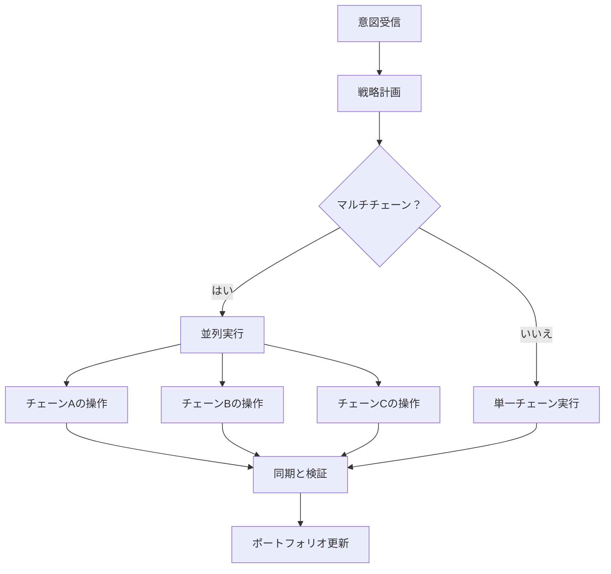

# 意図実行エンジン

Zap
Pilotの心臓部は、ユーザーの意図を複数のブロックチェーンにわたる最適なDeFi操作に変換する洗練されたシステムである意図実行エンジンです。

## 🎯 意図を理解する

### 意図を構成するもの

意図とは、それを達成する方法ではなく、達成したいことのハイレベルな表現です：

#### **従来のDeFiアプローチ：**

```
1. イーサリアムからArbitrumにUSDCをブリッジする
2. Uniswap V3でUSDCの50％をETHに交換する
3. プールにUSDC/ETHの流動性を追加する
4. ConvexにLPトークンをステークする
5. 報酬を請求して複利運用する
```

#### **意図ベースのアプローチ：**

```
「中程度のリスク許容度で、ETH/ステーブルコインのイールドファーミングに1000ドル投資したい」
```

### 意図の構成要素

すべての意図には以下が含まれます：

- **目的**：達成したいこと
- **制約**：リスク制限、時間設定
- **好み**：チェーンの好み、ガス許容度
- **コンテキスト**：現在のポートフォリオ、市場状況

## ⚙️ 実行パイプライン

### 1. 意図の解析と検証（例）

```typescript
interface UserIntent {
  objective: 'invest' | 'withdraw' | 'rebalance';
  amount: string;
  strategy: 'stablecoin' | 'index' | 'btc' | 'eth' | 'custom';
  riskTolerance: 'low' | 'medium' | 'high';
  timeHorizon: 'short' | 'medium' | 'long';
  constraints: {
    maxSlippage: number;
    gasLimit: string;
    chainPreferences: string[];
  };
}
```

### 2. 戦略の解決

当社のAIエンジンがあなたの意図を以下と照らし合わせて分析します：

- **現在の市場状況**
- **利用可能な利回りの機会**
- **既存のポートフォリオ**
- **リスクリターンの最適化**

### 3. 実行計画

プランナーが最適な実行シーケンスを作成します：

#### **パス検索**

- すべての可能な実行ルートを特定
- 各パスのコストとリスクを計算
- 以下を考慮して最適なルートを選択：
  - 総ガス料金
  - 価格への影響
  - 実行までの時間
  - 失敗の確率

#### **トランザクションの順序付け**

- 複雑な操作を原子的なステップに分割
- 各ステップでの障害回復を計画
- 可能な場合は並列実行を最適化

### 4. クロスチェーンオーケストレーション

複数のチェーンで同時に操作を実行します：



## 🧠 AIによる最適化

### 市場インテリジェンス

当社のシステムは以下から継続的に学習します：

- すべてのプロトコルの**過去の利回りデータ**
- 異なるチェーンの**ガス価格パターン**
- 時間の経過に伴う**流動性の深さ**の変化
- **プロトコルのリスクイベント**と対応

### 適応戦略

戦略は以下に基づいて進化します：

- **市場レジームの変化**（強気/弱気/横ばい）
- **あなたの行動パターン**と好み
- 過去の実行からの**パフォーマンスフィードバック**
- **新しいプロトコルの機会**

## 🔄 継続的な監視

### リアルタイムポートフォリオ追跡

実行後、私たちは以下を監視します：

- すべてのプロトコルでの**ポジションパフォーマンス**
- **リスクメトリクスの変化**（相関、ボラティリティ）
- **利回り最適化**の機会
- **リバランストリガー**条件

### プロアクティブな管理

自動アクションには以下が含まれます：

- **報酬の請求**と自動複利
- 配分が5％以上ずれた場合の**リバランス**
- 市場のストレス時の**リスクオフ**の動き
- より良いレートへの**利回り最適化**の切り替え

### アラートシステム

以下の通知を受け取ります：

- ポジションの**大幅な利益/損失**
- あなたのプロファイルに一致する**新しい利回りの機会**
- 使用しているプロトコルの**リスク警告**
- **リバランス**操作の完了

## 🛠️ 高度な機能

### カスタム意図スクリプティング

パワーユーザーはカスタム意図を作成できます（例）：

```javascript
// 例：ドルコスト平均法意図
const dcaIntent = {
  objective: 'recurring_invest',
  amount: '500',
  frequency: 'weekly',
  strategy: 'index',
  duration: '12_months',
  conditions: {
    pauseIf: 'portfolio_loss > 20%',
    increaseIf: 'btc_price < 40000',
  },
};
```

### バッチ意図処理

一度に複数の意図を送信します：

- 戦略間の**ポートフォリオリバランス**
- 分散化のための**マルチ戦略配分**
- DCAとリバランスのための**スケジュールされた操作**

### 意図テンプレート

一般的な戦略のための事前構築済みテンプレート：

- **インデックスファンド**：時価総額加重戦略、S&P-500のような戦略。
- **保守的な収入**：ステーブルコインの利回りに焦点を当てる
- **積極的な成長**：高リスク、高リターンの戦略
- **市場中立**：デルタニュートラル戦略

---

意図実行エンジンこそがZap
Pilotを魔法のようにするものです。複雑さをシンプルさに変えながら、DeFiのパワーと柔軟性を維持します。

👉 **[クロスチェーンオペレーションについて学ぶ→](./cross-chain-operations)** 👉
**[リバランスを探る→](./rebalancing)**
