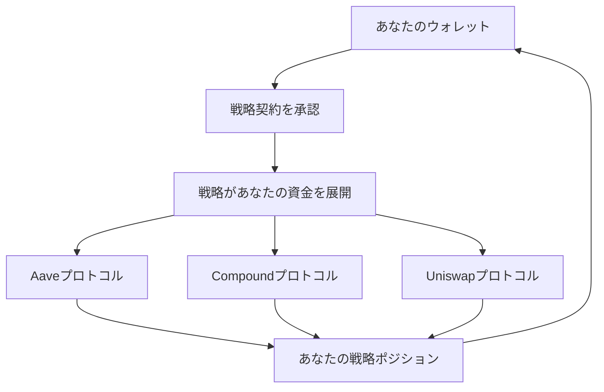

# 安全性とセキュリティの概要

**あなたの資金、あなたのコントロール - 常に** 🛡️

セキュリティは、Zap
Pilotで行うすべてのことの基盤です。DeFiの基本原則である分散化、透明性、ユーザーコントロールを維持しながら、投資を保護する方法を学びましょう。

## 🔐 設計による非保管

### あなたが資金を管理します

**最も重要**：Zap Pilotはあなたの資金を一切保管しません。これが意味することは次のとおりです：

#### **あなたの秘密鍵 = あなたのコントロール**

- 🔑
  **あなたのウォレット、あなたの鍵** - 私たちはあなたの秘密鍵を見たり保存したりすることはありません
- 🏦 **中央集権的な保管なし** - 資金はZap Pilotアカウントにはありません
- 🚫 **私たちはあなたの資産を凍結または没収することはできません**
- ✅ **いつでも終了できます** - プロトコルから直接引き出す

#### **非保管の仕組み**

あなたの資金は、あなたのウォレットから直接DeFiプロトコルに流れ、Zap
Pilotはインテリジェントなルーティングと管理のみを提供します。

### スマートコントラクトアーキテクチャ

#### **不変の戦略契約**

- 📋 **ユーザーごとに1つの契約** - あなたの戦略は隔離されています
- 🔒 **あなただけがアップグレード可能** - 許可なく戦略を変更することはできません
- 🚪 **緊急出口機能** - インターフェースがダウンしていても常にアクセス可能
- 🔍 **オープンソースで監査済み** - すべてのコードは公に検証可能です

#### **許可構造**

Zap Pilotができること：

- ✅ あなたの戦略に従ってリバランスを実行する
- ✅ 報酬を自動的に複利運用する
- ✅ 分析とレポートを提供する

Zap Pilotができないこと：

- ❌ 私たちの口座に資金を引き出す
- ❌ 承認なしにあなたの戦略を変更する
- ❌ あなたが終了するのを防ぐ
- ❌ ウォレットを紛失した場合に資金にアクセスする

## 🏗️ 多層セキュリティアーキテクチャ

### 1. スマートコントラクトのセキュリティ

#### **専門家による監査**

- 🔬 **複数の監査会社**：Trail of Bits、ConsenSys Diligence、Quantstamp
- 📊 **継続的な監査**：すべての主要な更新をレビュー
- 🏆 **バグバウンティプログラム**：脆弱性発見に50万ドルの報奨金
- 📈 **実戦テスト**：メインネット展開前に数ヶ月間テストネットで展開

#### **形式的検証**

- 🧮 **重要な機能の数学的証明**
- 🔒 **不変条件のチェック** - 特定の条件が常に維持される
- 🎯 **プロパティテスト** - 広範な自動テスト
- 📝 **ドキュメント**：すべての機能が徹底的に文書化されている

#### **セキュリティ機能**

- ⏱️ 管理機能の**タイムロック**
- 🛑 **緊急一時停止**メカニズム
- 🔄 すべての外部呼び出しに対する**再入防止**
- 💰 過度の集中を防ぐための**ポジション制限**

### 2. プロトコルのリスク管理

#### **プロトコル選択基準**

厳格な基準を満たすプロトコルのみを統合します：

**最小要件：**

- ✅ **メインネットで6ヶ月以上稼働**
- ✅ **1億ドル以上のTVLを維持**
- ✅ **評判の良い会社によるセキュリティ監査**
- ✅ **バグバウンティプログラムを積極的に維持**
- ✅ **ガバナンスの透明性**と分散化

**継続的な監視：**

- 📊 **TVL追跡** - 大規模な流出があればアラート
- 🔍 **コード変更**をセキュリティへの影響について監視
- 🏛️ **ガバナンス**を有害な提案について監視
- 📰 **コミュニティの感情**と専門家の意見

#### **リスクスコアリングシステム**

すべてのプロトコルはリスクスコア（1〜100）を取得します：

- **90-100**：実戦で試されたプロトコル（Aave、Compound）
- **80-89**：良好な実績を持つ確立されたプロトコル
- **70-79**：強力なセキュリティ慣行を持つ新しいプロトコル
- **70未満**：統合対象外

### 3. 保険適用

#### **プロトコル保険**

- 🏛️ **Nexus Mutual**：主要なプロトコルのスマートコントラクトカバー
- 🛡️ **InsurAce**：追加のカバーレイヤー
- 🔒 **Unslashed**：スラッシングおよび技術的リスクカバー
- 💰 **カバー額**：ユーザーごとにプロトコルごとに最大100万ドル

#### **保険の仕組み**

1. **リスク評価**：保険会社がプロトコルの安全性を評価
2. **保険の購入**：ユーザーの資金のために保険を購入
3. **請求プロセス**：ハッキングが発生した場合、自動的に請求を提出
4. **支払い**：ユーザーはカバーされた損失の補償を受け取ります

#### **カバーされるもの**

- ✅ カバーされたプロトコルの**スマートコントラクトエクスプロイト**
- ✅ **オラクル操作**攻撃
- ✅ 資金を流出させる**ガバナンス攻撃**
- ✅ 資金損失を引き起こす**技術的障害**

#### **カバーされないもの**

- ❌ **市場価格の変動**（保険ではなく、投資です）
- ❌ **ユーザーエラー**（間違ったアドレスへの送信など）
- ❌ **カバーされていないプロトコル**（カバーステータスを明確にマークします）
- ❌ プロトコルの運用に影響を与える**規制の変更**

## 🚨 リスク監視と対応

### リアルタイム監視

#### **24時間365日の監視**

- 🖥️ すべての統合プロトコルの**自動監視**
- 👥 セキュリティチームによる**人的監視**
- 🚨 異常な活動に対する**アラートシステム**
- 📱 緊急事態のための**モバイルアラート**

#### **監視される主要なメトリクス**

- 💧 すべてのプロトコルの**流動性レベル**
- 📊 **TVLの変更**と大規模な流出
- 🔄 異常なパターンのための**スマートコントラクトの相互作用**
- 📈 操作試行のための**オラクル価格**
- 🏛️ セキュリティに影響を与える可能性のある**ガバナンス提案**

### 緊急対応

#### **インシデント対応計画**

1. **検出**（自動アラート+人的監視）
2. **評価**（重大度と範囲を決定）
3. **アクション**（自動または手動の対応）
4. **コミュニケーション**（ユーザーに直ちに通知）
5. **回復**（安全に通常の運用を復元）

#### **自動保護**

- 🛑 異常が検出された場合に操作を停止する**サーキットブレーカー**
- 🏃 侵害されたプロトコルからの**自動退出**
- 🔒 さらなる損傷を防ぐための**ポジションの凍結**
- 💰 利用可能な最も安全なプロトコルでの**資金保全**

#### **手動介入**

- 🎯 緊急の決定のための**緊急ガバナンス**
- 📞 主要な問題に対する**直接のユーザー連絡**
- 🔧 リスクを回避するための**戦略調整**
- 💼 該当する場合に直ちに提出される**保険金請求**

## 🔍 透明性と監査可能性

### オープンソースへのコミットメント

#### **公開コード**

- 📂 すべての契約コードを含む**GitHubリポジトリ**
- 📝 すべての機能と特徴の**ドキュメント**
- 🔄 時間の経過に伴うすべての変更を示す**バージョン管理**
- 👥 **コミュニティの貢献**を歓迎し、報いる

#### **リアルタイムデータ**

- 🌐 すべての操作の**オンチェーン検証**
- 📊 システムの健全性を示す**公開ダッシュボード**
- 💰 誰でも閲覧可能な**プロトコルポジション**
- 📈 リアルタイムで更新される**パフォーマンスデータ**

### 監査証跡

#### **完全な取引履歴**

- 🔗 すべての操作の**ブロックチェーンレコード**
- 📋 タイムスタンプと理由付きの**戦略変更**
- 💸 すべての料金を示す**料金計算**
- 🔄 完全な正当化を伴う**リバランスロジック**

#### **ガバナンスの透明性**

- 🗳️ 実装前に公に閲覧可能な**すべての提案**
- 📊 コミュニティの決定を示す**投票記録**
- ⏱️ 変更をユーザーに事前に通知する**タイムロック**
- 🔄 何が変更されたかを正確に示す**実装ログ**

## 🛡️ ユーザーセキュリティのベストプラクティス

### ウォレットのセキュリティ

#### **必須の慣行**

- 🔐 大金には**ハードウェアウォレット**（Ledger、Trezor）
- 📝 複数の安全な場所に**シードフレーズをバックアップ**
- 🔒 可能な場合は**強力なパスワード**と2FA
- 🚫 **秘密鍵やシードフレーズを共有しない**

#### **フィッシング対策**

- 🌐 **公式サイトをブックマーク**（zap-pilot.com）
- 🔍 ウォレットを接続する前に**URLを確認**
- 📧 **メールアドレスを確認** - @zap-pilot.comからのみメールを送信します
- 🚫 **どのウェブサイトにもシードフレーズを入力しない**

### 取引の安全性

#### **すべての取引の前に**

- ✅ **契約アドレスが公式ドキュメントと一致することを確認**
- 💰 **金額と小数点を注意深く確認**
- ⛽ **ガス料金を確認** - 疑わしいほど高い場合は拒否
- 🌐 **ネットワークが意図と一致することを確認**

#### **注意すべき危険信号**

- 🚨 インターフェースからの**予期しない取引リクエスト**
- 💸 **異常に高いガス料金**（複雑な攻撃を示している可能性があります）
- 🔗 戦略に関係のない**不明なトークンの承認**
- 📧 即時行動を求める**緊急メッセージ**

## 📞 セキュリティサポート

### セキュリティ問題の報告

#### **バグバウンティプログラム**

- 💰 重大な脆弱性に対して**最大500,000ドル**
- 🔒 **責任ある開示**プロセス
- 🏆 セキュリティ研究者のための**殿堂**
- 📧 プライベートレポート用の**security@zap-pilot.com**

#### **緊急連絡先**

- 🚨 **重大な問題**：security@zap-pilot.com
- 📞 **24時間年中無休のホットライン**：アクティブなポジションを持つユーザー向け
- 💬 **Discord #security**：一般的なセキュリティに関する質問用
- 📱 **モバイルアラート**：緊急事態のプッシュ通知

### セキュリティ教育

#### **リソース**

- 📚 DeFi初心者向けの**セキュリティガイド**
- 🎥 ウォレットセキュリティに関する**ビデオチュートリアル**
- 📰 最新の脅威と保護に関する**ブログ投稿**
- 🎓 セキュリティ専門家との**ウェビナー**

---

セキュリティはテクノロジーだけではありません。透明性を通じて信頼を築き、ユーザーにコントロールを与え、私たちが行うすべてのことで最高の基準を維持することです。

あなたの資金は常にあなたのものです。私たちはそれらがより賢く機能するのを手伝うためにここにいます。
