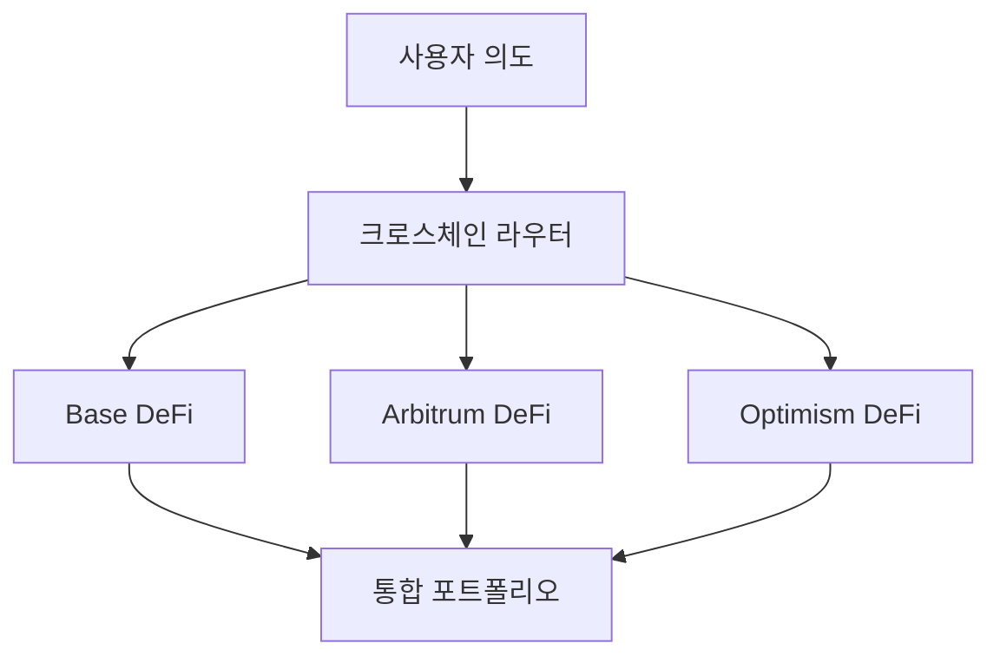

# 크로스체인 운영

**선도적인 레이어 2, 이더리움, 솔라나 간의 원활한 DeFi** 🌐

Zap Pilot의 크로스체인 기능은 다양한 레이어 2 네트워크와 이더리움, 솔라나에서 최고의 DeFi 기회에
접근할 수 있도록 해주며, 다른 지갑, 토큰 또는 브릿지를 관리하는 복잡성 없이 가능합니다.

## 🔗 멀티체인 아키텍처

### 네이티브 크로스체인 설계

크로스체인을 나중에 생각하는 다른 플랫폼과 달리, Zap Pilot은 지원되는 레이어 2 네트워크에서
기본적으로 작동하도록 처음부터 구축되었습니다.

#### **통합 유동성 풀**

귀하의 투자는 최상의 기회를 찾기 위해 지원되는 네트워크에 자동으로 분산되며, 단일 통합 포트폴리오로
표시됩니다.

#### **지능형 체인 선택**

당사 시스템은 보안, 거래 비용, 유동성, 속도 등 여러 요소를 조합하여 각 작업에 가장 적합한 블록체인을
자동으로 선택합니다.

## 🌐 지원되는 네트워크

Zap Pilot은 선도적인 레이어 2, 이더리움, 솔라나를 포함한 점점 더 많은 네트워크에서 작동합니다.
당사의 지능형 라우팅 시스템은 보안, 거래 비용, 유동성, 속도 등 여러 요소를 조합하여 각 작업에 가장
적합한 네트워크를 자동으로 선택합니다.

## ⚡ 크로스체인 실행 엔진

### 지능형 라우팅

#### **다중 경로 최적화**

인덱스 펀드 전략에 10,000달러를 투자하면 당사 시스템은 다음과 같이 할 수 있습니다:

1. Arbitrum에 **4,000달러 배포** (기존 DeFi 프로토콜 및 레버리지 포지션용)
2. Base에 **3,500달러 배포** (신흥 기회 및 기관 등급 프로토콜용)
3. Optimism에 **2,500달러 배포** (거버넌스 토큰 및 실험적 전략용)
4. **1,000달러 유동성으로 보유** (네트워크 간 리밸런싱용)

#### **실시간 최적화**

라우팅 엔진은 다음을 고려합니다:

- **가스 가격 차이**: 가스가 가장 저렴할 때 실행
- **수익률 변화**: 더 나은 기회가 있는 체인으로 이동
- **유동성 조건**: 유동성이 부족한 체인 회피
- **네트워크 혼잡**: 혼잡한 네트워크 우회
- **브릿지 가용성**: 신뢰할 수 있는 크로스체인 전송 보장

### 브릿지 통합

#### **Across Protocol - 우리의 브릿지 파트너**

우리는 모든 크로스체인 작업에 Across Protocol을 사용하여 최적의 보안, 속도 및 비용 효율성을
제공합니다:

| 브릿지 기능       | Across Protocol 이점                     |
| ----------------- | ---------------------------------------- |
| **지원되는 경로** | Base, Arbitrum, Optimism 간 원활한 전송  |
| **보안 모델**     | 경제적 보증을 통한 낙관적 검증           |
| **속도**          | 평균 완료 시간 1-4분                     |
| **비용**          | 주요 브릿지 제공업체 중 가장 낮은 수수료 |
| **신뢰성**        | 최소한의 다운타임으로 입증된 실적        |

#### **Across Protocol을 선택하는 이유**

- **낙관적 보안**: 정직한 행동에 대한 경제적 인센티브를 통해 낙관적 검증을 사용합니다
- **자본 효율성**: 최소한의 유동성 요구 사항으로 비용 절감
- **빠른 정산**: UMA의 오라클 시스템을 통한 빠른 최종성
- **입증된 신뢰성**: 강력한 보안 기록을 가진 전투 테스트를 거친 인프라
- **비용 효율성**: 빈번한 리밸런싱에 최적화된 경쟁력 있는 수수료

### 오류 처리

#### **강력한 오류 복구**

크로스체인 작업은 여러 지점에서 실패할 수 있습니다. 당사 시스템은 다음을 처리합니다:

**브릿지 오류:**

- **감지**: 브릿지 상태 실시간 모니터링
- **롤백**: 자동 재시도 및 대체 브릿지 사용
- **복구**: 멈춘 트랜잭션 수동 개입
- **알림**: 사용자에게 경고 및 명확한 다음 단계 제공

**대상 체인 문제:**

- **가스 추정**: 가스 오류 예측 및 처리
- **슬리피지 보호**: 변동성 조건에 따라 조정
- **타임아웃 처리**: 자동 재시도 및 매개변수 조정
- **긴급 복구**: 수동 트랜잭션 복구 절차

## 🎯 크로스체인 전략 이점

### 수익 최적화

#### **네트워크별 기회**

우리가 지원하는 각 네트워크는 다른 영역에서 탁월합니다:

**Base**:

- 코인베이스 생태계 이점 및 기관 신뢰
- 규제 친화적인 프로토콜 및 규정 준수
- 기관 DeFi 채택 증가
- 전통 금융 통합 기회
- 신흥 고품질 프로토콜

**Arbitrum**:

- 검증된 프로토콜을 갖춘 성숙한 DeFi 생태계
- 고급 거래 인프라 (GMX, Camelot)
- 확립된 유동성 풀 및 수익 기회
- 이더리움보다 낮은 비용, 동일한 보안
- 정교한 레버리지 전략

**Optimism**:

- 새로운 DeFi 실험을 위한 혁신 허브
- 강력한 거버넌스 토큰 생태계
- 개발자 친화적인 환경
- 기관 채택 증가
- 고유한 프로토콜 기회 (Velodrome, Synthetix)

#### **수익 차익 거래**

당사 시스템은 차익 거래 기회를 지속적으로 식별하고 포착합니다:

- **프로토콜 요율 차이**: 동일한 프로토콜, 다른 체인
- **토큰 가격 불일치**: 브릿지 프리미엄/할인 차익 거래
- **인센티브 파밍**: 체인별 유동성 인센티브
- **가스 효율성**: 가장 비용 효율적인 곳에서 실행

### 위험 분산

#### **기술 위험 분산**

체인 간 분산은 다음을 줄입니다:

- **단일 체인 위험**: 단일 체인의 가동 시간에 의존하지 않음
- **브릿지 위험**: 여러 브릿지 제공업체가 상대방 위험을 줄임
- **합의 위험**: 다른 합의 메커니즘
- **거버넌스 위험**: 단일 체인의 거버넌스 결정에 종속되지 않음

#### **규제 위험 완화**

- **관할권 분산**: 다른 규제 환경에 걸친 프로토콜
- **규정 준수 선택권**: 규제 진화에 따라 규정 준수 체인으로 이동
- **검열 저항**: 여러 체인이 검열 위험을 줄임
- **운영 연속성**: 한 체인에 문제가 발생하더라도 운영 지속

## 🔄 크로스체인 리밸런싱

### 지능형 리밸런싱

#### **크로스체인 포트폴리오 관리**

전략을 리밸런싱할 때 다음을 고려합니다:

- **현재 할당**: 자산이 현재 어디에 있는지
- **목표 할당**: 체인 간 최적 분배
- **리밸런싱 비용**: 브릿지 수수료 대 최적화 이점
- **시장 상황**: 어떤 체인이 최상의 기회를 제공하는지

#### **예시: 인덱스 펀드 리밸런싱**

**현재 상태:**

- Arbitrum: 포트폴리오의 50%
- Base: 포트폴리오의 30%
- Optimism: 포트폴리오의 20%

**시장 변화:** Base에 새로운 고수익 기회 발생 **조치:** Across Protocol을 사용하여 2일 동안
Arbitrum에서 Base로 15%를 점진적으로 이동 **고려 사항:** 브릿지 비용과 수익 이점의 균형을 맞추고
분산 유지

### 비용 최적화

#### **리밸런싱 효율성**

- **일괄 작업**: 여러 리밸런싱 작업을 결합
- **가스 타이밍**: 최적의 가스 가격 창에서 실행
- **경로 최적화**: 필요한 브릿지 수 최소화
- **임계값 관리**: 이점이 비용을 초과할 때만 리밸런싱

#### **사용자 비용 절감**

수동 크로스체인 관리와 비교:

- **80% 낮은 가스 비용**: 일괄 처리 및 최적화를 통해
- **90% 낮은 복잡성**: 자동화된 브릿지 선택 및 실행
- **100% 적은 시간**: 설정하고 잊어버리는 크로스체인 작업
- **더 나은 수익**: 놓칠 수 있는 기회에 접근

## 📊 크로스체인 분석

### 통합 포트폴리오 보기

#### **체인 불가지론적 보고**

대시보드에 다음이 표시됩니다:

- **총 포트폴리오 가치**: 모든 체인에 걸친 USD 가치
- **체인 할당**: 각 체인에 있는 가치
- **성과 귀속**: 어떤 체인이 수익에 기여했는지
- **위험 노출**: 집중 및 분산 지표

#### **크로스체인 성과 추적**

- **수익 비교**: 각 체인에서 얻은 APY
- **비용 분석**: 체인별 브릿지 및 가스 비용
- **효율성 지표**: 지불된 수수료 1달러당 수익
- **기회 비용**: 다른 체인에서 놓쳤을 수 있는 것

### 브릿지 비용 추적

#### **완전한 비용 투명성**

모든 크로스체인 비용 추적:

- **브릿지 수수료**: 브릿지 프로토콜이 청구하는 명시적 수수료
- **가스 비용**: 브릿지 트랜잭션에 대한 L1 및 L2 가스 비용
- **슬리피지**: 브릿지 작업으로 인한 가격 영향
- **기회 비용**: 브릿지 중 자금의 시간 가치

#### **ROI 분석**

각 크로스체인 작업에 대해:

- **비용 정당화**: 왜 이 움직임이 수익성이 있었는지
- **손익분기점까지의 시간**: 브릿지 비용을 회수하는 데 걸리는 시간
- **대체 분석**: 이 움직임이 없었다면 어떻게 되었을까
- **최적화 점수**: 라우팅이 얼마나 잘 수행되었는지

## 🛡️ 크로스체인 보안

### 보안 모델

#### **다층 보안**

- **브릿지 보안**: 감사되고 입증된 브릿지만 사용
- **체인 보안**: 더 큰 금액에 대해 더 안전한 체인 선호
- **분산**: 여러 체인 및 브릿지에 위험 분산
- **모니터링**: 모든 체인에 걸친 실시간 보안 모니터링

#### **브릿지 위험 관리**

- **브릿지 제한**: 브릿지 제공업체당 최대 노출
- **보안 점수**: 브릿지 상태의 실시간 평가
- **사고 대응**: 브릿지 보안 이벤트에 대한 즉각적인 조치
- **보험 적용**: 사용 가능한 경우 브릿지 장애에 대한 보호

### 비상 절차

#### **크로스체인 비상 대응**

보안 문제가 발생한 경우:

1. **즉시 일시 중지**: 모든 크로스체인 작업 중지
2. **자산 평가**: 안전한 포지션과 위험한 포지션 식별
3. **긴급 인출**: 안전한 체인으로 신속하게 인출
4. **사용자 통신**: 상황 및 조치에 대한 명확한 업데이트
5. **복구 계획**: 체계적인 복구 및 재개

---

크로스체인 작업은 Zap Pilot을 진정으로 강력하게 만듭니다. 사용자에게 단순성을 유지하면서 전체 DeFi
우주에 접근할 수 있습니다. 개별적으로 관리하는 복잡성 없이 모든 체인의 이점을 얻을 수 있습니다.

👉 **[리밸런싱에 대해 알아보기 →](./rebalancing)** 👉 **[전략 실행 탐색 →](./intent-execution)** 👉
**[지원되는 네트워크 보기 →](../security)**
