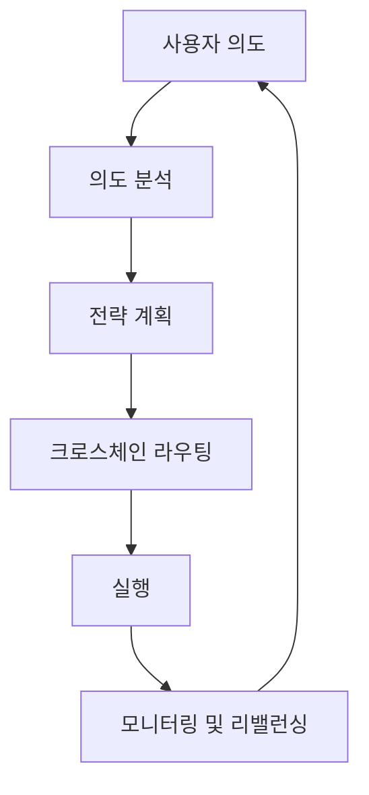

# Zap Pilot 작동 방식

Zap Pilot은 의도 기반 실행 엔진을 통해 복잡한 DeFi 작업을 간단한 원클릭 경험으로 변환합니다. 마법이
어떻게 일어나는지 살펴보세요:

## 🧠 의도 기반 실행

### 의도란 무엇인가요?

트랜잭션을 **어떻게** 실행할지 지정하는 대신, **무엇을** 달성하고 싶은지 알려주기만 하면 됩니다:

```
의도: "보수적인 스테이블코인 전략에 500달러 투자"

기존 DeFi: 3개 체인에 걸쳐 12개 이상의 트랜잭션
Zap Pilot: 1클릭, 완전 승인
```

### 의도 수명 주기



## ⚡ 3단계 프로세스

### 1. **의도 표현**

- 투자 금액 선택
- 전략 유형 선택
- 위험 선호도 설정
- 시간 범위 정의

### 2. **AI 기반 계획**

- 현재 시장 상황 분석
- 최적의 프로토콜 및 체인 식별
- 최상의 실행 경로 계산
- 가스 효율적인 트랜잭션 계획

### 3. **승인 실행**

- 여러 체인에서 동시에 실행
- 최저 수수료 및 최상의 요율로 최적화
- 실시간 모니터링
- 필요에 따라 리밸런싱 제안, 승인 대기

## 🔗 크로스체인 인텔리전스

### 네이티브 멀티체인 지원

Zap Pilot은 자산을 브릿지하는 것뿐만 아니라, 선도적인 레이어 2, 이더리움, 솔라나를 포함한 여러
체인을 기본적으로 이해하고 작동합니다.

### 지능형 라우팅

당사의 라우팅 엔진은 다음을 고려합니다:

- 모든 체인의 **가스 비용**
- 다양한 풀의 **유동성 깊이**
- 각 네트워크의 **수익 기회**
- **브릿지 보안** 및 속도
- **현재 네트워크 혼잡**

## 🎯 전략 실행

### 자동화된 포트폴리오 관리

전략이 활성화되면 Zap Pilot은 지속적으로 다음을 수행합니다:

#### **성과 모니터링**

- 모든 포지션의 수익 추적
- 실시간으로 위험 지표 모니터링
- 전략 드리프트 감시

#### **할당 최적화**

- 목표가 5% 이상 벗어날 때 리밸런싱 제안
- 더 높은 수익 기회로 자산 이동

#### **위험 관리**

- 프로토콜 간 자동 분산

### 스마트 리밸런싱

당사의 켈리 기준 기반 할당 시스템은 다음을 수행합니다:

- 최적의 포지션 크기 계산
- 자산 간의 상관 관계 고려
- 트랜잭션 비용 최소화
- 위험 조정 수익 극대화

## 🛡️ 계정 추상화 통합

### 계정 추상화를 통한 가스리스 경험

ThirdWeb의 스마트 지갑 인프라를 통해:

- 페이마스터를 통한 적격 트랜잭션에 대한 **가스 후원**
- 소셜 지갑 옵션으로 **간소화된 온보딩**
- 트랜잭션 수를 줄이는 **배치 작업**
- 통합된 경험의 **멀티체인 지원**

### 향상된 보안

- 기관 사용자를 위한 **다중 서명 지원**
- **소셜 복구** 옵션
- **지출 한도** 및 제어
- 자동화된 전략을 위한 **세션 키**

## 📊 실시간 인텔리전스

### 시장 분석

- 100개 이상의 프로토콜에서 **24시간 연중무휴 수익 모니터링**
- DeFi 프로토콜의 **위험 평가**
- 최적의 실행을 위한 **유동성 분석**

### 포트폴리오 분석

- **성과 귀속** - 수익을 주도하는 요인 파악 (출시 예정)
- **위험 분해** - 노출 이해
- **시나리오 분석** - 포트폴리오 스트레스 테스트
- **세금 최적화** - 과세 대상 이벤트 최소화

## 🔄 지속적인 최적화

### 동적 전략 조정

당신의 전략은 시장 상황에 따라 진화합니다:

#### **시장 체제 감지**

- 강세장: 위험 노출 증가
- 약세장: 자본 보존
- 횡보장: 수익 창출에 집중

#### **프로토콜 상태 모니터링**

- TVL 변경 추적
- 거버넌스 위험 모니터링
- 익스플로잇 경고 감시
- 필요할 때 자동 위험 해제

## 🏗️ 인프라

### 확장을 위한 구축

- 빠른 프로토콜 통합을 위한 **모듈식 아키텍처**
- 실시간 응답성을 위한 **이벤트 기반 시스템**
- 실패한 트랜잭션을 방지하기 위한 **중복 실행**
- 99.9% 가동 시간 SLA를 통한 **고가용성**

### 통합 파트너

- 최상의 스왑 요율을 위한 **20개 이상의 DEX 애그리게이터**
- 다양한 기회를 위한 **50개 이상의 수익 프로토콜**
- 신뢰할 수 있는 크로스체인을 위한 **10개 이상의 브릿지 제공업체**
- 위험 보장을 위한 **5개 이상의 보험 제공업체**

---

실제로 작동하는 것을 볼 준비가 되셨나요?

👉 **[시작하기 →](../getting-started)** 👉 **[전략 보기 →](../strategies)**
