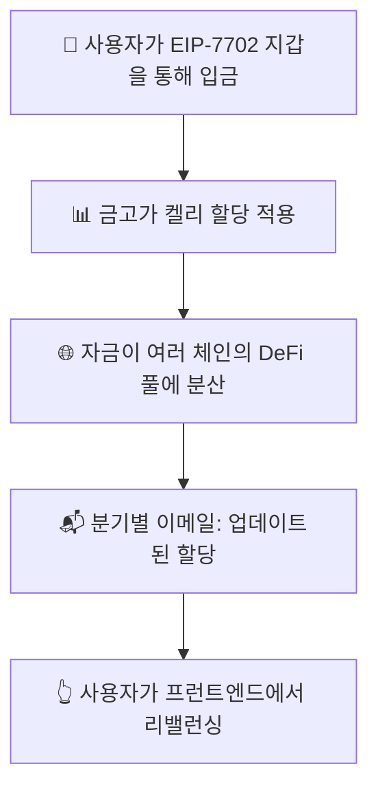

# 🚀 Zap Pilot 작동 방식

## 🧠 프로토콜 메커니즘

Zap Pilot은 **비수탁, 알고리즘 포트폴리오 자동 조종 장치**입니다 ✨ EIP-7702로 구동되는 자신만의
**스마트 EOA 지갑**을 통해 자금을 완전히 제어할 수 있습니다. 클릭 한 번으로 **자금 최적화**,
**리밸런싱**, **라우팅**을 도와드립니다 — 수탁 없음. 잠금 없음. 전략적 제안 및 실행만.

### 핵심 원칙

- **완전한 사용자 제어**: 당신의 지갑, 당신의 키
- **고급 할당**: 수학적으로 최적화된 전략
- **투명한 실행**: 원클릭 최적화

---

## 1️⃣ 사용자 입금

👜 EIP-7702로 구동되는 **스마트 EOA 지갑**에서 직접 입금합니다. 💡 자금은 **전략 금고**로 들어갑니다
— 여러 체인에 걸쳐 엄선된 DeFi 기회의 묶음입니다.

**참조:** [시작 안내서](../getting-started)

---

## 2️⃣ 금고 전략

각 금고는 다음과 같은 특정 투자 전략을 나타냅니다:

- 💵 **스테이블코인 이자 농사**
- 🔗 **유동 스테이킹**
- 🌉 **크로스체인 이자 사냥**

자금은 금고 안의 풀에 분산되며, 성과와 위험에 따라 **가중치가 동적으로 조정됩니다**. 📊

**자세히 알아보기:** [투자 전략 개요](../strategies)

---

## 3️⃣ 📐 켈리 할당 전략

### 켈리 기준이란?

켈리 기준은 일련의 베팅의 최적 크기를 결정하는 데 사용되는 수학 공식입니다. 우리의 맥락에서는 위험을
관리하면서 장기적인 성장을 극대화하기 위해 여러 DeFi 프로토콜에 자금을 할당하는 데 도움이 됩니다.

#### 단순화된 공식:

`할당 ∝ 예상 수익 / 분산`

🧮 주요 이점:

- 📈 변동성이 낮고 보상이 높은 풀에 더 높은 가중치
- 🛡️ 단일 프로토콜에 대한 과도한 노출 위험 감소
- 🔄 시장 변화를 반영하기 위한 분기별 재계산

**자세한 설명:** [켈리 기준 심층 분석](../strategies/kelly-criterion)

---

## 4️⃣ ♻️ 리밸런싱 (사용자 주도)

자산이 **절대 지갑을 떠나지 않기 때문에**, 자동으로 리밸런싱할 수는 없지만 **매우 쉽게**
만들었습니다:

- 📬 **분기별**: 개인화된 리밸런싱 권장 사항
- 👆 **원클릭 리밸런싱**: 지갑에서 전략 업데이트 실행

**왜 사용자 주도인가?** 우리는 당신의 제어와 투명성을 우선시합니다.

---

## 5️⃣ 🗺️ 자산 흐름 개요

---

## 🔒 보안 및 투명성

- **비수탁**: 자금은 항상 지갑에 남아 있습니다
- **온체인 실행**: 모든 거래는 투명합니다
- **사용자 제어**: 모든 움직임을 승인합니다

**보안 세부 정보:** [보안 사고 및 투명성](../security)

잽, 리밸런싱, 최적화 — 30초 이내. 당신의 암호화폐, 당신의 키, 우리의 전략.

👉 **[시작하기 →](https://app.zap-pilot.org/)**

### 관련 자료

- [시작 안내서](../getting-started)
- [투자 전략](../strategies)
- [켈리 기준 설명](../strategies/kelly-criterion)
