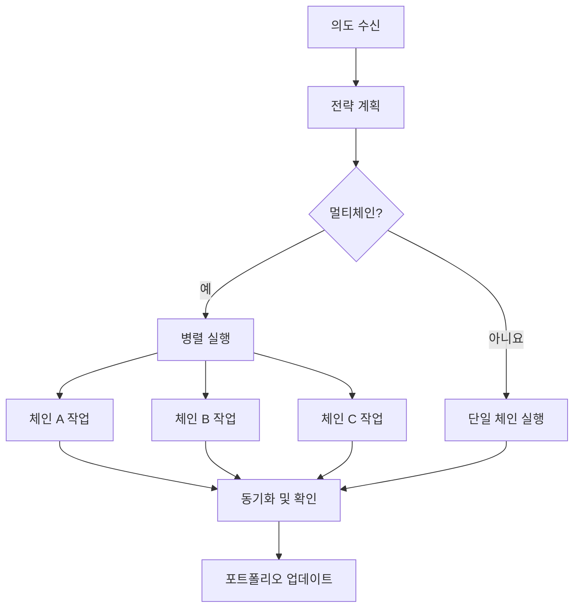

# 의도 실행 엔진

Zap Pilot의 핵심은 의도 실행 엔진입니다. 이는 사용자 의도를 여러 블록체인에 걸쳐 최적의 DeFi
작업으로 변환하는 정교한 시스템입니다.

## 🎯 의도 이해

### 의도를 구성하는 요소

의도는 달성하려는 목표에 대한 높은 수준의 표현이며, 이를 달성하는 방법이 아닙니다:

#### **기존 DeFi 접근 방식:**

```
1. 이더리움에서 Arbitrum으로 USDC 브릿지
2. Uniswap V3에서 USDC 50%를 ETH로 스왑
3. 풀에 USDC/ETH 유동성 추가
4. Convex에 LP 토큰 스테이킹
5. 보상 청구 및 복리
```

#### **의도 기반 접근 방식:**

```
"중간 위험 허용 범위로 ETH/스테이블코인 수익 농사에 1000달러를 투자하고 싶습니다"
```

### 의도 구성 요소

모든 의도에는 다음이 포함됩니다:

- **목표**: 달성하려는 목표
- **제약**: 위험 제한, 시간 선호도
- **선호도**: 체인 선호도, 가스 허용 범위
- **컨텍스트**: 현재 포트폴리오, 시장 상황

## ⚙️ 실행 파이프라인

### 1. 의도 구문 분석 및 유효성 검사

```typescript
interface UserIntent {
  objective: 'invest' | 'withdraw' | 'rebalance';
  amount: string;
  strategy: 'stablecoin' | 'index' | 'btc' | 'eth' | 'custom';
  riskTolerance: 'low' | 'medium' | 'high';
  timeHorizon: 'short' | 'medium' | 'long';
  constraints: {
    maxSlippage: number;
    gasLimit: string;
    chainPreferences: string[];
  };
}
```

### 2. 전략 해결

당사의 AI 엔진은 귀하의 의도를 다음을 기준으로 분석합니다:

- **현재 시장 상황**
- **사용 가능한 수익 기회**
- **기존 포트폴리오**
- **위험-수익 최적화**

### 3. 실행 계획

플래너는 최적의 실행 시퀀스를 생성합니다:

#### **경로 찾기**

- 가능한 모든 실행 경로 식별
- 각 경로의 비용 및 위험 계산
- 다음을 고려하여 최적의 경로 선택:
  - 총 가스 비용
  - 가격 영향
  - 실행 시간
  - 실패 확률

#### **트랜잭션 시퀀싱**

- 복잡한 작업을 원자적 단계로 분할
- 각 단계에서 오류 복구 계획
- 가능한 경우 병렬 실행 최적화

### 4. 크로스체인 오케스트레이션

여러 체인에서 동시에 작업을 실행합니다:



## 🧠 AI 기반 최적화

### 시장 인텔리전스

당사 시스템은 다음으로부터 지속적으로 학습합니다:

- 모든 프로토콜의 **과거 수익 데이터**
- 다양한 체인의 **가스 가격 패턴**
- 시간 경과에 따른 **유동성 깊이** 변화
- **프로토콜 위험 이벤트** 및 응답

### 적응형 전략

전략은 다음을 기반으로 진화합니다:

- **시장 체제 변화** (강세/약세/횡보)
- **당신의 행동 패턴** 및 선호도
- 과거 실행의 **성과 피드백**
- **새로운 프로토콜 기회**

## 🔄 지속적인 모니터링

### 실시간 포트폴리오 추적

실행 후, 우리는 다음을 모니터링합니다:

- 모든 프로토콜의 **포지션 성과**
- **위험 지표 변화** (상관 관계, 변동성)
- **수익 최적화** 기회
- **리밸런싱 트리거** 조건

### 사전 예방적 관리

자동 작업에는 다음이 포함됩니다:

- **보상 청구** 및 자동 복리
- 할당이 5% 이상 벗어날 때 **리밸런싱**
- 시장 스트레스 시 **위험 해제**
- 더 나은 요율로 **수익 최적화** 전환

### 알림 시스템

다음에 대한 알림을 받습니다:

- 포지션의 **상당한 이득/손실**
- 귀하의 프로필과 일치하는 **새로운 수익 기회**
- 사용 중인 프로토콜에 대한 **위험 경고**
- **리밸런싱** 작업 완료

## 🛠️ 고급 기능

### 맞춤형 의도 스크립팅

고급 사용자는 맞춤형 의도를 생성할 수 있습니다 (예시):

```javascript
// 예시: 달러 코스트 애버리징 의도
const dcaIntent = {
  objective: 'recurring_invest',
  amount: '500',
  frequency: 'weekly',
  strategy: 'index',
  duration: '12_months',
  conditions: {
    pauseIf: 'portfolio_loss > 20%',
    increaseIf: 'btc_price < 40000',
  },
};
```

### 일괄 의도 처리

한 번에 여러 의도를 제출합니다:

- 전략 간 **포트폴리오 리밸런싱**
- 분산을 위한 **다중 전략 할당**
- DCA 및 리밸런싱을 위한 **예정된 작업**

### 의도 템플릿

일반적인 전략을 위한 사전 구축된 템플릿:

- **인덱스 펀드**: 시가총액 가중 전략, S&P-500과 유사한 전략
- **보수적 수입**: 스테이블코인 수익 중심
- **공격적 성장**: 고위험, 고수익 전략
- **시장 중립**: 델타 중립 전략

---

의도 실행 엔진은 Zap Pilot을 마법처럼 만듭니다. 복잡성을 단순성으로 변환하면서 DeFi의 힘과 유연성을
유지합니다.

👉 **[크로스체인 운영에 대해 알아보기 →](./cross-chain-operations)** 👉
**[리밸런싱 탐색 →](./rebalancing)**
