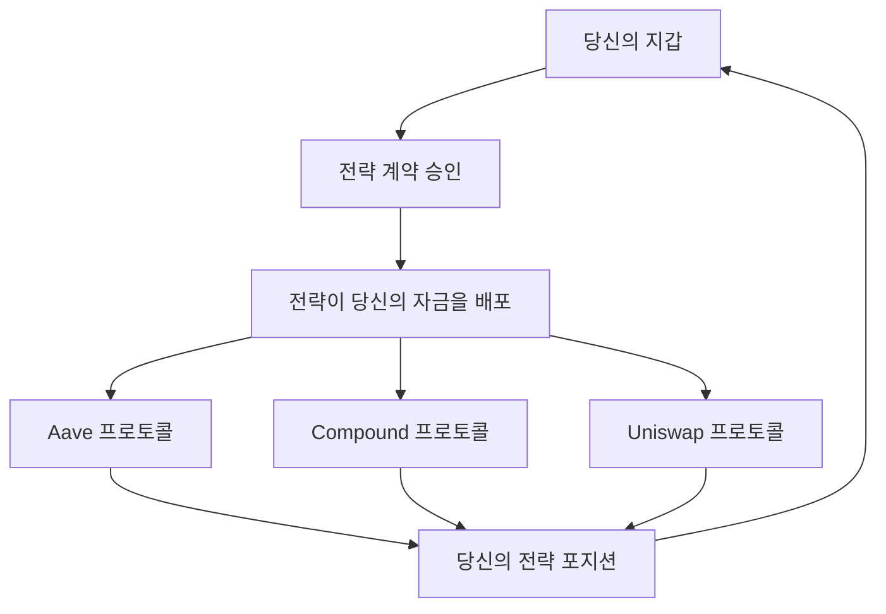

# 안전 및 보안 개요

**당신의 자금, 당신의 통제 - 항상** 🛡️

보안은 Zap Pilot에서 우리가 하는 모든 것의 기반입니다. 분산화, 투명성, 사용자 제어라는 DeFi의 핵심
원칙을 유지하면서 투자를 보호하는 방법을 알아보세요.

## 🔐 설계에 의한 비수탁

### 당신이 자금을 통제합니다

**가장 중요**: Zap Pilot은 당신의 자금을 절대 보관하지 않습니다. 이는 다음을 의미합니다:

#### **당신의 개인 키 = 당신의 통제**

- 🔑 **당신의 지갑, 당신의 키** - 우리는 당신의 개인 키를 보거나 저장하지 않습니다
- 🏦 **중앙 집중식 보관 없음** - 자금은 Zap Pilot 계정에 보관되지 않습니다
- 🚫 **우리는 당신의 자산을 동결하거나 몰수할 수 없습니다**
- ✅ **언제든지 종료할 수 있습니다** - 프로토콜에서 직접 인출

#### **비수탁 작동 방식**

당신의 자금은 당신의 지갑에서 DeFi 프로토콜로 직접 흐르며, Zap Pilot은 지능형 라우팅 및 관리만
제공합니다.

### 스마트 계약 아키텍처

#### **불변 전략 계약**

- 📋 **사용자당 하나의 계약** - 당신의 전략은 격리되어 있습니다
- 🔒 **당신만 업그레이드 가능** - 허가 없이 당신의 전략을 변경할 수 없습니다
- 🚪 **긴급 종료 기능** - 우리의 인터페이스가 다운되어도 항상 접근 가능
- 🔍 **오픈 소스 및 감사 완료** - 모든 코드는 공개적으로 검증 가능합니다

#### **권한 구조**

Zap Pilot이 할 수 있는 일:

- ✅ 당신의 전략에 따라 리밸런싱 실행
- ✅ 보상 자동 복리
- ✅ 분석 및 보고 제공

Zap Pilot이 할 수 없는 일:

- ❌ 우리 계정으로 자금 인출
- ❌ 승인 없이 당신의 전략 변경
- ❌ 당신의 종료 방해
- ❌ 지갑을 잃어버린 경우 자금 접근

## 🏗️ 다층 보안 아키텍처

### 1. 스마트 계약 보안

#### **전문 감사**

- 🔬 **여러 감사 회사**: Trail of Bits, ConsenSys Diligence, Quantstamp
- 📊 **지속적인 감사**: 모든 주요 업데이트 검토
- 🏆 **버그 바운티 프로그램**: 취약점 발견에 50만 달러 보상
- 📈 **전투 테스트**: 메인넷 배포 전 몇 달 동안 테스트넷에서 배포

#### **형식 검증**

- 🧮 **핵심 기능의 수학적 증명**
- 🔒 **불변성 검사** - 특정 조건이 항상 유지됨
- 🎯 **속성 테스트** - 광범위한 자동 테스트
- 📝 **문서화**: 모든 기능이 철저히 문서화됨

#### **보안 기능**

- ⏱️ 관리 기능에 대한 **타임락**
- 🛑 **긴급 일시 중지** 메커니즘
- 🔄 모든 외부 호출에 대한 **재진입 방지**
- 💰 과도한 집중을 방지하기 위한 **포지션 제한**

### 2. 프로토콜 위험 관리

#### **프로토콜 선택 기준**

우리는 엄격한 기준을 충족하는 프로토콜만 통합합니다:

**최소 요구 사항:**

- ✅ **메인넷에서 6개월 이상 운영**
- ✅ **지속적으로 1억 달러 이상의 TVL 유지**
- ✅ **평판 좋은 회사에 의한 보안 감사**
- ✅ **버그 바운티 프로그램 적극 유지**
- ✅ **거버넌스 투명성** 및 분산화

**지속적인 모니터링:**

- 📊 **TVL 추적** - 대규모 유출 시 경고
- 🔍 **코드 변경** 보안 영향 모니터링
- 🏛️ **거버넌스** 유해한 제안 모니터링
- 📰 **커뮤니티 정서** 및 전문가 의견

#### **위험 점수 시스템**

모든 프로토콜은 위험 점수(1-100)를 받습니다:

- **90-100**: 전투 테스트를 거친 프로토콜 (Aave, Compound)
- **80-89**: 좋은 실적을 가진 확립된 프로토콜
- **70-79**: 강력한 보안 관행을 가진 새로운 프로토콜
- **70 미만**: 포함 대상 아님

### 3. 보험 적용

#### **프로토콜 보험**

- 🏛️ **Nexus Mutual**: 주요 포지션에 대한 스마트 계약 보장
- 🛡️ **InsurAce**: 추가 보장 계층
- 🔒 **Unslashed**: 슬래싱 및 기술적 위험 보장
- 💰 **보장 금액**: 프로토콜당 사용자당 최대 100만 달러

#### **보험 작동 방식**

1. **위험 평가**: 보험사가 프로토콜 보안 평가
2. **보장 구매**: 사용자 자금에 대한 보험 구매
3. **청구 절차**: 해킹 발생 시 자동 청구 제출
4. **지급**: 사용자는 보장된 손실에 대한 보상 수령

#### **보장 범위**

- ✅ 보장된 프로토콜의 **스마트 계약 익스플로잇**
- ✅ **오라클 조작** 공격
- ✅ 자금 손실을 초래하는 **거버넌스 공격**
- ✅ 자금 손실을 초래하는 **기술적 오류**

#### **보장되지 않는 범위**

- ❌ **시장 가격 변동** (보험이 아닌 투자입니다)
- ❌ **사용자 오류** (잘못된 주소로 전송 등)
- ❌ **보장되지 않는 프로토콜** (보장 상태를 명확하게 표시합니다)
- ❌ 프로토콜 운영에 영향을 미치는 **규제 변경**

## 🚨 위험 모니터링 및 대응

### 실시간 모니터링

#### **24시간 연중무휴 감시**

- 🖥️ 모든 통합 프로토콜의 **자동 모니터링**
- 👥 보안 팀의 **인적 감독**
- 🚨 비정상적인 활동에 대한 **경고 시스템**
- 📱 긴급 상황에 대한 **모바일 경고**

#### **모니터링되는 주요 지표**

- 💧 모든 프로토콜의 **유동성 수준**
- 📊 **TVL 변경** 및 대규모 유출
- 🔄 비정상적인 패턴에 대한 **스마트 계약 상호 작용**
- 📈 조작 시도에 대한 **오라클 가격**
- 🏛️ 보안에 영향을 미칠 수 있는 **거버넌스 제안**

### 비상 대응

#### **사고 대응 계획**

1. **감지** (자동 경고 + 수동 모니터링)
2. **평가** (심각도 및 범위 결정)
3. **조치** (자동 또는 수동 대응)
4. **통신** (사용자에게 즉시 알림)
5. **복구** (안전하게 정상 작동 복원)

#### **자동 보호**

- 🛑 이상 감지 시 작동을 중지하는 **회로 차단기**
- 🏃 손상된 프로토콜에서 **자동 종료**
- 🔒 추가 손상을 방지하기 위한 **포지션 동결**
- 💰 가장 안전한 사용 가능한 프로토콜에서 **자금 보존**

#### **수동 개입**

- 🎯 긴급 결정에 대한 **긴급 거버넌스**
- 📞 주요 문제에 대한 **직접 사용자 연락**
- 🔧 위험을 피하기 위한 **전략 조정**
- 💼 해당되는 경우 즉시 제출되는 **보험 청구**

## 🔍 투명성 및 감사 가능성

### 오픈 소스 약속

#### **공개 코드**

- 📂 모든 계약 코드가 포함된 **GitHub 저장소**
- 📝 모든 기능 및 특징에 대한 **문서**
- 🔄 시간 경과에 따른 모든 변경 사항을 보여주는 **버전 관리**
- 👥 **커뮤니티 기여**를 환영하고 보상합니다

#### **실시간 데이터**

- 🌐 모든 작업의 **온체인 검증**
- 📊 시스템 상태를 보여주는 **공개 대시보드**
- 💰 누구나 볼 수 있는 **프로토콜 포지션**
- 📈 실시간으로 업데이트되는 **성능 데이터**

### 감사 추적

#### **완전한 거래 내역**

- 🔗 모든 작업의 **블록체인 기록**
- 📋 타임스탬프 및 이유가 포함된 **전략 변경**
- 💸 모든 수수료를 보여주는 **수수료 계산**
- 🔄 완전한 정당성을 가진 **리밸런싱 로직**

#### **거버넌스 투명성**

- 🗳️ 구현 전에 공개적으로 볼 수 있는 **모든 제안**
- 📊 커뮤니티 결정을 보여주는 **투표 기록**
- ⏱️ 사용자에게 변경 사항을 미리 알리는 **타임락**
- 🔄 정확히 무엇이 변경되었는지 보여주는 **구현 로그**

## 🛡️ 사용자 보안 모범 사례

### 지갑 보안

#### **필수 관행**

- 🔐 대규모 자금에는 **하드웨어 지갑** (Ledger, Trezor)
- 📝 여러 안전한 위치에 **시드 구문 백업**
- 🔒 가능한 경우 **강력한 비밀번호** 및 2FA 사용
- 🚫 **개인 키 또는 시드 구문을 공유하지 마십시오**

#### **피싱 방지**

- 🌐 **공식 사이트를 북마크** (zap-pilot.com)
- 🔍 지갑 연결 전 **URL 확인**
- 📧 **이메일 주소 확인** - @zap-pilot.com에서만 이메일을 보냅니다
- 🚫 **어떤 웹사이트에도 시드 구문을 입력하지 마십시오**

### 트랜잭션 보안

#### **모든 트랜잭션 전에**

- ✅ **계약 주소**가 공식 문서와 일치하는지 확인
- 💰 **금액** 및 소수점 자리를 주의 깊게 확인
- ⛽ **가스 수수료** 확인 - 의심스럽게 높으면 거부
- 🌐 **네트워크**가 의도와 일치하는지 확인

#### **주의해야 할 위험 신호**

- 🚨 인터페이스에서 **예상치 못한 트랜잭션 요청**
- 💸 **비정상적으로 높은 가스 수수료** (복잡한 공격을 나타낼 수 있음)
- 🔗 전략과 관련 없는 **알 수 없는 토큰 승인**
- 📧 즉각적인 조치를 요구하는 **긴급 메시지**

## 📞 보안 지원

### 보안 문제 보고

#### **버그 바운티 프로그램**

- 💰 심각한 취약점에 대해 **최대 50만 달러**
- 🔒 **책임 있는 공개** 프로세스
- 🏆 보안 연구자를 위한 **명예의 전당**
- 📧 비공개 보고용 **security@zap-pilot.com**

#### **긴급 연락처**

- 🚨 **중요 문제**: security@zap-pilot.com
- 📞 **24시간 연중무휴 핫라인**: 활성 포지션을 가진 사용자용
- 💬 **Discord #security**: 일반적인 보안 질문용
- 📱 **모바일 알림**: 긴급 상황에 대한 푸시 알림

### 보안 교육

#### **자료**

- 📚 DeFi 초보자를 위한 **보안 가이드**
- 🎥 지갑 보안에 대한 **비디오 튜토리얼**
- 📰 최신 위협 및 보호에 대한 **블로그 게시물**
- 🎓 보안 전문가와 함께하는 **웹 세미나**

---

보안은 기술만이 아닙니다. 투명성을 통해 신뢰를 구축하고, 사용자에게 통제권을 부여하며, 우리가 하는
모든 일에서 최고 수준을 유지하는 것입니다.

당신의 자금은 항상 당신의 것입니다. 우리는 단지 그들이 더 스마트하게 작동하도록 돕기 위해 여기에
있습니다.
