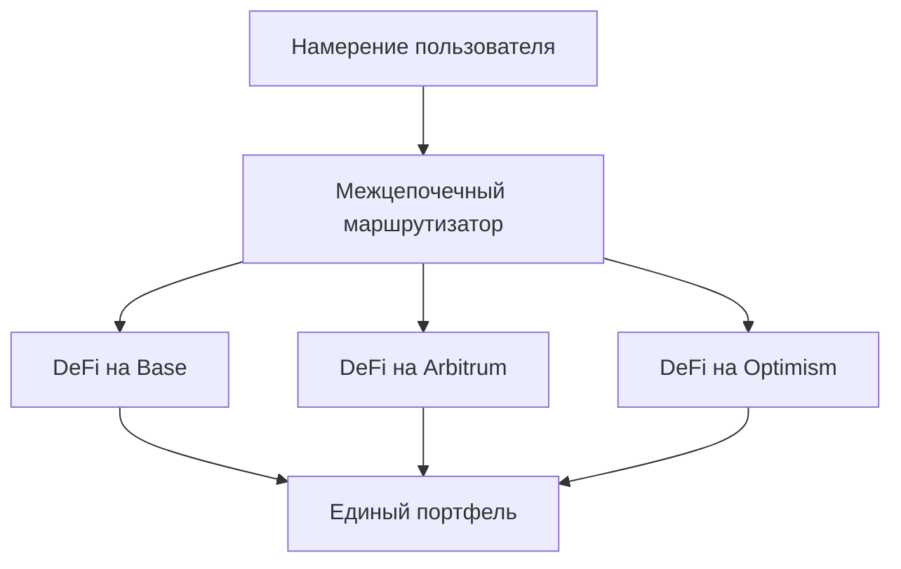

# Межцепочечные операции

**Бесшовный DeFi на Base, Arbitrum и Optimism** 🌐

Межцепочечные возможности Zap Pilot позволяют вам получать доступ к лучшим возможностям DeFi в
различных сетях Layer 2, а также в Ethereum и Solana, без сложностей управления различными
кошельками, токенами или мостами.

## 🔗 Мультичейн-архитектура

### Нативная межцепочечная архитектура

В отличие от других платформ, которые рассматривают межцепочечные операции как второстепенную
функцию, Zap Pilot изначально разработан для работы в поддерживаемых нами сетях Layer 2.

#### **Единый пул ликвидности**

Ваши инвестиции автоматически распределяются по поддерживаемым нами сетям, чтобы найти лучшие
возможности, при этом отображаясь как единый, унифицированный портфель.

#### **Интеллектуальный выбор цепочки**

Наша система автоматически выбирает оптимальный блокчейн для каждой операции на основе:

- **Возможностей доходности**: Самый высокий APY для вашего профиля риска
- **Глубины ликвидности**: Достаточная ликвидность для размера вашей транзакции
- **Стоимости газа**: Самые низкие общие затраты на выполнение
- **Уровня безопасности**: Соответствующая безопасность для стоимости транзакции
- **Требований к скорости**: Самое быстрое выполнение для операций, чувствительных ко времени

## 🌐 Поддерживаемые сети

Zap Pilot работает в постоянно растущем числе сетей, включая ведущие Layer 2, Ethereum и Solana.
Наша интеллектуальная система маршрутизации автоматически выбирает лучшую сеть для любой данной
операции на основе комбинации факторов, включая безопасность, стоимость транзакций, ликвидность и
скорость.

## ⚡ Движок межцепочечного выполнения

### Интеллектуальная маршрутизация

#### **Оптимизация по нескольким путям**

Когда вы инвестируете 10 000 долларов США в стратегию индексного фонда, наша система может:

1. **Разместить 4 000 долларов США** на Arbitrum для устоявшихся протоколов DeFi и позиций с
   кредитным плечом
2. **Разместить 3 500 долларов США** на Base для новых возможностей и протоколов институционального
   уровня
3. **Разместить 2 500 долларов США** на Optimism для токенов управления и экспериментальных
   стратегий
4. **Оставить 1 000 долларов США** ликвидными для ребалансировки между сетями

#### **Оптимизация в реальном времени**

Движок маршрутизации учитывает:

- **Различия в ценах на газ**: Выполнение, когда газ самый дешевый
- **Изменения ставок доходности**: Переход к цепочкам с лучшими возможностями
- **Условия ликвидности**: Избегать цепочек с недостаточной ликвидностью
- **Загруженность сети**: Обход перегруженных сетей
- **Доступность мостов**: Обеспечение надежных межцепочечных переводов

### Интеграция мостов

#### **Across Protocol - наш партнер по мостам**

Мы используем Across Protocol для всех межцепочечных операций, обеспечивая оптимальную безопасность,
скорость и экономичность:

| Особенность моста           | Преимущества Across Protocol                                |
| --------------------------- | ----------------------------------------------------------- |
| **Поддерживаемые маршруты** | Бесшовные переводы между Base, Arbitrum и Optimism          |
| **Модель безопасности**     | Оптимистическая верификация с экономическими гарантиями     |
| **Скорость**                | Среднее время завершения 1-4 минуты                         |
| **Стоимость**               | Самые низкие комиссии среди основных поставщиков мостов     |
| **Надежность**              | Проверенный послужной список с минимальным временем простоя |

#### **Почему Across Protocol**

- **Оптимистическая безопасность**: Использует оптимистическую верификацию с экономическими
  стимулами для честного поведения
- **Эффективность капитала**: Минимальные требования к ликвидности снижают затраты
- **Быстрое урегулирование**: Быстрая окончательность с системой оракулов UMA
- **Проверенная надежность**: Проверенная инфраструктура с сильным послужным списком безопасности
- **Экономичность**: Конкурентные комиссии, оптимизированные для частой ребалансировки

## 🎯 Преимущества межцепочечной стратегии

### Оптимизация доходности

#### **Возможности для конкретных сетей**

Каждая из поддерживаемых нами сетей превосходит в разных областях:

**Base**:

- Преимущества экосистемы Coinbase и институциональное доверие
- Протоколы, дружественные к регулированию, и соответствие требованиям
- Растущее институциональное внедрение DeFi
- Возможности интеграции традиционных финансов
- Появляющиеся высококачественные протоколы

**Arbitrum**:

- Зрелая экосистема DeFi с проверенными протоколами
- Продвинутая торговая инфраструктура (GMX, Camelot)
- Устоявшиеся пулы ликвидности и возможности доходности
- Более низкие затраты, чем у Ethereum, с той же безопасностью
- Сложные стратегии с кредитным плечом

**Optimism**:

- Инновационный центр для новых экспериментов DeFi
- Сильные экосистемы токенов управления
- Среда, дружественная к разработчикам
- Растущее институциональное внедрение
- Уникальные возможности протоколов (Velodrome, Synthetix)

#### **Арбитраж доходности**

Наша система постоянно выявляет и использует арбитражные возможности:

- **Различия в ставках протоколов**: Один и тот же протокол, разные цепочки
- **Расхождения в ценах токенов**: Арбитраж премии/дисконта моста
- **Стимулирующий фарминг**: Стимулы ликвидности для конкретных цепочек
- **Эффективность газа**: Выполнение там, где это наиболее экономически выгодно

### Диверсификация рисков

#### **Распределение технологических рисков**

Распределение по цепочкам снижает:

- **Риск одной цепочки**: Не зависит от работоспособности одной цепочки
- **Риск моста**: Несколько поставщиков мостов снижают риск контрагента
- **Риск консенсуса**: Различные механизмы консенсуса
- **Риск управления**: Не подпадает под решения управления одной цепочки

#### **Снижение регуляторного риска**

- **Диверсификация юрисдикций**: Протоколы в разных регуляторных средах
- **Вариативность соответствия**: Переход к соответствующим цепочкам по мере развития регулирования
- **Устойчивость к цензуре**: Несколько цепочек снижают риск цензуры
- **Непрерывность операций**: Продолжение операций, даже если одна цепочка сталкивается с проблемами

## 🔄 Межцепочечная ребалансировка

### Интеллектуальная ребалансировка

#### **Управление портфелем между цепочками**

При ребалансировке стратегии мы учитываем:

- **Текущие распределения**: Где в настоящее время находятся активы
- **Целевые распределения**: Оптимальное распределение по цепочкам
- **Затраты на ребалансировку**: Комиссии моста против преимуществ оптимизации
- **Рыночные условия**: Какие цепочки предлагают лучшие возможности

#### **Пример: Ребалансировка индексного фонда**

**Текущее состояние:**

- Arbitrum: 50% портфеля
- Base: 30% портфеля
- Optimism: 20% портфеля

**Изменение рынка:** Появляется новая высокодоходная возможность на Base **Действие:** Постепенно
перевести 15% с Arbitrum на Base в течение 2 дней с использованием Across Protocol **Рассмотрение:**
Баланс затрат на мост с выгодами от доходности и поддержание диверсификации

### Оптимизация затрат

#### **Эффективность ребалансировки**

- **Пакетные операции**: Объединение нескольких действий по ребалансировке
- **Время газа**: Выполнение в оптимальные периоды цен на газ
- **Оптимизация пути**: Минимизация количества необходимых мостов
- **Управление пороговыми значениями**: Ребалансировка только тогда, когда выгоды превышают затраты

#### **Экономия средств пользователя**

По сравнению с ручным межцепочечным управлением:

- **На 80% ниже затраты на газ**: За счет пакетной обработки и оптимизации
- **На 90% меньше сложности**: Автоматический выбор моста и выполнение
- **На 100% меньше времени**: Межцепочечные операции "настроил и забыл"
- **Лучшая доходность**: Доступ к возможностям, которые вы могли бы упустить

## 📊 Межцепочечная аналитика

### Единый вид портфеля

#### **Отчетность, не зависящая от цепочки**

Ваша панель управления показывает:

- **Общая стоимость портфеля**: Стоимость в долларах США по всем цепочкам
- **Распределение по цепочкам**: Сколько стоимости находится в каждой цепочке
- **Атрибуция производительности**: Какие цепочки способствовали доходности
- **Риск-экспозиция**: Метрики концентрации и диверсификации

#### **Отслеживание межцепочечной производительности**

- **Сравнение доходности**: APY, полученный в каждой цепочке
- **Анализ затрат**: Затраты на мост и газ по цепочкам
- **Метрики эффективности**: Доходность на доллар уплаченных комиссий
- **Альтернативные издержки**: Что вы могли бы упустить в других цепочках

### Отслеживание стоимости моста

#### **Полная прозрачность затрат**

Отслеживайте все межцепочечные затраты:

- **Комиссии моста**: Явные комиссии, взимаемые протоколами моста
- **Затраты на газ**: Комиссии за газ L1 и L2 для транзакций моста
- **Проскальзывание**: Влияние на цену от операций моста
- **Альтернативные издержки**: Временная стоимость денег во время мостов

#### **Анализ ROI**

Для каждой межцепочечной операции:

- **Обоснование затрат**: Почему перемещение было прибыльным
- **Время до окупаемости**: Сколько времени потребуется для возмещения затрат на мост
- **Альтернативный анализ**: Что произошло бы без перемещения
- **Оценка оптимизации**: Насколько хорошо выполнена маршрутизация

## 🛡️ Межцепочечная безопасность

### Модель безопасности

#### **Многоуровневая безопасность**

- **Безопасность моста**: Использовать только проверенные и аудированные мосты
- **Безопасность цепочки**: Предпочтение более безопасным цепочкам для больших сумм
- **Диверсификация**: Распределение риска по нескольким цепочкам и мостам
- **Мониторинг**: Мониторинг безопасности в реальном времени по всем цепочкам

#### **Управление рисками моста**

- **Лимиты моста**: Максимальная подверженность риску на одного поставщика моста
- **Оценка безопасности**: Оценка состояния моста в реальном времени
- **Реагирование на инциденты**: Немедленные действия при инцидентах безопасности моста
- **Страховое покрытие**: Защита от сбоев моста, где это возможно

### Аварийные процедуры

#### **Межцепочечное реагирование на чрезвычайные ситуации**

В случае проблем с безопасностью:

1. **Немедленная пауза**: Остановить все межцепочечные операции
2. **Оценка активов**: Определить безопасные и рискованные позиции
3. **Аварийные выходы**: Быстрый вывод средств в безопасные цепочки
4. **Связь с пользователями**: Четкие обновления о ситуации и действиях
5. **Планирование восстановления**: Систематическое восстановление и возобновление

---

Межцепочечные операции — это то, что делает Zap Pilot по-настоящему мощным — доступ ко всей
вселенной DeFi при сохранении простоты для пользователей. Вы получаете преимущества всех цепочек без
сложности управления ими по отдельности.

👉 **[Узнайте о ребалансировке →](./rebalancing)** 👉
**[Изучите выполнение стратегии →](./intent-execution)** 👉
**[Посмотреть поддерживаемые сети →](../security)**
