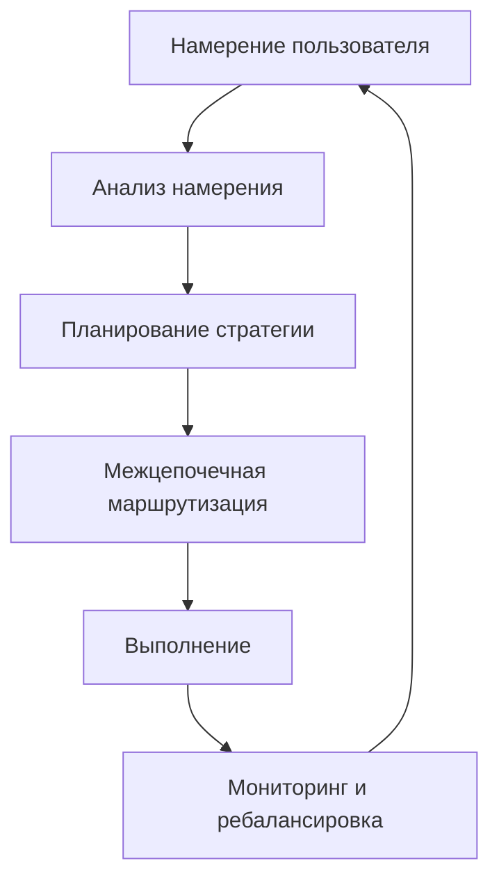

# Как работает Zap Pilot

Zap Pilot превращает сложные операции DeFi в простые, выполняемые одним щелчком мыши, благодаря
нашему движку выполнения намерений. Вот как происходит волшебство:

## 🧠 Выполнение на основе намерений

### Что такое намерения?

Вместо того, чтобы указывать, **как** выполнять транзакции, вы просто говорите нам, **что** вы
хотите достичь:

```
Намерение: "Инвестировать $500 в консервативную стейблкоин-стратегию"

Традиционный DeFi: 12+ транзакций в 3 цепочках
Zap Pilot: 1 клик, полностью автоматизировано
```

### Жизненный цикл намерения



## ⚡ 3-шаговый процесс

### 1. **Выразите свое намерение**

- Выберите сумму инвестиций
- Выберите тип стратегии
- Установите предпочтения по риску
- Определите временной горизонт

### 2. **Планирование на основе ИИ**

- Анализ текущих рыночных условий
- Определение оптимальных протоколов и цепочек
- Расчет лучших путей выполнения
- Планирование транзакций с эффективным использованием газа

### 3. **Выполнение с одобрения**

- Выполнение в нескольких цепочках одновременно
- Оптимизация для минимальных комиссий и лучших ставок
- Мониторинг в реальном времени
- Предложение ребалансировки по мере необходимости для вашего одобрения

## 🔗 Межцепочечный интеллект

### Нативная поддержка нескольких цепочек

Zap Pilot не просто переводит активы — мы нативно понимаем и работаем в нескольких цепочках, включая
ведущие Layer 2, Ethereum и Solana.

### Интеллектуальная маршрутизация

Наш движок маршрутизации учитывает:

- **Затраты на газ** по всем цепочкам
- **Глубину ликвидности** в разных пулах
- **Возможности доходности** в каждой сети
- **Безопасность моста** и скорость
- **Текущую загруженность сети**

## 🎯 Выполнение стратегии

### Автоматическое управление портфелем

Как только ваша стратегия запущена, Zap Pilot постоянно:

#### **Мониторит производительность**

- Отслеживает доходность по всем позициям
- Мониторит метрики риска в реальном времени
- Следит за дрейфом стратегии

#### **Оптимизирует распределение**

- Ребалансирует, когда цели отклоняются >5%
- Перемещает активы в возможности с более высокой доходностью

#### **Управляет риском**

- Автоматически диверсифицирует по протоколам

### Умная ребалансировка

Наша система распределения на основе критерия Келли:

- Рассчитывает оптимальные размеры позиций
- Учитывает корреляцию между активами
- Минимизирует транзакционные издержки
- Максимизирует доходность с поправкой на риск

## 🛡️ Интеграция абстракции учетных записей

### Безгазовые транзакции

Через кошельки с абстракцией учетных записей:

- **Не требуется ETH для газа** в любой цепочке
- **Пакетная обработка нескольких операций** в одну транзакцию
- **Спонсируемые транзакции** для мелких инвесторов

### Повышенная безопасность

- **Поддержка мультиподписи** для институциональных пользователей
- **Опции социального восстановления**
- **Лимиты расходов** и контроль
- **Ключи сессий** для автоматизированных стратегий

## 📊 Аналитика в реальном времени

### Анализ рынка

- **Круглосуточный мониторинг доходности** по 100+ протоколам
- **Оценка риска** протоколов DeFi
- **Анализ ликвидности** для оптимального выполнения

### Аналитика портфеля

- **Атрибуция производительности** - знайте, что движет доходностью (скоро)
- **Декомпозиция риска** - понимайте свою подверженность риску
- **Анализ сценариев** - стресс-тестирование вашего портфеля
- **Оптимизация налогов** - минимизация налогооблагаемых событий

## 🔄 Непрерывная оптимизация

### Динамическая корректировка стратегии

Ваша стратегия развивается в соответствии с рыночными условиями:

#### **Определение рыночного режима**

- Бычий рынок: Увеличение подверженности риску
- Медвежий рынок: Сохранение капитала
- Боковой рынок: Фокус на генерации доходности

#### **Мониторинг состояния протокола**

- Отслеживание изменений TVL
- Мониторинг рисков управления
- Отслеживание предупреждений об эксплойтах
- Автоматическое снижение риска при необходимости

## 🏗️ Инфраструктура

### Создано для масштабирования

- **Модульная архитектура** для быстрой интеграции протоколов
- **Событийно-ориентированная система** для реагирования в реальном времени
- **Избыточное выполнение** для предотвращения неудачных транзакций
- **Высокая доступность** с SLA 99,9% времени безотказной работы

### Партнеры по интеграции

- **20+ агрегаторов DEX** для лучших курсов обмена
- **50+ протоколов доходности** для разнообразных возможностей
- **10+ поставщиков мостов** для надежных межцепочечных операций
- **5+ поставщиков страхования** для покрытия рисков

---

Готовы увидеть это в действии?

👉 **[Начать →](../getting-started)** 👉 **[Посмотреть стратегии →](../strategies)**
