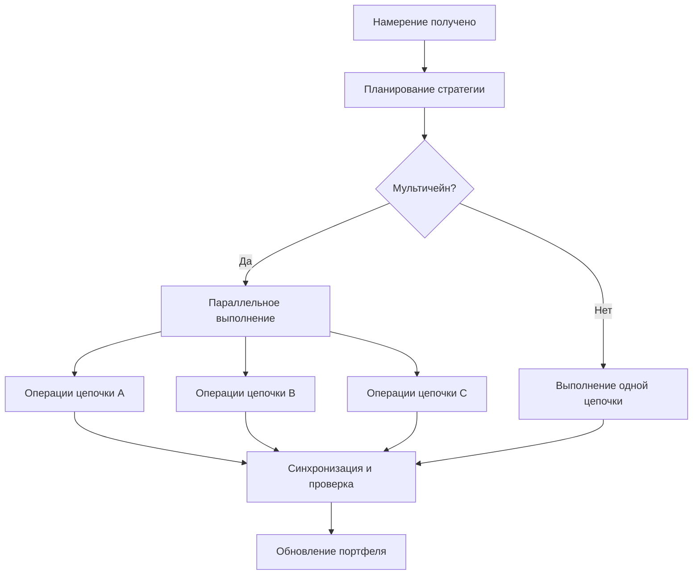

# Движок выполнения намерений

Сердцем Zap Pilot является наш движок выполнения намерений — сложная система, которая преобразует
намерения пользователей в оптимальные операции DeFi на нескольких блокчейнах.

## 🎯 Понимание намерений

### Что такое намерение?

Намерение — это высокоуровневое выражение того, чего вы хотите достичь, а не того, как это сделать:

#### **Традиционный подход DeFi:**

```
1. Перевести USDC из Ethereum в Arbitrum
2. Обменять 50% USDC на ETH на Uniswap V3
3. Добавить ликвидность USDC/ETH в пул
4. Застейкать LP-токены в Convex
5. Забрать вознаграждения и реинвестировать
```

#### **Подход, основанный на намерениях:**

```
"Я хочу инвестировать $1000 в фарминг доходности ETH/стейблкоинов
с умеренной толерантностью к риску"
```

### Компоненты намерения

Каждое намерение содержит:

- **Цель**: Чего вы хотите достичь
- **Ограничения**: Лимиты риска, временные предпочтения
- **Предпочтения**: Предпочтения цепочки, толерантность к газу
- **Контекст**: Текущий портфель, рыночные условия

## ⚙️ Конвейер выполнения

### 1. Разбор и проверка намерений (пример)

```typescript
interface UserIntent {
  objective: 'invest' | 'withdraw' | 'rebalance';
  amount: string;
  strategy: 'stablecoin' | 'index' | 'btc' | 'eth' | 'custom';
  riskTolerance: 'low' | 'medium' | 'high';
  timeHorizon: 'short' | 'medium' | 'long';
  constraints: {
    maxSlippage: number;
    gasLimit: string;
    chainPreferences: string[];
  };
}
```

### 2. Разрешение стратегии

Наш ИИ-движок анализирует ваше намерение с учетом:

- **Текущих рыночных условий**
- **Доступных возможностей доходности**
- **Вашего существующего портфеля**
- **Оптимизации риска и доходности**

### 3. Планирование выполнения

Планировщик создает оптимальную последовательность выполнения:

#### **Поиск пути**

- Определить все возможные маршруты выполнения
- Рассчитать затраты и риски для каждого пути
- Выбрать оптимальный маршрут с учетом:
  - Общих затрат на газ
  - Влияния на цену
  - Времени до выполнения
  - Вероятности сбоя

#### **Последовательность транзакций**

- Разбить сложные операции на атомарные шаги
- Планировать восстановление после сбоев на каждом шаге
- Оптимизировать для параллельного выполнения, где это возможно

### 4. Межцепочечная оркестровка

Выполнение операций на нескольких цепочках одновременно:



## 🧠 Оптимизация на основе ИИ

### Рыночная аналитика

Наша система постоянно учится на основе:

- **Исторических данных о доходности** по всем протоколам
- **Закономерностей цен на газ** в разных цепочках
- **Изменений глубины ликвидности** со временем
- **Событий риска протокола** и ответных мер

### Адаптивные стратегии

Стратегии развиваются на основе:

- **Изменений рыночного режима** (бычий/медвежий/боковой)
- **Ваших моделей поведения** и предпочтений
- **Обратной связи по производительности** от прошлых выполнений
- **Новых возможностей протокола**

## 🔄 Непрерывный мониторинг

### Отслеживание портфеля в реальном времени

После выполнения мы отслеживаем:

- **Производительность позиции** по всем протоколам
- **Изменения метрик риска** (корреляция, волатильность)
- **Возможности оптимизации доходности**
- **Условия срабатывания ребалансировки**

### Проактивное управление

Автоматические действия включают:

- **Получение вознаграждений** и автоматическое реинвестирование
- **Ребалансировка** при отклонении распределения >5%
- **Снижение риска** во время рыночного стресса
- **Переключение оптимизации доходности** на лучшие ставки

### Система оповещений

Получайте уведомления о:

- **Значительных прибылях/убытках** по позициям
- **Новых возможностях доходности**, соответствующих вашему профилю
- **Предупреждениях о риске** для используемых вами протоколов
- **Завершенных операциях ребалансировки**

## 🛠️ Расширенные функции

### Пользовательское написание сценариев намерений

Опытные пользователи могут создавать пользовательские намерения (пример):

```javascript
// Пример: Намерение усреднения долларовой стоимости
const dcaIntent = {
  objective: 'recurring_invest',
  amount: '500',
  frequency: 'weekly',
  strategy: 'index',
  duration: '12_months',
  conditions: {
    pauseIf: 'portfolio_loss > 20%',
    increaseIf: 'btc_price < 40000',
  },
};
```

### Пакетная обработка намерений

Отправляйте несколько намерений одновременно:

- **Ребалансировка портфеля** по стратегиям
- **Распределение по нескольким стратегиям** для диверсификации
- **Запланированные операции** для DCA и ребалансировки

### Шаблоны намерений

Предварительно созданные шаблоны для общих стратегий:

- **Индексный фонд**: Стратегии, взвешенные по рыночной капитализации, стратегия, похожая на
  S&P-500.
- **Консервативный доход**: Фокус на доходности стейблкоинов
- **Агрессивный рост**: Стратегии с высоким риском и высокой доходностью
- **Рыночно-нейтральный**: Дельта-нейтральные стратегии

---

Движок выполнения намерений — это то, что делает Zap Pilot волшебным — он преобразует сложность в
простоту, сохраняя при этом мощь и гибкость DeFi.

👉 **[Узнайте о межцепочечных операциях →](./cross-chain-operations)** 👉
**[Изучите ребалансировку →](./rebalancing)**
