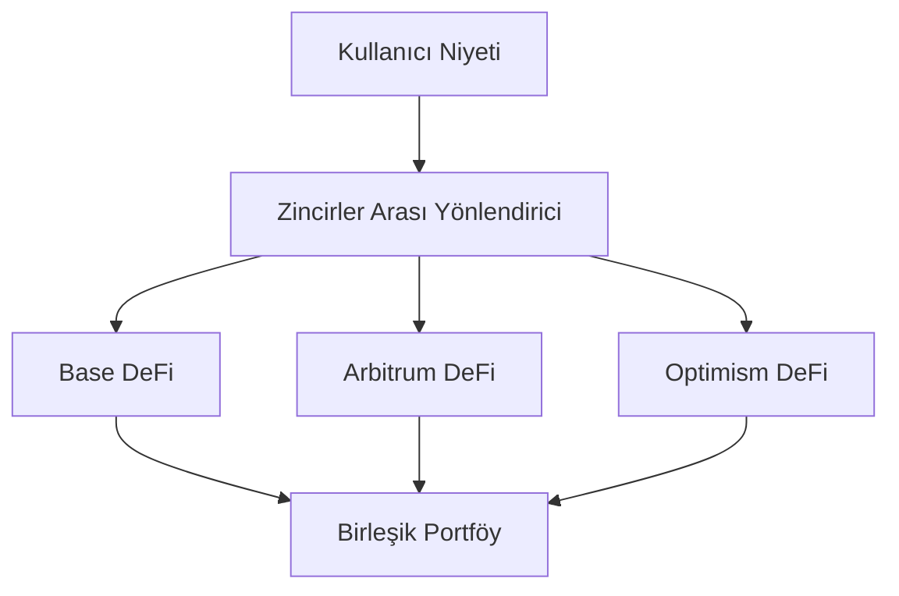

# Zincirler Arası Operasyonlar

**Base, Arbitrum ve Optimism'de sorunsuz DeFi** 🌐

Zap Pilot'un zincirler arası yetenekleri, farklı cüzdanları, tokenları veya köprüleri yönetme
karmaşası olmadan, çeşitli Katman 2 ağlarında, Ethereum ve Solana'da en iyi DeFi fırsatlarına
erişmenizi sağlar.

## 🔗 Çoklu Zincir Mimarisi

### Yerel Zincirler Arası Tasarım

Zincirler arası işlemleri sonradan akla gelen bir şey olarak gören diğer platformların aksine, Zap
Pilot, desteklediğimiz Katman 2 ağlarında yerel olarak çalışmak üzere sıfırdan inşa edilmiştir.

#### **Birleşik Likidite Havuzu**

Yatırımınız, tek bir birleşik portföy olarak görünürken en iyi fırsatları bulmak için
desteklediğimiz ağlar arasında otomatik olarak yayılır.

#### **Akıllı Zincir Seçimi**

Sistemimiz, her işlem için optimal blok zincirini şunlara göre otomatik olarak seçer:

- **Getiri Fırsatları**: Risk profilinize göre en yüksek APY
- **Likidite Derinliği**: İşlem boyutunuz için yeterli likidite
- **Gas Maliyetleri**: En düşük toplam yürütme maliyetleri
- **Güvenlik Seviyesi**: İşlem değeri için uygun güvenlik
- **Hız Gereksinimleri**: Zamana duyarlı işlemler için en hızlı yürütme

## 🌐 Desteklenen Ağlar

Zap Pilot, önde gelen Katman 2'ler, Ethereum ve Solana dahil olmak üzere giderek artan sayıda ağda
faaliyet göstermektedir. Akıllı yönlendirme sistemimiz, güvenlik, işlem maliyetleri, likidite ve hız
gibi faktörlerin bir kombinasyonuna dayanarak herhangi bir işlem için en iyi ağı otomatik olarak
seçer.

## ⚡ Zincirler Arası Yürütme Motoru

### Akıllı Yönlendirme

#### **Çoklu Yol Optimizasyonu**

Bir Endeks Fonu stratejisine 10.000 $ yatırım yaptığınızda, sistemimiz şunları yapabilir:

1. Kurulmuş DeFi protokolleri ve kaldıraçlı pozisyonlar için Arbitrum'a **4.000 $ dağıtın**
2. Gelişen fırsatlar ve kurumsal düzeyde protokoller için Base'e **3.500 $ dağıtın**
3. Yönetişim tokenları ve deneysel stratejiler için Optimism'e **2.500 $ dağıtın**
4. Ağlar arasında yeniden dengeleme için **1.000 $ likit tutun**

#### **Gerçek Zamanlı Optimizasyon**

Yönlendirme motoru şunları dikkate alır:

- **Gas Fiyat Farkları**: Gas en ucuz olduğunda yürütün
- **Getiri Oranı Değişiklikleri**: Daha iyi fırsatlara sahip zincirlere geçin
- **Likidite Koşulları**: Yetersiz likiditeye sahip zincirlerden kaçının
- **Ağ Tıkanıklığı**: Tıkalı ağların etrafından dolaşın
- **Köprü Kullanılabilirliği**: Güvenilir zincirler arası transferleri sağlayın

### Köprü Entegrasyonu

#### **Across Protocol - Köprü Ortağımız**

Tüm zincirler arası operasyonlar için Across Protocol'ü kullanıyoruz, optimal güvenlik, hız ve
maliyet verimliliği sağlıyoruz:

| Köprü Özelliği          | Across Protocol Faydaları                                |
| ----------------------- | -------------------------------------------------------- |
| **Desteklenen Rotalar** | Base, Arbitrum ve Optimism arasında sorunsuz transferler |
| **Güvenlik Modeli**     | Ekonomik garantilerle iyimser doğrulama                  |
| **Hız**                 | Ortalama 1-4 dakika tamamlama süresi                     |
| **Maliyet**             | Büyük köprü sağlayıcıları arasında en düşük ücretler     |
| **Güvenilirlik**        | Minimum kesinti süresi ile kanıtlanmış geçmiş performans |

#### **Neden Across Protocol**

- **İyimser Güvenlik**: Dürüst davranış için ekonomik teşviklerle iyimser doğrulama kullanır
- **Sermaye Verimliliği**: Minimum likidite gereksinimleri maliyetleri azaltır
- **Hızlı Uzlaşma**: UMA'nın oracle sistemi ile hızlı kesinlik
- **Kanıtlanmış Güvenilirlik**: Güçlü güvenlik geçmişine sahip, savaşta test edilmiş altyapı
- **Maliyet Etkin**: Sık yeniden dengeleme için optimize edilmiş rekabetçi ücretler

## 🎯 Zincirler Arası Strateji Faydaları

### Getiri Optimizasyonu

#### **Ağa Özel Fırsatlar**

Desteklediğimiz her ağ farklı alanlarda üstündür:

**Base**:

- Coinbase ekosistem faydaları ve kurumsal güven
- Düzenleyici dostu protokoller ve uyumluluk
- Büyüyen kurumsal DeFi benimsenmesi
- Geleneksel finans entegrasyon fırsatları
- Gelişen yüksek kaliteli protokoller

**Arbitrum**:

- Kanıtlanmış protokollere sahip olgun DeFi ekosistemi
- Gelişmiş ticaret altyapısı (GMX, Camelot)
- Kurulmuş likidite havuzları ve getiri fırsatları
- Aynı güvenlikle Ethereum'dan daha düşük maliyetler
- Sofistike kaldıraçlı stratejiler

**Optimism**:

- Yeni DeFi deneyleri için inovasyon merkezi
- Güçlü yönetişim token ekosistemleri
- Geliştirici dostu ortam
- Büyüyen kurumsal benimsenmesi
- Benzersiz protokol fırsatları (Velodrome, Synthetix)

#### **Getiri Arbitrajı**

Sistemimiz sürekli olarak arbitraj fırsatlarını belirler ve yakalar:

- **Protokol Oran Farkları**: Aynı protokol, farklı zincirler
- **Token Fiyat Farklılıkları**: Köprü prim/indirim arbitrajı
- **Teşvik Çiftçiliği**: Zincire özel likidite teşvikleri
- **Gas Verimliliği**: En uygun maliyetli yerde yürütün

### Risk Çeşitlendirmesi

#### **Teknoloji Riski Dağıtımı**

Zincirler arasında yayılma şunları azaltır:

- **Tek Zincir Riski**: Bir zincirin çalışma süresine bağlı değil
- **Köprü Riski**: Birden fazla köprü sağlayıcısı karşı taraf riskini azaltır
- **Konsensüs Riski**: Farklı konsensüs mekanizmaları
- **Yönetişim Riski**: Bir zincirin yönetişim kararlarına tabi değil

#### **Düzenleyici Risk Azaltma**

- **Yargı Yetkisi Çeşitlendirmesi**: Farklı düzenleyici ortamlardaki protokoller
- **Uyum Seçeneği**: Düzenlemeler geliştikçe uyumlu zincirlere geçiş
- **Sansür Direnci**: Birden fazla zincir sansür riskini azaltır
- **Operasyonel Süreklilik**: Bir zincir sorun yaşasa bile operasyonlara devam edin

## 🔄 Zincirler Arası Yeniden Dengeleme

### Akıllı Yeniden Dengeleme

#### **Zincirler Arası Portföy Yönetimi**

Bir stratejiyi yeniden dengelerken şunları dikkate alırız:

- **Mevcut Tahsisler**: Varlıkların şu anda nerede olduğu
- **Hedef Tahsisler**: Zincirler arasında optimal dağıtım
- **Yeniden Dengeleme Maliyetleri**: Köprü ücretleri ve optimizasyon faydaları
- **Piyasa Koşulları**: Hangi zincirler en iyi fırsatları sunuyor

#### **Örnek: Endeks Fonu Yeniden Dengeleme**

**Mevcut Durum:**

- Arbitrum: Portföyün %50'si
- Base: Portföyün %30'u
- Optimism: Portföyün %20'si

**Piyasa Değişikliği:** Base'de yeni yüksek getirili bir fırsat ortaya çıkıyor **Eylem:** Across
Protocol kullanarak Arbitrum'dan Base'e 2 gün içinde %15'i kademeli olarak kaydırın **Dikkate
Alınanlar:** Köprü maliyetlerini getiri faydalarıyla dengeleyin ve çeşitlendirmeyi sürdürün

### Maliyet Optimizasyonu

#### **Yeniden Dengeleme Verimliliği**

- **Toplu İşlemler**: Birden fazla yeniden dengeleme eylemini birleştirin
- **Gas Zamanlaması**: Optimal gas fiyatı pencerelerinde yürütün
- **Yol Optimizasyonu**: Gerekli köprü sayısını minimize edin
- **Eşik Yönetimi**: Yalnızca faydalar maliyetleri aştığında yeniden dengeleyin

#### **Kullanıcı Maliyet Tasarrufları**

Manuel zincirler arası yönetime kıyasla:

- **%80 Daha Düşük Gas Maliyetleri**: Toplu işlem ve optimizasyon yoluyla
- **%90 Daha Az Karmaşıklık**: Otomatik köprü seçimi ve yürütme
- **%100 Daha Az Zaman**: Ayarla ve unut zincirler arası operasyonlar
- **Daha İyi Getiriler**: Kaçırabileceğiniz fırsatlara erişim

## 📊 Zincirler Arası Analiz

### Birleşik Portföy Görünümü

#### **Zincirden Bağımsız Raporlama**

Kontrol paneliniz şunları gösterir:

- **Toplam Portföy Değeri**: Tüm zincirlerdeki USD değeri
- **Zincir Tahsisi**: Her zincirde ne kadar değer olduğu
- **Performans Atfı**: Hangi zincirlerin getirileri katkıda bulunduğu
- **Risk Maruziyeti**: Konsantrasyon ve çeşitlendirme metrikleri

#### **Zincirler Arası Performans Takibi**

- **Getiri Karşılaştırması**: Her zincirde kazanılan APY
- **Maliyet Analizi**: Zincire göre köprü ve gas maliyetleri
- **Verimlilik Metrikleri**: Ödenen ücretin dolar başına getirisi
- **Fırsat Maliyeti**: Diğer zincirlerde kaçırmış olabileceğiniz şeyler

### Köprü Maliyet Takibi

#### **Tam Maliyet Şeffaflığı**

Tüm zincirler arası maliyetleri takip edin:

- **Köprü Ücretleri**: Köprü protokolleri tarafından tahsil edilen açık ücretler
- **Gas Maliyetleri**: Köprü işlemleri için L1 ve L2 gas ücretleri
- **Kayma**: Köprüleme işlemlerinden kaynaklanan fiyat etkisi
- **Fırsat Maliyeti**: Köprüler sırasında paranın zaman değeri

#### **ROI Analizi**

Her zincirler arası işlem için:

- **Maliyet Gerekçesi**: Hareketin neden karlı olduğu
- **Başa Baş Noktasına Ulaşma Süresi**: Köprü maliyetlerini geri kazanmak ne kadar sürer
- **Alternatif Analiz**: Hareket olmasaydı ne olurdu
- **Optimizasyon Puanı**: Yönlendirmenin ne kadar iyi performans gösterdiği

## 🛡️ Zincirler Arası Güvenlik

### Güvenlik Modeli

#### **Çok Katmanlı Güvenlik**

- **Köprü Güvenliği**: Yalnızca denetlenmiş, kanıtlanmış köprüleri kullanın
- **Zincir Güvenliği**: Daha büyük miktarlar için daha güvenli zincirleri tercih edin
- **Çeşitlendirme**: Riski birden fazla zincir ve köprüye yayın
- **İzleme**: Tüm zincirlerde gerçek zamanlı güvenlik izleme

#### **Köprü Risk Yönetimi**

- **Köprü Limitleri**: Köprü sağlayıcısı başına maksimum maruziyet
- **Güvenlik Puanlaması**: Köprü sağlığının gerçek zamanlı değerlendirmesi
- **Olay Müdahalesi**: Köprü güvenlik olaylarına anında müdahale
- **Sigorta Kapsamı**: Mümkün olduğunda köprü arızalarına karşı koruma

### Acil Durum Prosedürleri

Güvenlik sorunları durumunda:

1. **Anında Duraklatma**: Tüm zincirler arası işlemleri durdurun
2. **Varlık Değerlendirmesi**: Güvenli ve riskli pozisyonları belirleyin
3. **Acil Çıkışlar**: Güvenli zincirlere hızlı çekim
4. **Kullanıcı İletişimi**: Durum ve eylemler hakkında net güncellemeler
5. **Kurtarma Planlaması**: Sistematik kurtarma ve yeniden başlama

---

Zincirler arası operasyonlar, Zap Pilot'u gerçekten güçlü kılan şeydir - kullanıcılar için basitliği
korurken tüm DeFi evrenine erişim. Tüm zincirlerin faydalarını, bunları ayrı ayrı yönetme karmaşası
olmadan elde edersiniz.

👉 **[Yeniden Dengeleme Hakkında Bilgi Edinin →](./rebalancing)** 👉
**[Strateji Yürütmeyi Keşfedin →](./intent-execution)** 👉
**[Desteklenen Ağları Görüntüle →](../security)**
