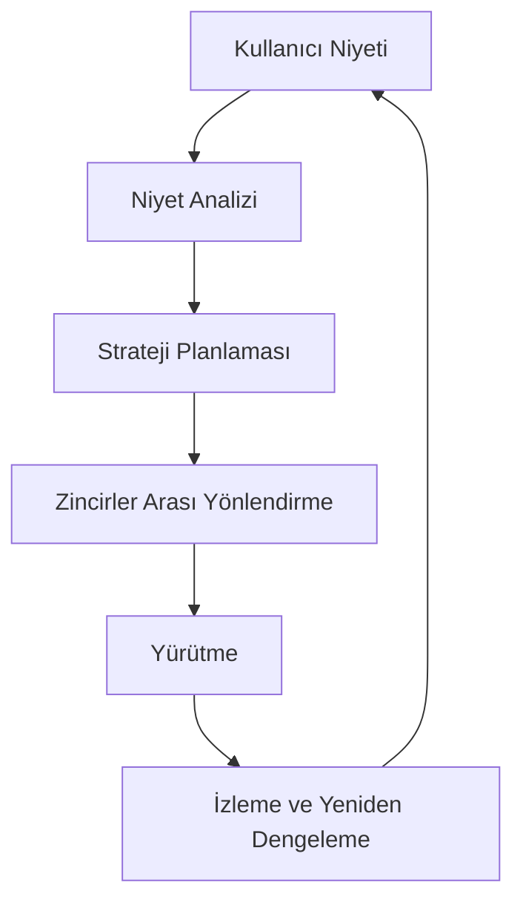

# Zap Pilot Nasıl Çalışır?

Zap Pilot, karmaşık DeFi operasyonlarını, niyet tabanlı yürütme motorumuz aracılığıyla basit, tek
tıklamayla deneyimlere dönüştürür. İşte sihrin nasıl gerçekleştiği:

## 🧠 Niyet Tabanlı Yürütme

### Niyetler Nelerdir?

İşlemleri **nasıl** yürüteceğinizi belirtmek yerine, bize sadece **ne** başarmak istediğinizi
söylersiniz:

```
Niyet: "Muhafazakar bir stablecoin stratejisine 500 $ yatırım yapmak istiyorum"

Geleneksel DeFi: 3 zincirde 12+ işlem
Zap Pilot: 1 tıklama, tamamen otomatik
```

### Niyet Yaşam Döngüsü



## ⚡ 3 Adımlı Süreç

### 1. **Niyetinizi İfade Edin**

- Yatırım miktarını seçin
- Strateji türünü seçin
- Risk tercihlerini ayarlayın
- Zaman ufkunu tanımlayın

### 2. **Yapay Zeka Destekli Planlama**

- Mevcut piyasa koşullarını analiz edin
- Optimal protokolleri ve zincirleri belirleyin
- En iyi yürütme yollarını hesaplayın
- Gas verimli işlemler planlayın

### 3. **Onay ile Yürütme**

- Birden fazla zincirde aynı anda yürütün
- En düşük ücretler ve en iyi oranlar için optimize edin
- Gerçek zamanlı olarak izleyin
- Onayınız için gerektiğinde yeniden dengeleme önerin

## 🔗 Zincirler Arası Zeka

### Yerel Çoklu Zincir Desteği

Zap Pilot sadece varlıkları köprülemez — önde gelen Katman 2'ler, Ethereum ve Solana dahil olmak
üzere birden fazla zinciri yerel olarak anlar ve üzerinde çalışır.

### Akıllı Yönlendirme

Yönlendirme motorumuz şunları dikkate alır:

- Tüm zincirlerdeki **gas maliyetleri**
- Farklı havuzlardaki **likidite derinliği**
- Her ağdaki **getiri fırsatları**
- **Köprü güvenliği** ve hızı
- **Mevcut ağ tıkanıklığı**

## 🎯 Strateji Yürütme

### Otomatik Portföy Yönetimi

Stratejiniz aktif hale geldiğinde, Zap Pilot sürekli olarak:

#### **Performansı İzler**

- Tüm pozisyonlardaki getirileri takip edin
- Gerçek zamanlı olarak risk metriklerini izleyin
- Strateji kaymasını izleyin

#### **Tahsisi Optimize Eder**

- Hedefler %5'ten fazla saptığında yeniden dengeleyin
- Varlıkları daha yüksek getirili fırsatlara taşıyın

#### **Riski Yönetir**

- Protokoller arasında otomatik olarak çeşitlendirin

### Akıllı Yeniden Dengeleme

Kelly Kriteri tabanlı tahsis sistemimiz:

- Optimal pozisyon boyutlarını hesaplar
- Varlıklar arasındaki korelasyonu hesaba katar
- İşlem maliyetlerini minimize eder
- Riske göre ayarlanmış getirileri maksimize eder

## 🛡️ Hesap Soyutlama Entegrasyonu

### Hesap Soyutlama ile Gas'sız Deneyim

ThirdWeb'in akıllı cüzdan altyapısı aracılığıyla:

- Paymaster aracılığıyla uygun işlemler için **gas sponsorluğu**
- Sosyal cüzdan seçenekleriyle **basitleştirilmiş katılım**
- İşlem sayısını azaltmak için **toplu işlemler**
- Birleşik deneyimle **çoklu zincir desteği**

### Gelişmiş Güvenlik

- Kurumsal kullanıcılar için **çoklu imza desteği**
- **Sosyal kurtarma** seçenekleri
- **Harcama limitleri** ve kontrolleri
- Otomatik stratejiler için **oturum anahtarları**

## 📊 Gerçek Zamanlı Zeka

### Piyasa Analizi

- 100+ protokolde **7/24 getiri izleme**
- DeFi protokollerinin **risk değerlendirmesi**
- Optimal yürütme için **likidite analizi**

### Portföy Analizi

- **Performans atfı** - getirileri neyin sağladığını bilin (çok yakında)
- **Risk ayrıştırması** - maruziyetinizi anlayın
- **Senaryo analizi** - portföyünüzü stres testinden geçirin
- **Vergi optimizasyonu** - vergilendirilebilir olayları minimize edin

## 🔄 Sürekli Optimizasyon

### Dinamik Strateji Ayarı

Stratejiniz piyasa koşullarıyla birlikte gelişir:

#### **Piyasa Rejimi Tespiti**

- Boğa piyasası: Risk maruziyetini artırın
- Ayı piyasası: Sermayeyi koruyun
- Yatay: Getiri üretimine odaklanın

#### **Protokol Sağlık İzleme**

- TVL değişikliklerini takip edin
- Yönetişim risklerini izleyin
- Exploit uyarılarını izleyin
- Gerektiğinde otomatik riskten kaçınma

## 🏗️ Altyapı

### Ölçek İçin İnşa Edildi

- Hızlı protokol entegrasyonu için **modüler mimari**
- Gerçek zamanlı yanıt verebilirlik için **olay odaklı sistem**
- Başarısız işlemleri önlemek için **yedekli yürütme**
- %99,9 çalışma süresi SLA'sı ile **yüksek kullanılabilirlik**

### Entegrasyon Ortakları

- En iyi takas oranları için **20+ DEX toplayıcı**
- Çeşitli fırsatlar için **50+ getiri protokolü**
- Güvenilir zincirler arası için **10+ köprü sağlayıcı**
- Risk kapsamı için **5+ sigorta sağlayıcı**

---

Çalışırken görmeye hazır mısınız?

👉 **[Başlarken →](../getting-started)** 👉 **[Stratejileri Görüntüle →](../strategies)**
