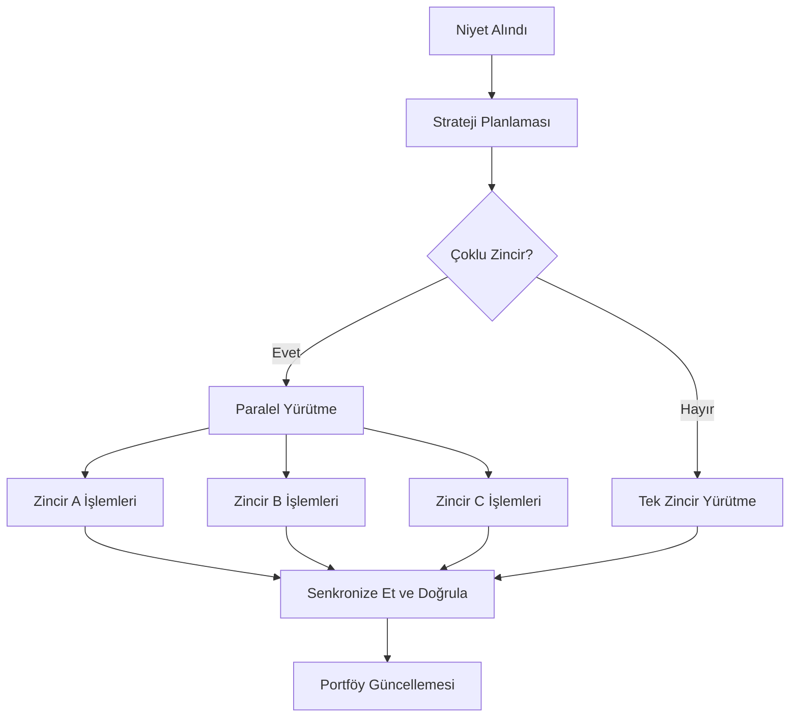

# Niyet Yürütme Motoru

Zap Pilot'un kalbi, niyet yürütme motorumuzdur — kullanıcı niyetlerini birden fazla blok zincirinde
optimal DeFi operasyonlarına dönüştüren sofistike bir sistemdir.

## 🎯 Niyetleri Anlamak

### Niyet Nedir?

Bir niyet, neyi başarmak istediğinizin yüksek seviyeli bir ifadesidir, nasıl başaracağınızın değil:

#### **Geleneksel DeFi Yaklaşımı:**

```
1. USDC'yi Ethereum'dan Arbitrum'a köprüleyin
2. Uniswap V3'te %50 USDC'yi ETH'ye takas edin
3. USDC/ETH likiditesini havuza ekleyin
4. LP tokenlarını Convex'te stake edin
5. Ödülleri talep edin ve bileşik yapın
```

#### **Niyet Tabanlı Yaklaşım:**

```
"Orta risk toleransıyla ETH/stablecoin getiri çiftçiliğine 1000 $ yatırım yapmak istiyorum"
```

### Niyet Bileşenleri

Her niyet şunları içerir:

- **Hedef**: Neyi başarmak istediğiniz
- **Kısıtlamalar**: Risk limitleri, zaman tercihleri
- **Tercihler**: Zincir tercihleri, gas toleransı
- **Bağlam**: Mevcut portföy, piyasa koşulları

## ⚙️ Yürütme Hattı

### 1. Niyet Ayrıştırma ve Doğrulama (Örnek)

```typescript
interface UserIntent {
  objective: 'invest' | 'withdraw' | 'rebalance';
  amount: string;
  strategy: 'stablecoin' | 'index' | 'btc' | 'eth' | 'custom';
  riskTolerance: 'low' | 'medium' | 'high';
  timeHorizon: 'short' | 'medium' | 'long';
  constraints: {
    maxSlippage: number;
    gasLimit: string;
    chainPreferences: string[];
  };
}
```

### 2. Strateji Çözünürlüğü

Yapay zeka motorumuz niyetinizi şunlara göre analiz eder:

- **Mevcut piyasa koşulları**
- **Mevcut getiri fırsatları**
- **Mevcut portföyünüz**
- **Risk-getiri optimizasyonu**

### 3. Yürütme Planlaması

Planlayıcı, optimal bir yürütme sırası oluşturur:

#### **Yol Bulma**

- Tüm olası yürütme rotalarını belirleyin
- Her yol için maliyetleri ve riskleri hesaplayın
- Şunları göz önünde bulundurarak optimal rotayı seçin:
  - Toplam gas maliyetleri
  - Fiyat etkisi
  - Yürütme süresi
  - Başarısızlık olasılığı

#### **İşlem Sıralaması**

- Karmaşık işlemleri atomik adımlara ayırın
- Her adımda hata kurtarma planlayın
- Mümkün olduğunda paralel yürütme için optimize edin

### 4. Zincirler Arası Orkestrasyon

Birden fazla zincirde aynı anda işlemler gerçekleştirin:



## 🧠 Yapay Zeka Destekli Optimizasyon

### Piyasa Zekası

Sistemimiz sürekli olarak şunlardan öğrenir:

- Tüm protokollerdeki **tarihsel getiri verileri**
- Farklı zincirlerdeki **gas fiyatı modelleri**
- Zamanla değişen **likidite derinliği**
- **Protokol risk olayları** ve yanıtları

### Uyarlanabilir Stratejiler

Stratejiler şunlara göre gelişir:

- **Piyasa rejimi değişiklikleri** (boğa/ayı/yatay)
- **Davranış kalıplarınız** ve tercihleriniz
- Geçmiş yürütmelerden **performans geri bildirimi**
- **Yeni protokol fırsatları**

## 🔄 Sürekli İzleme

### Gerçek Zamanlı Portföy Takibi

Yürütüldükten sonra şunları izliyoruz:

- Tüm protokollerdeki **pozisyon performansı**
- **Risk metrik değişiklikleri** (korelasyon, oynaklık)
- **Getiri optimizasyonu** fırsatları
- **Yeniden dengeleme tetikleyici** koşulları

### Proaktif Yönetim

Otomatik eylemler şunları içerir:

- **Ödül talep etme** ve otomatik bileşik
- Tahsisler %5'ten fazla saptığında **yeniden dengeleme**
- Piyasa stresi sırasında **riskten kaçınma** hareketleri
- Daha iyi oranlara geçiş için **getiri optimizasyonu**

### Uyarı Sistemi

Şunlar hakkında bildirim alın:

- Pozisyonlardaki **önemli kazançlar/kayıplar**
- Profilinize uygun **yeni getiri fırsatları**
- Kullandığınız protokoller için **risk uyarıları**
- **Yeniden dengeleme** işlemleri tamamlandı

## 🛠️ Gelişmiş Özellikler

### Özel Niyet Betikleme

Gelişmiş kullanıcılar özel niyetler oluşturabilir (Örnek):

```javascript
// Örnek: Dolar maliyet ortalaması niyeti
const dcaIntent = {
  objective: 'recurring_invest',
  amount: '500',
  frequency: 'weekly',
  strategy: 'index',
  duration: '12_months',
  conditions: {
    pauseIf: 'portfolio_loss > 20%',
    increaseIf: 'btc_price < 40000',
  },
};
```

### Toplu Niyet İşleme

Aynı anda birden fazla niyet gönderin:

- Stratejiler arasında **portföy yeniden dengeleme**
- Çeşitlendirme için **çoklu strateji tahsisi**
- DCA ve yeniden dengeleme için **planlanmış işlemler**

### Niyet Şablonları

Yaygın stratejiler için önceden oluşturulmuş şablonlar:

- **Endeks Fonu**: Piyasa değeri ağırlıklı stratejiler, S&P-500 benzeri strateji.
- **Muhafazakar Gelir**: Stablecoin getiri odaklı
- **Agresif Büyüme**: Yüksek riskli, yüksek getirili stratejiler
- **Piyasa Nötr**: Delta-nötr stratejiler

---

Niyet yürütme motoru, Zap Pilot'u büyülü kılan şeydir — karmaşıklığı basitliğe dönüştürürken
DeFi'nin gücünü ve esnekliğini korur.

👉 **[Zincirler Arası Operasyonlar Hakkında Bilgi Edinin →](./cross-chain-operations)** 👉
**[Yeniden Dengelemeyi Keşfedin →](./rebalancing)**
