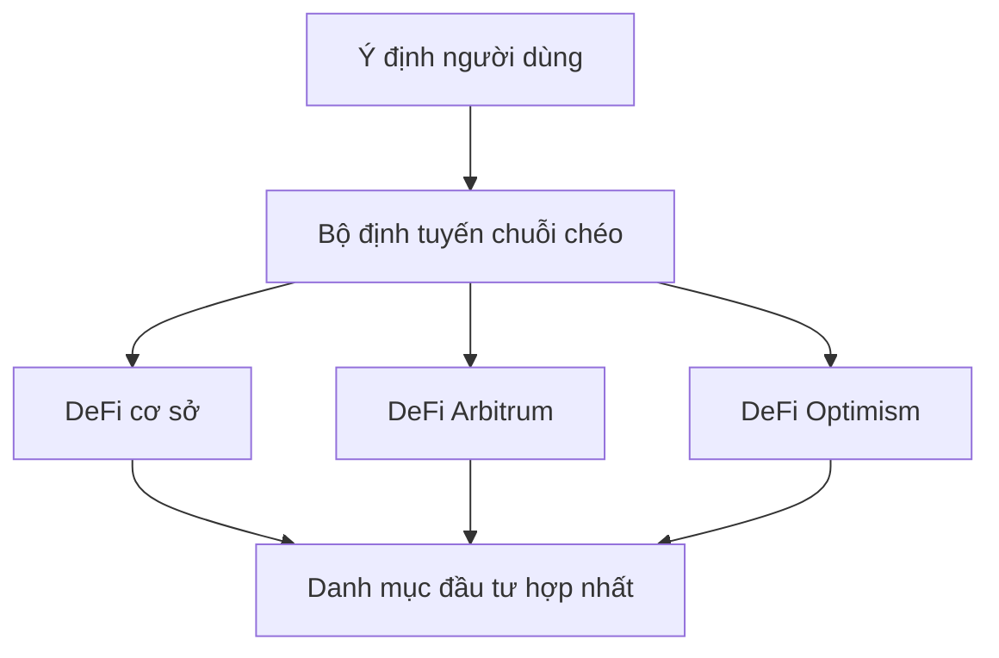

# Hoạt động chuỗi chéo

**DeFi liền mạch trên Base, Arbitrum và Optimism** 🌐

Khả năng chuỗi chéo của Zap Pilot cho phép bạn truy cập các cơ hội DeFi tốt nhất trên nhiều mạng
Layer 2 khác nhau, cũng như Ethereum và Solana, mà không gặp phải sự phức tạp trong việc quản lý các
ví, token hoặc cầu nối khác nhau.

## 🔗 Kiến trúc đa chuỗi

### Thiết kế chuỗi chéo gốc

Không giống như các nền tảng khác coi chuỗi chéo là một suy nghĩ sau, Zap Pilot được xây dựng từ đầu
để hoạt động nguyên bản trên các mạng Layer 2 được hỗ trợ của chúng tôi.

#### **Pool thanh khoản hợp nhất**

Khoản đầu tư của bạn tự động trải rộng trên các mạng được hỗ trợ của chúng tôi để tìm kiếm các cơ
hội tốt nhất trong khi xuất hiện dưới dạng một danh mục đầu tư duy nhất, hợp nhất.

#### **Lựa chọn chuỗi thông minh**

Hệ thống của chúng tôi tự động chọn blockchain tối ưu cho mỗi hoạt động dựa trên:

- **Cơ hội lợi nhuận**: APY cao nhất cho hồ sơ rủi ro của bạn
- **Độ sâu thanh khoản**: Thanh khoản đủ cho kích thước giao dịch của bạn
- **Chi phí gas**: Tổng chi phí thực hiện thấp nhất
- **Mức độ bảo mật**: Bảo mật phù hợp với giá trị giao dịch
- **Yêu cầu tốc độ**: Thực hiện nhanh nhất cho các hoạt động nhạy cảm về thời gian

## 🌐 Mạng được hỗ trợ

Zap Pilot hoạt động trên số lượng mạng ngày càng tăng, bao gồm các Layer 2 hàng đầu, Ethereum và
Solana. Hệ thống định tuyến thông minh của chúng tôi tự động chọn mạng tốt nhất cho bất kỳ hoạt động
nào dựa trên sự kết hợp của các yếu tố bao gồm bảo mật, chi phí giao dịch, thanh khoản và tốc độ.

## ⚡ Công cụ thực thi chuỗi chéo

### Định tuyến thông minh

#### **Tối ưu hóa đa đường**

Khi bạn đầu tư 10.000 đô la vào chiến lược Quỹ chỉ số, hệ thống của chúng tôi có thể:

1. **Triển khai 4.000 đô la** trên Arbitrum cho các giao thức DeFi đã được thiết lập và các vị thế
   đòn bẩy
2. **Triển khai 3.500 đô la** trên Base cho các cơ hội mới nổi và các giao thức cấp tổ chức
3. **Triển khai 2.500 đô la** trên Optimism cho các token quản trị và các chiến lược thử nghiệm
4. **Giữ 1.000 đô la** thanh khoản để tái cân bằng trên các mạng

#### **Tối ưu hóa thời gian thực**

Công cụ định tuyến xem xét:

- **Chênh lệch giá gas**: Thực hiện khi gas rẻ nhất
- **Thay đổi tỷ lệ lợi nhuận**: Chuyển sang các chuỗi có cơ hội tốt hơn
- **Điều kiện thanh khoản**: Tránh các chuỗi có thanh khoản không đủ
- **Tắc nghẽn mạng**: Định tuyến xung quanh các mạng bị tắc nghẽn
- **Tính khả dụng của cầu nối**: Đảm bảo chuyển khoản chuỗi chéo đáng tin cậy

### Tích hợp cầu nối

#### **Across Protocol - Đối tác cầu nối của chúng tôi**

Chúng tôi sử dụng Across Protocol cho tất cả các hoạt động chuỗi chéo, cung cấp bảo mật, tốc độ và
hiệu quả chi phí tối ưu:

| Tính năng cầu nối               | Lợi ích của Across Protocol                                               |
| ------------------------------- | ------------------------------------------------------------------------- |
| **Các tuyến đường được hỗ trợ** | Chuyển khoản liền mạch giữa Base, Arbitrum và Optimism                    |
| **Mô hình bảo mật**             | Xác minh lạc quan với các đảm bảo kinh tế                                 |
| **Tốc độ**                      | Thời gian hoàn thành trung bình 1-4 phút                                  |
| **Chi phí**                     | Phí thấp nhất trong số các nhà cung cấp cầu nối lớn                       |
| **Độ tin cậy**                  | Hồ sơ theo dõi đã được chứng minh với thời gian ngừng hoạt động tối thiểu |

#### **Tại sao Across Protocol**

- **Bảo mật lạc quan**: Sử dụng xác minh lạc quan với các ưu đãi kinh tế cho hành vi trung thực
- **Hiệu quả vốn**: Yêu cầu thanh khoản tối thiểu giảm chi phí
- **Thanh toán nhanh**: Hoàn tất nhanh chóng với hệ thống oracle của UMA
- **Độ tin cậy đã được chứng minh**: Cơ sở hạ tầng đã được thử nghiệm trong thực chiến với hồ sơ
  theo dõi bảo mật mạnh mẽ
- **Hiệu quả chi phí**: Phí cạnh tranh được tối ưu hóa cho việc tái cân bằng thường xuyên

## 🎯 Lợi ích chiến lược chuỗi chéo

### Tối ưu hóa lợi nhuận

#### **Cơ hội dành riêng cho mạng**

Mỗi mạng được hỗ trợ của chúng tôi đều xuất sắc trong các lĩnh vực khác nhau:

**Base**:

- Lợi ích hệ sinh thái Coinbase và niềm tin của tổ chức
- Các giao thức thân thiện với quy định và tuân thủ
- Tăng trưởng áp dụng DeFi của tổ chức
- Cơ hội tích hợp tài chính truyền thống
- Các giao thức chất lượng cao mới nổi

**Arbitrum**:

- Hệ sinh thái DeFi trưởng thành với các giao thức đã được chứng minh
- Cơ sở hạ tầng giao dịch nâng cao (GMX, Camelot)
- Các pool thanh khoản và cơ hội lợi nhuận đã được thiết lập
- Chi phí thấp hơn Ethereum với cùng bảo mật
- Các chiến lược đòn bẩy tinh vi

**Optimism**:

- Trung tâm đổi mới cho các thử nghiệm DeFi mới
- Hệ sinh thái token quản trị mạnh mẽ
- Môi trường thân thiện với nhà phát triển
- Tăng trưởng áp dụng của tổ chức
- Các cơ hội giao thức độc đáo (Velodrome, Synthetix)

#### **Arbitrage lợi nhuận**

Hệ thống của chúng tôi liên tục xác định và nắm bắt các cơ hội arbitrage:

- **Chênh lệch tỷ lệ giao thức**: Cùng một giao thức, các chuỗi khác nhau
- **Chênh lệch giá token**: Arbitrage phí bảo hiểm/chiết khấu cầu nối
- **Canh tác khuyến khích**: Các ưu đãi thanh khoản dành riêng cho chuỗi
- **Hiệu quả gas**: Thực hiện ở nơi hiệu quả chi phí nhất

### Đa dạng hóa rủi ro

#### **Phân phối rủi ro công nghệ**

Trải rộng trên các chuỗi giúp giảm:

- **Rủi ro chuỗi đơn lẻ**: Không phụ thuộc vào thời gian hoạt động của một chuỗi
- **Rủi ro cầu nối**: Nhiều nhà cung cấp cầu nối giảm rủi ro đối tác
- **Rủi ro đồng thuận**: Các cơ chế đồng thuận khác nhau
- **Rủi ro quản trị**: Không phải tuân theo các quyết định quản trị của một chuỗi

#### **Giảm thiểu rủi ro quy định**

- **Đa dạng hóa khu vực pháp lý**: Các giao thức trên các môi trường quy định khác nhau
- **Tùy chọn tuân thủ**: Chuyển sang các chuỗi tuân thủ khi các quy định phát triển
- **Kháng kiểm duyệt**: Nhiều chuỗi giảm rủi ro kiểm duyệt
- **Tính liên tục hoạt động**: Tiếp tục hoạt động ngay cả khi một chuỗi gặp sự cố

## 🔄 Tái cân bằng chuỗi chéo

### Tái cân bằng thông minh

#### **Quản lý danh mục đầu tư chuỗi chéo**

Khi tái cân bằng một chiến lược, chúng tôi xem xét:

- **Phân bổ hiện tại**: Nơi tài sản hiện đang nằm
- **Phân bổ mục tiêu**: Phân phối tối ưu trên các chuỗi
- **Chi phí tái cân bằng**: Phí cầu nối so với lợi ích tối ưu hóa
- **Điều kiện thị trường**: Chuỗi nào mang lại cơ hội tốt nhất

#### **Ví dụ: Tái cân bằng quỹ chỉ số**

**Trạng thái hiện tại:**

- Arbitrum: 50% danh mục đầu tư
- Base: 30% danh mục đầu tư
- Optimism: 20% danh mục đầu tư

**Thay đổi thị trường:** Cơ hội lợi nhuận cao mới xuất hiện trên Base **Hành động:** Dần dần chuyển
15% từ Arbitrum sang Base trong 2 ngày bằng cách sử dụng Across Protocol **Xem xét:** Cân bằng chi
phí cầu nối với lợi ích lợi nhuận và duy trì đa dạng hóa

### Tối ưu hóa chi phí

#### **Hiệu quả tái cân bằng**

- **Hoạt động theo lô**: Kết hợp nhiều hành động tái cân bằng
- **Thời gian gas**: Thực hiện trong các khoảng thời gian giá gas tối ưu
- **Tối ưu hóa đường dẫn**: Giảm thiểu số lượng cầu nối cần thiết
- **Quản lý ngưỡng**: Chỉ tái cân bằng khi lợi ích vượt quá chi phí

#### **Tiết kiệm chi phí người dùng**

So với quản lý chuỗi chéo thủ công:

- **Giảm 80% chi phí gas**: Thông qua gộp và tối ưu hóa
- **Giảm 90% độ phức tạp**: Lựa chọn và thực hiện cầu nối tự động
- **Giảm 100% thời gian**: Các hoạt động chuỗi chéo thiết lập và quên
- **Lợi nhuận tốt hơn**: Tiếp cận các cơ hội mà bạn có thể bỏ lỡ

## 📊 Phân tích chuỗi chéo

### Chế độ xem danh mục đầu tư hợp nhất

#### **Báo cáo không phụ thuộc chuỗi**

Bảng điều khiển của bạn hiển thị:

- **Tổng giá trị danh mục đầu tư**: Giá trị USD trên tất cả các chuỗi
- **Phân bổ chuỗi**: Giá trị bao nhiêu trên mỗi chuỗi
- **Phân bổ hiệu suất**: Chuỗi nào đã đóng góp vào lợi nhuận
- **Tiếp xúc rủi ro**: Các chỉ số tập trung và đa dạng hóa

#### **Theo dõi hiệu suất chuỗi chéo**

- **So sánh lợi nhuận**: APY kiếm được trên mỗi chuỗi
- **Phân tích chi phí**: Chi phí cầu nối và gas theo chuỗi
- **Các chỉ số hiệu quả**: Lợi nhuận trên mỗi đô la phí đã trả
- **Chi phí cơ hội**: Những gì bạn có thể đã bỏ lỡ trên các chuỗi khác

### Theo dõi chi phí cầu nối

#### **Minh bạch chi phí hoàn toàn**

Theo dõi tất cả các chi phí chuỗi chéo:

- **Phí cầu nối**: Phí rõ ràng do các giao thức cầu nối tính
- **Chi phí gas**: Phí gas L1 và L2 cho các giao dịch cầu nối
- **Trượt giá**: Tác động giá từ các hoạt động cầu nối
- **Chi phí cơ hội**: Giá trị thời gian của tiền trong quá trình bắc cầu

#### **Phân tích ROI**

Đối với mỗi hoạt động chuỗi chéo:

- **Biện minh chi phí**: Tại sao việc di chuyển có lợi nhuận
- **Thời gian hòa vốn**: Mất bao lâu để thu hồi chi phí cầu nối
- **Phân tích thay thế**: Điều gì sẽ xảy ra nếu không có việc di chuyển
- **Điểm tối ưu hóa**: Hiệu suất định tuyến tốt như thế nào

## 🛡️ Bảo mật chuỗi chéo

### Mô hình bảo mật

#### **Bảo mật đa lớp**

- **Bảo mật cầu nối**: Chỉ sử dụng các cầu nối đã được kiểm toán, đã được chứng minh
- **Bảo mật chuỗi**: Ưu tiên các chuỗi an toàn hơn cho số tiền lớn hơn
- **Đa dạng hóa**: Phân tán rủi ro trên nhiều chuỗi và cầu nối
- **Giám sát**: Giám sát bảo mật thời gian thực trên tất cả các chuỗi

#### **Quản lý rủi ro cầu nối**

- **Giới hạn cầu nối**: Mức độ tiếp xúc tối đa cho mỗi nhà cung cấp cầu nối
- **Đánh giá bảo mật**: Đánh giá thời gian thực về tình trạng cầu nối
- **Phản ứng sự cố**: Hành động ngay lập tức đối với các sự kiện bảo mật cầu nối
- **Bảo hiểm**: Bảo vệ chống lại các lỗi cầu nối nếu có

### Quy trình khẩn cấp

#### **Phản ứng khẩn cấp chuỗi chéo**

Trong trường hợp có vấn đề bảo mật:

1. **Tạm dừng ngay lập tức**: Dừng tất cả các hoạt động chuỗi chéo
2. **Đánh giá tài sản**: Xác định các vị thế an toàn so với rủi ro
3. **Thoát khẩn cấp**: Rút tiền nhanh chóng về các chuỗi an toàn
4. **Thông báo người dùng**: Cập nhật rõ ràng về tình hình và hành động
5. **Lập kế hoạch phục hồi**: Phục hồi và tiếp tục có hệ thống

---

Các hoạt động chuỗi chéo là điều làm cho Zap Pilot thực sự mạnh mẽ - truy cập toàn bộ vũ trụ DeFi
trong khi vẫn duy trì sự đơn giản cho người dùng. Bạn nhận được lợi ích của tất cả các chuỗi mà
không gặp phải sự phức tạp trong việc quản lý chúng riêng lẻ.

👉 **[Tìm hiểu về tái cân bằng →](./rebalancing)** 👉
**[Khám phá thực thi chiến lược →](./intent-execution)** 👉
**[Xem các mạng được hỗ trợ →](../security)**
