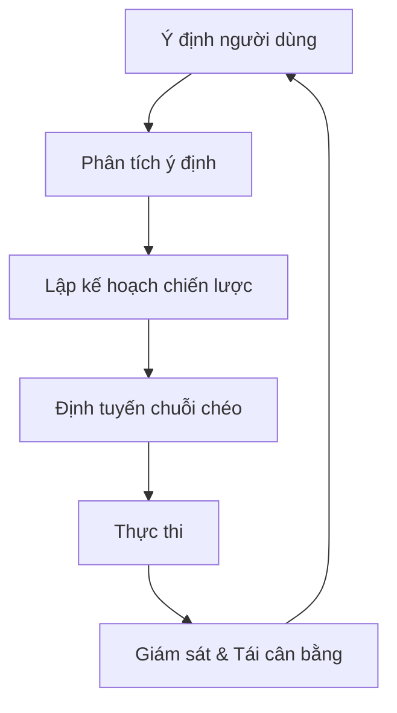

# Zap Pilot hoạt động như thế nào?

Zap Pilot biến các hoạt động DeFi phức tạp thành trải nghiệm đơn giản, chỉ với một cú nhấp chuột
thông qua công cụ thực thi dựa trên ý định của chúng tôi. Đây là cách điều kỳ diệu xảy ra:

## 🧠 Thực thi dựa trên ý định

### Ý định là gì?

Thay vì chỉ định **cách** thực hiện giao dịch, bạn chỉ cần cho chúng tôi biết **những gì** bạn muốn
đạt được:

```
Ý định: "Đầu tư 500 đô la vào một chiến lược stablecoin bảo thủ"

DeFi truyền thống: Hơn 12 giao dịch trên 3 chuỗi
Zap Pilot: 1 cú nhấp chuột, hoàn toàn tự động
```

### Vòng đời ý định



## ⚡ Quy trình 3 bước

### 1. **Bày tỏ ý định của bạn**

- Chọn số tiền đầu tư
- Chọn loại chiến lược
- Đặt ưu tiên rủi ro
- Xác định thời gian

### 2. **Lập kế hoạch dựa trên AI**

- Phân tích điều kiện thị trường hiện tại
- Xác định các giao thức và chuỗi tối ưu
- Tính toán các đường dẫn thực thi tốt nhất
- Lập kế hoạch các giao dịch hiệu quả về gas

### 3. **Thực thi với sự chấp thuận**

- Thực thi trên nhiều chuỗi đồng thời
- Tối ưu hóa để có phí thấp nhất và tỷ lệ tốt nhất
- Giám sát theo thời gian thực
- Đề xuất tái cân bằng khi cần thiết để bạn chấp thuận

## 🔗 Thông minh chuỗi chéo

### Hỗ trợ đa chuỗi gốc

Zap Pilot không chỉ bắc cầu tài sản — chúng tôi hiểu và hoạt động nguyên bản trên nhiều chuỗi, bao
gồm các Layer 2 hàng đầu, Ethereum và Solana.

### Định tuyến thông minh

Công cụ định tuyến của chúng tôi xem xét:

- **Chi phí gas** trên tất cả các chuỗi
- **Độ sâu thanh khoản** trong các pool khác nhau
- **Cơ hội lợi nhuận** trên mỗi mạng
- **Bảo mật cầu nối** và tốc độ
- **Tắc nghẽn mạng hiện tại**

## 🎯 Thực thi chiến lược

### Quản lý danh mục đầu tư tự động

Khi chiến lược của bạn hoạt động, Zap Pilot liên tục:

#### **Giám sát hiệu suất**

- Theo dõi lợi nhuận trên tất cả các vị thế
- Giám sát các chỉ số rủi ro theo thời gian thực
- Theo dõi sự trôi dạt của chiến lược

#### **Tối ưu hóa phân bổ**

- Tái cân bằng khi mục tiêu lệch >5%
- Chuyển tài sản sang các cơ hội lợi nhuận cao hơn

#### **Quản lý rủi ro**

- Tự động đa dạng hóa trên các giao thức

### Tái cân bằng thông minh

Hệ thống phân bổ dựa trên tiêu chí Kelly của chúng tôi:

- Tính toán kích thước vị thế tối ưu
- Tính đến mối tương quan giữa các tài sản
- Giảm thiểu chi phí giao dịch
- Tối đa hóa lợi nhuận điều chỉnh rủi ro

## 🛡️ Tích hợp trừu tượng hóa tài khoản

### Trải nghiệm không phí gas với trừu tượng hóa tài khoản

Thông qua cơ sở hạ tầng ví thông minh của ThirdWeb:

- **Tài trợ gas** cho các giao dịch đủ điều kiện thông qua paymaster
- **Đăng ký đơn giản** với các tùy chọn ví xã hội
- **Hoạt động hàng loạt** để giảm số lượng giao dịch
- **Hỗ trợ đa chuỗi** với trải nghiệm thống nhất

### Bảo mật nâng cao

- **Hỗ trợ đa chữ ký** cho người dùng tổ chức
- **Tùy chọn khôi phục xã hội**
- **Giới hạn chi tiêu** và kiểm soát
- **Khóa phiên** cho các chiến lược tự động

## 📊 Thông minh thời gian thực

### Phân tích thị trường

- **Giám sát lợi nhuận 24/7** trên hơn 100 giao thức
- **Đánh giá rủi ro** của các giao thức DeFi
- **Phân tích thanh khoản** để thực hiện tối ưu

### Phân tích danh mục đầu tư

- **Phân bổ hiệu suất** - biết điều gì đang thúc đẩy lợi nhuận (sắp ra mắt)
- **Phân tích rủi ro** - hiểu mức độ tiếp xúc của bạn
- **Phân tích kịch bản** - kiểm tra căng thẳng danh mục đầu tư của bạn
- **Tối ưu hóa thuế** - giảm thiểu các sự kiện chịu thuế

## 🔄 Tối ưu hóa liên tục

### Điều chỉnh chiến lược động

Chiến lược của bạn phát triển theo điều kiện thị trường:

#### **Phát hiện chế độ thị trường**

- Thị trường tăng: Tăng rủi ro
- Thị trường giảm: Bảo toàn vốn
- Đi ngang: Tập trung vào tạo lợi nhuận
- Chế độ biến động: Điều chỉnh dựa trên biến động thị trường

#### **Giám sát tình trạng giao thức**

- Theo dõi thay đổi TVL
- Giám sát rủi ro quản trị
- Theo dõi cảnh báo khai thác
- Tự động giảm rủi ro khi cần

## 🏗️ Cơ sở hạ tầng

### Được xây dựng để mở rộng quy mô

- **Kiến trúc mô-đun** để tích hợp giao thức nhanh chóng
- **Hệ thống hướng sự kiện** để phản hồi theo thời gian thực
- **Thực thi dự phòng** để ngăn chặn các giao dịch thất bại
- **Tính khả dụng cao** với SLA thời gian hoạt động 99,9%

### Đối tác tích hợp

- **Hơn 20 công cụ tổng hợp DEX** để có tỷ giá hoán đổi tốt nhất
- **Hơn 50 giao thức lợi nhuận** cho các cơ hội đa dạng
- **Hơn 10 nhà cung cấp cầu nối** cho chuỗi chéo đáng tin cậy
- **Hơn 5 nhà cung cấp bảo hiểm** để bảo hiểm rủi ro

---

Sẵn sàng xem nó hoạt động?

👉 **[Bắt đầu →](../getting-started)** 👉 **[Xem chiến lược →](../strategies)**
