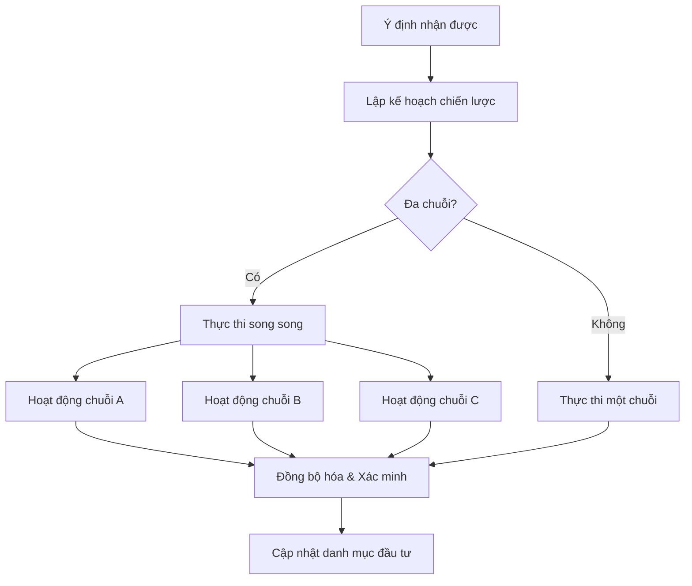

# Công cụ thực thi ý định

Trái tim của Zap Pilot là công cụ thực thi ý định của chúng tôi — một hệ thống tinh vi chuyển đổi ý
định của người dùng thành các hoạt động DeFi tối ưu trên nhiều blockchain.

## 🎯 Hiểu về ý định

### Điều gì tạo nên một ý định?

Một ý định là một biểu hiện cấp cao về những gì bạn muốn đạt được, chứ không phải cách đạt được nó:

#### **Cách tiếp cận DeFi truyền thống:**

```
1. Chuyển USDC từ Ethereum sang Arbitrum
2. Hoán đổi 50% USDC sang ETH trên Uniswap V3
3. Thêm thanh khoản USDC/ETH vào pool
4. Đặt cược token LP vào Convex
5. Yêu cầu phần thưởng và gộp lãi
```

#### **Cách tiếp cận dựa trên ý định:**

```
"Tôi muốn đầu tư 1000 đô la vào canh tác lợi nhuận ETH/stablecoin
với mức độ chấp nhận rủi ro trung bình"
```

### Các thành phần của ý định

Mỗi ý định chứa:

- **Mục tiêu**: Những gì bạn muốn đạt được
- **Ràng buộc**: Giới hạn rủi ro, ưu tiên thời gian
- **Ưu tiên**: Ưu tiên chuỗi, khả năng chịu phí gas
- **Ngữ cảnh**: Danh mục đầu tư hiện tại, điều kiện thị trường

## ⚙️ Quy trình thực thi

### 1. Phân tích & Xác thực ý định (Ví dụ)

```typescript
interface UserIntent {
  objective: 'invest' | 'withdraw' | 'rebalance';
  amount: string;
  strategy: 'stablecoin' | 'index' | 'btc' | 'eth' | 'custom';
  riskTolerance: 'low' | 'medium' | 'high';
  timeHorizon: 'short' | 'medium' | 'long';
  constraints: {
    maxSlippage: number;
    gasLimit: string;
    chainPreferences: string[];
  };
}
```

### 2. Giải quyết chiến lược

Công cụ AI của chúng tôi phân tích ý định của bạn dựa trên:

- **Điều kiện thị trường hiện tại**
- **Cơ hội lợi nhuận có sẵn**
- **Danh mục đầu tư hiện có của bạn**
- **Tối ưu hóa rủi ro-lợi nhuận**

### 3. Lập kế hoạch thực thi

Công cụ lập kế hoạch tạo ra một chuỗi thực thi tối ưu:

#### **Tìm đường**

- Xác định tất cả các tuyến đường thực thi có thể
- Tính toán chi phí và rủi ro cho mỗi đường dẫn
- Chọn tuyến đường tối ưu có tính đến:
  - Tổng chi phí gas
  - Tác động giá
  - Thời gian thực hiện
  - Xác suất thất bại

#### **Trình tự giao dịch**

- Chia các hoạt động phức tạp thành các bước nguyên tử
- Lập kế hoạch phục hồi sau lỗi ở mỗi bước
- Tối ưu hóa để thực hiện song song nếu có thể

### 4. Điều phối chuỗi chéo

Thực hiện các hoạt động trên nhiều chuỗi đồng thời:



## 🧠 Tối ưu hóa dựa trên AI

### Thông tin thị trường

Hệ thống của chúng tôi liên tục học hỏi từ:

- **Dữ liệu lợi nhuận lịch sử** trên tất cả các giao thức
- **Mô hình giá gas** trên các chuỗi khác nhau
- **Độ sâu thanh khoản** thay đổi theo thời gian
- **Các sự kiện rủi ro giao thức** và phản ứng

### Chiến lược thích ứng

Các chiến lược phát triển dựa trên:

- **Thay đổi chế độ thị trường** (tăng/giảm/đi ngang)
- **Mô hình hành vi của bạn** và sở thích
- **Phản hồi hiệu suất** từ các lần thực hiện trước
- **Cơ hội giao thức mới**

## 🔄 Giám sát liên tục

### Theo dõi danh mục đầu tư theo thời gian thực

Sau khi thực hiện, chúng tôi giám sát:

- **Hiệu suất vị thế** trên tất cả các giao thức
- **Thay đổi chỉ số rủi ro** (tương quan, biến động)
- **Cơ hội tối ưu hóa lợi nhuận**
- **Điều kiện kích hoạt tái cân bằng**

### Quản lý chủ động

Các hành động tự động bao gồm:

- **Yêu cầu phần thưởng** và tự động gộp lãi
- **Tái cân bằng** khi phân bổ lệch >5%
- **Di chuyển giảm rủi ro** trong thời kỳ thị trường căng thẳng
- **Chuyển đổi tối ưu hóa lợi nhuận** sang tỷ lệ tốt hơn

### Hệ thống cảnh báo

Nhận thông báo về:

- **Lợi nhuận/thua lỗ đáng kể** trong các vị thế
- **Cơ hội lợi nhuận mới** phù hợp với hồ sơ của bạn
- **Cảnh báo rủi ro** cho các giao thức bạn đang sử dụng
- **Các hoạt động tái cân bằng** đã hoàn thành

## 🛠️ Tính năng nâng cao

### Viết kịch bản ý định tùy chỉnh

Người dùng nâng cao có thể tạo các ý định tùy chỉnh (Ví dụ):

```javascript
// Ví dụ: Ý định trung bình hóa chi phí đô la
const dcaIntent = {
  objective: 'recurring_invest',
  amount: '500',
  frequency: 'weekly',
  strategy: 'index',
  duration: '12_months',
  conditions: {
    pauseIf: 'portfolio_loss > 20%',
    increaseIf: 'btc_price < 40000',
  },
};
```

### Xử lý ý định theo lô

Gửi nhiều ý định cùng một lúc:

- **Tái cân bằng danh mục đầu tư** trên các chiến lược
- **Phân bổ đa chiến lược** để đa dạng hóa
- **Các hoạt động theo lịch trình** cho DCA và tái cân bằng

### Mẫu ý định

Các mẫu được xây dựng sẵn cho các chiến lược phổ biến:

- **Quỹ chỉ số**: Các chiến lược được trọng số theo vốn hóa thị trường, chiến lược tương tự S&P-500.
- **Thu nhập bảo thủ**: Tập trung vào lợi nhuận stablecoin
- **Tăng trưởng tích cực**: Các chiến lược rủi ro cao, lợi nhuận cao
- **Trung lập thị trường**: Các chiến lược delta-neutral

---

Công cụ thực thi ý định là điều làm cho Zap Pilot trở nên kỳ diệu — biến sự phức tạp thành sự đơn
giản trong khi vẫn duy trì sức mạnh và tính linh hoạt của DeFi.

👉 **[Tìm hiểu về các hoạt động chuỗi chéo →](./cross-chain-operations)** 👉
**[Khám phá tái cân bằng →](./rebalancing)**
