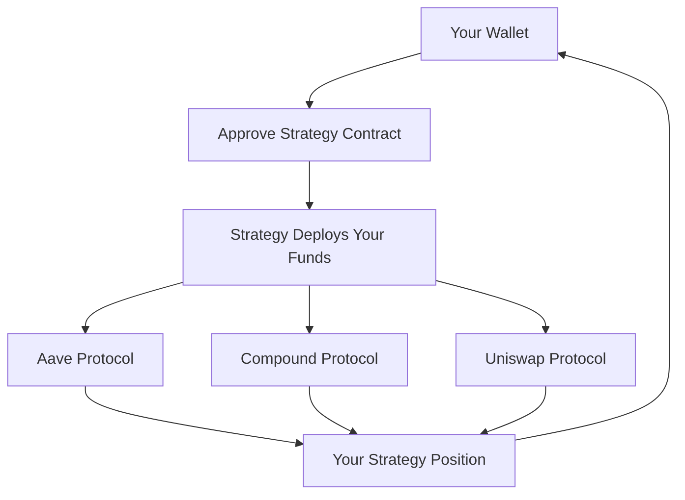

# Safety & Security Overview

**Your funds, your control - always** 🛡️

Security is the foundation of everything we do at Zap Pilot. Learn how we protect your investments
while maintaining the core principles of DeFi: decentralization, transparency, and user control.

## 🔐 Non-Custodial by Design

### You Control Your Funds

**Most Important**: Zap Pilot NEVER has custody of your funds. Here's what this means:

#### **Your Private Keys = Your Control**

- 🔑 **Your wallet, your keys** - we never see or store your private keys
- 🏦 **No central custody** - funds never sit in Zap Pilot accounts
- 🚫 **We can't freeze** or confiscate your assets
- ✅ **You can exit anytime** - withdraw directly from protocols

#### **How Non-Custodial Works**

Your funds flow directly from your wallet to DeFi protocols, with Zap Pilot only providing the
intelligent routing and management.

### Smart Contract Architecture

#### **Immutable Strategy Contracts**

- 📋 **One contract per user** - your strategy is isolated
- 🔒 **Upgradeable only by you** - we can't change your strategy without permission
- 🚪 **Emergency exit functions** - always accessible even if our interface is down
- 🔍 **Open source and audited** - all code is publicly verifiable

#### **Permission Structure**

What Zap Pilot CAN do:

- ✅ Execute rebalancing according to your strategy
- ✅ Compound rewards automatically
- ✅ Provide analytics and reporting

What Zap Pilot CANNOT do:

- ❌ Withdraw funds to our accounts
- ❌ Change your strategy without approval
- ❌ Prevent you from exiting
- ❌ Access funds if you lose your wallet

## 🏗️ Multi-Layer Security Architecture

### 1. Smart Contract Security

#### **Professional Audits**

- 🔬 **Multiple audit firms**: Trail of Bits, ConsenSys Diligence, Quantstamp
- 📊 **Continuous auditing**: Every major update reviewed
- 🏆 **Bug bounty program**: $500k bounty for finding vulnerabilities
- 📈 **Battle testing**: Deployed on testnets for months before mainnet

#### **Formal Verification**

- 🧮 **Mathematical proofs** of critical functions
- 🔒 **Invariant checking** - certain conditions always maintained
- 🎯 **Property testing** - extensive automated testing
- 📝 **Documentation**: Every function thoroughly documented

#### **Security Features**

- ⏱️ **Time locks** on administrative functions
- 🛑 **Emergency pause** mechanisms
- 🔄 **Reentrancy protection** on all external calls
- 💰 **Position limits** to prevent over-concentration

### 2. Protocol Risk Management

#### **Protocol Selection Criteria**

We only integrate protocols that meet strict criteria:

**Minimum Requirements:**

- ✅ **6+ months live** on mainnet
- ✅ **$100M+ TVL** sustained over time
- ✅ **Security audits** by reputable firms
- ✅ **Bug bounty programs** actively maintained
- ✅ **Governance transparency** and decentralization

**Continuous Monitoring:**

- 📊 **TVL tracking** - alert if major outflows
- 🔍 **Code changes** monitored for security implications
- 🏛️ **Governance** monitored for harmful proposals
- 📰 **Community sentiment** and expert opinions

#### **Risk Scoring System**

Every protocol gets a risk score (1-100):

- **90-100**: Battle-tested protocols (Aave, Compound)
- **80-89**: Established protocols with good track record
- **70-79**: Newer protocols with strong security practices
- **Below 70**: Not eligible for inclusion

### 3. Insurance Coverage

#### **Protocol Insurance**

- 🏛️ **Nexus Mutual**: Smart contract cover for major protocols
- 🛡️ **InsurAce**: Additional coverage layers
- 🔒 **Unslashed**: Slashing and technical risk coverage
- 💰 **Coverage amounts**: Up to $1M per protocol per user

#### **How Insurance Works**

1. **Risk Assessment**: Insurers evaluate protocol safety
2. **Coverage Purchase**: We buy insurance for user funds
3. **Claim Process**: If hack occurs, automatic claim filing
4. **Payout**: Users receive compensation for covered losses

#### **What's Covered**

- ✅ **Smart contract exploits** in covered protocols
- ✅ **Oracle manipulation** attacks
- ✅ **Governance attacks** that drain funds
- ✅ **Technical failures** causing fund loss

#### **What's NOT Covered**

- ❌ **Market price movements** (not insurance, it's investing)
- ❌ **User errors** (sending to wrong address, etc.)
- ❌ **Uncovered protocols** (we clearly mark coverage status)
- ❌ **Regulatory changes** affecting protocol operation

## 🚨 Risk Monitoring & Response

### Real-Time Monitoring

#### **24/7 Surveillance**

- 🖥️ **Automated monitoring** of all integrated protocols
- 👥 **Human oversight** from our security team
- 🚨 **Alert systems** for unusual activity
- 📱 **Mobile alerts** for urgent situations

#### **Key Metrics Monitored**

- 💧 **Liquidity levels** in all protocols
- 📊 **TVL changes** and large outflows
- 🔄 **Smart contract interactions** for unusual patterns
- 📈 **Oracle prices** for manipulation attempts
- 🏛️ **Governance proposals** that could affect security

### Emergency Response

#### **Incident Response Plan**

1. **Detection** (automated alerts + human monitoring)
2. **Assessment** (determine severity and scope)
3. **Action** (automatic or manual response)
4. **Communication** (notify users immediately)
5. **Recovery** (restore normal operations safely)

#### **Automatic Protections**

- 🛑 **Circuit breakers** halt operations if anomalies detected
- 🏃 **Auto-exit** from compromised protocols
- 🔒 **Position freezing** to prevent further damage
- 💰 **Fund preservation** in safest available protocols

#### **Manual Interventions**

- 🎯 **Emergency governance** for urgent decisions
- 📞 **Direct user contact** for major issues
- 🔧 **Strategy adjustments** to avoid risks
- 💼 **Insurance claims** filed immediately when applicable

## 🔍 Transparency & Auditability

### Open Source Commitment

#### **Public Code**

- 📂 **GitHub repositories** with all contract code
- 📝 **Documentation** for every function and feature
- 🔄 **Version control** showing all changes over time
- 👥 **Community contributions** welcomed and rewarded

#### **Real-Time Data**

- 🌐 **On-chain verification** of all operations
- 📊 **Public dashboards** showing system health
- 💰 **Protocol positions** viewable by anyone
- 📈 **Performance data** updated in real-time

### Audit Trail

#### **Complete Transaction History**

- 🔗 **Blockchain records** of every operation
- 📋 **Strategy changes** with timestamps and reasons
- 💸 **Fee calculations** showing all charges
- 🔄 **Rebalancing logic** with full justification

#### **Governance Transparency**

- 🗳️ **All proposals** publicly visible before implementation
- 📊 **Voting records** showing community decisions
- ⏱️ **Time locks** giving users advance notice of changes
- 🔄 **Implementation logs** showing exactly what changed

## 🛡️ User Security Best Practices

### Wallet Security

#### **Essential Practices**

- 🔐 **Hardware wallets** for large amounts (Ledger, Trezor)
- 📝 **Seed phrase backup** in multiple secure locations
- 🔒 **Strong passwords** and 2FA where possible
- 🚫 **Never share** private keys or seed phrases

#### **Phishing Protection**

- 🌐 **Bookmark our official site** (zap-pilot.com)
- 🔍 **Verify URLs** before connecting wallet
- 📧 **Check email addresses** - we only email from @zap-pilot.com
- 🚫 **Never enter seed phrases** on any website

### Transaction Safety

#### **Before Every Transaction**

- ✅ **Verify contract addresses** match our official documentation
- 💰 **Check amounts** and decimals carefully
- ⛽ **Review gas fees** - reject if suspiciously high
- 🌐 **Confirm network** matches your intention

#### **Red Flags to Watch For**

- 🚨 **Unexpected transaction requests** from our interface
- 💸 **Unusually high gas fees** (may indicate complex attack)
- 🔗 **Unknown token approvals** not related to your strategy
- 📧 **Urgent messages** asking for immediate action

## 📞 Security Support

### Reporting Security Issues

#### **Bug Bounty Program**

- 💰 **Up to $500,000** for critical vulnerabilities
- 🔒 **Responsible disclosure** process
- 🏆 **Hall of fame** for security researchers
- 📧 **security@zap-pilot.com** for private reports

#### **Emergency Contact**

- 🚨 **Critical issues**: security@zap-pilot.com
- 📞 **24/7 hotline**: For users with active positions
- 💬 **Discord #security**: For general security questions
- 📱 **Mobile alerts**: Push notifications for urgent matters

### Security Education

#### **Resources**

- 📚 **Security guides** for DeFi beginners
- 🎥 **Video tutorials** on wallet security
- 📰 **Blog posts** about latest threats and protections
- 🎓 **Webinars** with security experts

---

Security isn't just about technology - it's about building trust through transparency, giving users
control, and maintaining the highest standards in everything we do.

Your funds are always yours. We're just here to help them work smarter.

👉 **[Learn About Smart Contracts →](./smart-contracts)** 👉
**[Understand Insurance Coverage →](./insurance)** 👉
**[Emergency Procedures →](./emergency-procedures)**
