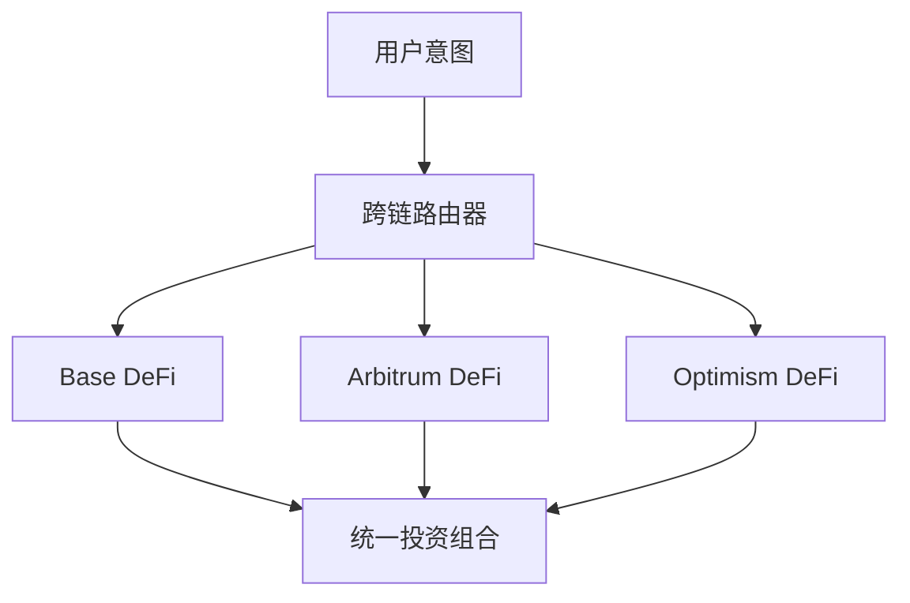

# 跨链操作

**主要 Layer 2、以太坊和 Solana 之间的无缝 DeFi** 🌐

Zap Pilot 的跨链功能让您无需管理不同的钱包、代币或桥接，即可在各种 Layer
2 网络以及以太坊和 Solana 中访问最佳的 DeFi 机会。

## 🔗 多链架构

### 原生跨链设计

与其他将跨链视为事后诸葛的平台不同，Zap Pilot 从头开始构建，以在支持的 Layer 2 网络中原生运行。

#### **统一流动性池**

您的投资会自动分散到支持的网络中，以寻找最佳机会，同时呈现为一个单一、统一的投资组合。

#### **智能链选择**

我们的系统会根据安全性、交易成本、流动性、速度等因素的组合，自动为任何给定操作选择最佳网络。

## 🌐 支持的网络

Zap Pilot 在包括领先的 Layer
2、以太坊和 Solana 在内的越来越多网络上运行。我们的智能路由系统会根据安全性、交易成本、流动性、速度等因素的组合，自动为任何给定操作选择最佳网络。

## ⚡ 跨链执行引擎

### 智能路由

#### **多路径优化**

当您投资 10,000 美元于指数基金策略时，我们的系统可能会：

1. 在 Arbitrum 上**部署 4,000 美元**，用于已建立的 DeFi 协议和杠杆头寸
2. 在 Base 上**部署 3,500 美元**，用于新兴机会和机构级协议
3. 在 Optimism 上**部署 2,500 美元**，用于治理代币和实验性策略
4. **保留 1,000 美元**流动性，用于跨网络再平衡

#### **实时优化**

路由引擎考虑：

- **Gas 价格差异**：在 Gas 最便宜时执行
- **收益率变化**：转移到有更好机会的链
- **流动性条件**：避免流动性不足的链
- **网络拥塞**：绕过拥塞的网络
- **桥接可用性**：确保可靠的跨链传输

### 桥接集成

#### **Across Protocol - 我们的桥接合作伙伴**

我们使用 Across Protocol 进行所有跨链操作，提供最佳的安全性、速度和成本效益：

| 桥接功能     | Across Protocol 优势                      |
| ------------ | ----------------------------------------- |
| **支持路线** | Base、Arbitrum 和 Optimism 之间的无缝传输 |
| **安全模型** | 带有经济保证的乐观验证                    |
| **速度**     | 平均完成时间 1-4 分钟                     |
| **成本**     | 主要桥接提供商中费用最低                  |
| **可靠性**   | 经过验证的记录，停机时间最短              |

#### **为何选择 Across Protocol**

- **乐观安全性**：使用乐观验证和经济激励来鼓励诚实行为
- **资本效率**：最小的流动性要求降低成本
- **快速结算**：UMA 预言机系统快速最终性
- **经过验证的可靠性**：经过实战考验的基础设施，具有强大的安全记录
- **成本效益**：具有竞争力的费用，针对频繁再平衡进行优化

### 故障处理

#### **强大的错误恢复**

跨链操作可能在多个点失败。我们的系统处理：

**桥接故障：**

- **检测**：实时监控桥接状态
- **回退**：自动重试并使用替代桥接
- **恢复**：手动干预卡住的交易
- **通知**：向用户发出警报并提供明确的后续步骤

**目标链问题：**

- **Gas 估算**：预测和处理 Gas 故障
- **滑点保护**：根据波动条件调整
- **超时处理**：自动重试并调整参数
- **紧急恢复**：手动交易救援程序

## 🎯 跨链策略优势

### 收益优化

#### **网络特定机会**

我们支持的每个网络在不同领域表现出色：

**Base**：

- Coinbase 生态系统优势和机构信任
- 监管友好的协议和合规性
- 不断增长的机构 DeFi 采用
- 传统金融集成机会
- 新兴高质量协议

**Arbitrum**：

- 成熟的 DeFi 生态系统，具有经过验证的协议
- 先进的交易基础设施 (GMX, Camelot)
- 已建立的流动性池和收益机会
- 费用比以太坊低，安全性相同
- 精密的杠杆策略

**Optimism**：

- 新 DeFi 实验的创新中心
- 强大的治理代币生态系统
- 对开发者友好的环境
- 不断增长的机构采用
- 独特的协议机会 (Velodrome, Synthetix)

#### **收益套利**

我们的系统持续识别和捕捉套利机会：

- **协议费率差异**：相同协议，不同链
- **代币价格差异**：桥接溢价/折价套利
- **激励挖矿**：链特定流动性激励
- **Gas 效率**：在成本效益最高的地方执行

### 风险多元化

#### **技术风险分布**

跨链分散可降低：

- **单链风险**：不依赖单链的正常运行时间
- **桥接风险**：多个桥接提供商降低交易对手风险
- **共识风险**：不同的共识机制
- **治理风险**：不受单链的治理决策影响

#### **监管风险缓解**

- **管辖权多元化**：跨不同监管环境的协议
- **合规选择性**：随着法规演变转移到合规链
- **审查抵抗**：多链降低审查风险
- **运营连续性**：即使一条链出现问题也能继续运营

## 🔄 跨链再平衡

### 智能再平衡

#### **跨链投资组合管理**

再平衡策略时，我们考虑：

- **当前配置**：资产目前所在位置
- **目标配置**：跨链的最佳分布
- **再平衡成本**：桥接费用与优化效益
- **市场条件**：哪些链提供最佳机会

#### **示例：指数基金再平衡**

**当前状态：**

- Arbitrum：投资组合的 50%
- Base：投资组合的 30%
- Optimism：投资组合的 20%

**市场变化：** Base 上出现新的高收益机会 **行动：** 在 2 天内使用 Across
Protocol 逐步将 15% 从 Arbitrum 转移到 Base **考虑：** 平衡桥接成本与收益效益，并维持多元化

### 成本优化

#### **再平衡效率**

- **批处理操作**：合并多个再平衡操作
- **Gas 时机**：在最佳 Gas 价格窗口执行
- **路径优化**：最小化所需的桥接数量
- **阈值管理**：仅在效益超过成本时才再平衡

#### **用户成本节省**

与手动跨链管理相比：

- **80% 较低 Gas 成本**：通过批处理和优化
- **90% 较低复杂性**：自动化桥接选择和执行
- **100% 较少时间**：设置后即可忘记的跨链操作
- **更高收益**：访问您可能错过的机会

## 📊 跨链分析

### 统一投资组合视图

#### **链无关报告**

您的仪表板显示：

- **总投资组合价值**：所有链上的美元价值
- **链配置**：每个链上的价值
- **绩效归因**：哪些链对回报有贡献
- **风险敞口**：集中度和多元化指标

#### **跨链绩效追踪**

- **收益比较**：每个链上赚取的 APY
- **成本分析**：按链划分的桥接和 Gas 成本
- **效率指标**：每支付一美元费用获得的回报
- **机会成本**：您可能在其他链上错过了什么

### 桥接成本追踪

#### **完全成本透明度**

追踪所有跨链成本：

- **桥接费**：桥接协议收取的明确费用
- **Gas 成本**：L1 和 L2 Gas 费用于桥接交易
- **滑点**：桥接操作的价格影响
- **机会成本**：桥接期间的时间价值

#### **ROI 分析**

对于每个跨链操作：

- **成本合理性**：为何此举有利可图
- **回本时间**：收回桥接成本所需的时间
- **替代分析**：如果此举未发生会怎样
- **优化分数**：路由表现如何

## 🛡️ 跨链安全

### 安全模型

#### **多层安全**

- **桥接安全**：仅使用经过审计、经过验证的桥接
- **链安全**：优先选择更安全的链以处理较大金额
- **多元化**：将风险分散到多个链和桥接
- **监控**：所有链上的实时安全监控

#### **桥接风险管理**

- **桥接限制**：每个桥接提供商的最大敞口
- **安全评分**：桥接的实时健康评估
- **事件响应**：桥接安全事件的即时行动
- **保险覆盖**：针对桥接故障提供保护（如果可用）

### 紧急程序

#### **跨链紧急响应**

如果发生安全问题：

1. **立即暂停**：停止所有跨链操作
2. **资产评估**：识别安全与有风险的头寸
3. **紧急退出**：快速提款到安全链
4. **用户沟通**：清晰地更新情况和行动
5. **恢复计划**：系统性恢复和恢复

---

跨链操作是 Zap
Pilot 真正强大的地方——在为用户保持简单的同时，访问整个 DeFi 宇宙。您无需单独管理所有链，即可获得所有链的好处。

👉 **[了解再平衡 →](./rebalancing)** 👉 **[探索策略执行 →](./intent-execution)** 👉
**[查看支持的网络 →](../security)**
