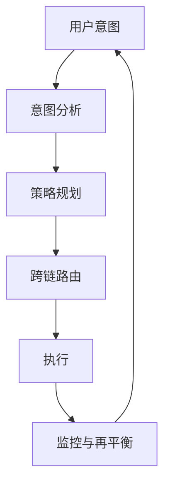

# Zap Pilot 的工作原理

Zap Pilot 通过意图执行引擎，将复杂的 DeFi 操作转化为简单的一键式体验。以下是魔法发生的方式：

## 🧠 意图执行

### 什么是意图？

您无需指定**如何**执行交易，只需告诉我们您想**达成什么**：

```
意图：“投资 500 美元于保守的稳定币策略”

传统 DeFi：跨 3 条链的 12+ 笔交易
Zap Pilot：1 次点击，完全批准
```

### 意图生命周期



## ⚡ 3 步流程

### 1. **表达您的意图**

- 选择投资金额
- 选择策略类型
- 设置风险偏好
- 定义时间范围

### 2. **AI 驱动的规划**

- 分析当前市场状况
- 识别最佳协议和链
- 计算最佳执行路径
- 规划 Gas 效率高的交易

### 3. **批准执行**

- 同时在多条链上执行
- 优化以获得最低费用和最佳费率
- 实时监控
- 根据需要提出再平衡建议，供您批准

## 🔗 跨链智能

### 原生多链支持

Zap Pilot 不仅桥接资产 — 我们原生理解并支持包括领先的 Layer 2、以太坊和 Solana 在内的多个链。

### 智能路由

我们的路由引擎考虑：

- 所有链的 **Gas 成本**
- 不同资金池中的 **流动性深度**
- 每个网络上的 **收益机会**
- **桥接安全性** 和速度
- **当前网络拥塞**

## 🎯 策略执行

### 自动化投资组合管理

一旦您的策略上线，Zap Pilot 会持续：

#### **监控绩效**

- 追踪所有头寸的收益
- 实时监控风险指标
- 观察策略漂移

#### **优化配置**

- 当目标漂移超过 5% 时再平衡
- 将资产转移到更高收益的机会

#### **管理风险**

- 自动跨协议多元化

### 智能再平衡

我们基于凯利准则的分配系统：

- 计算最佳头寸规模
- 考虑资产之间的相关性
- 最大程度地降低交易成本
- 最大化风险调整后的回报

## 🛡️ 账户抽象集成

### 使用账户抽象的无 Gas 体验

通过 ThirdWeb 的智能钱包基础设施：

- 通过付费主为符合条件的交易提供 **Gas 赞助**
- 使用社交钱包选项**简化用户注册**
- **批量操作**以减少交易数量
- **多链支持**提供统一体验

### 增强安全性

- 为机构用户提供**多重签名支持**
- **社交恢复** 选项
- **支出限制** 和控制
- 为自动化策略提供**会话密钥**

## 📊 实时智能

### 市场分析

- 24/7 **收益监控** 跨 100 多个协议
- DeFi 协议的 **风险评估**
- **流动性分析** 以实现最佳执行

### 投资组合分析

- **绩效归因** - 了解是什么推动了回报 (即将推出)
- **风险分解** - 了解您的敞口
- **情景分析** - 对您的投资组合进行压力测试
- **税务优化** - 最小化应税事件

## 🔄 持续优化

### 动态策略调整

您的策略会随着市场条件而演变：

#### **市场机制检测**

- 牛市：增加风险敞口
- 熊市：保值
- 横盘：专注于收益生成

#### **协议健康监控**

- 追踪 TVL 变化
- 监控治理风险
- 观察漏洞警告
- 需要时自动风险关闭

## 🏗️ 基础设施

### 为规模而建

- **模块化架构** 以实现快速协议集成
- **事件驱动系统** 以实现实时响应
- **冗余执行** 以防止交易失败
- **高可用性**，99.9% 正常运行时间 SLA

### 集成合作伙伴

- 最佳兑换率的 **20+ DEX 聚合器**
- 多样化机会的 **50+ 收益协议**
- 可靠跨链的 **10+ 桥接提供商**
- 风险覆盖的 **5+ 保险提供商**

---

准备好亲身体验了吗？

👉 **[开始使用 →](../getting-started)** 👉 **[查看策略 →](../strategies)**
