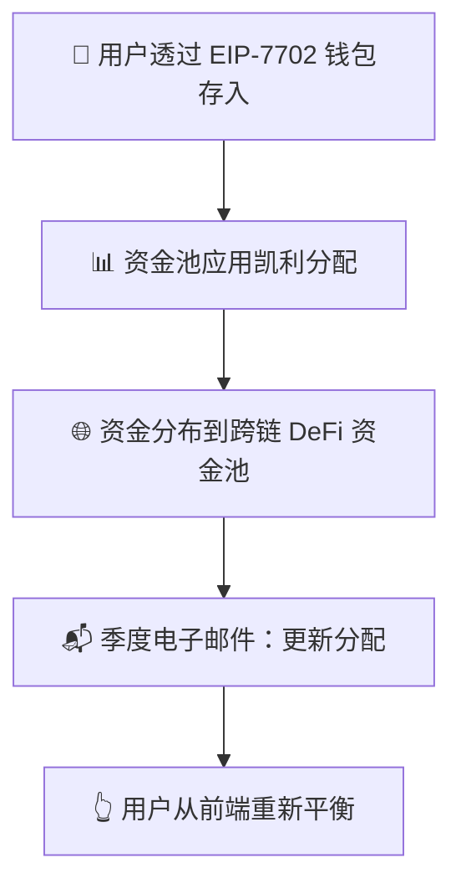

# 🚀 Zap Pilot 运作方式

## 🧠 协议机制

Zap Pilot 是一个**非托管、算法投资组合自动驾驶系统** ✨  
您透过自己的**智能 EOA 钱包**（由 EIP-7702 提供）完全控制资金。  
我们帮助您**优化**、**重新平衡**和**路由资金**，只需一键 —  
无托管。无锁定。只有策略建议和执行。

### 关键原则

- **完全用户控制**：您的钱包，您的金钥
- **高级分配**：数学优化策略
- **透明执行**：一键优化

---

## 1️⃣ 用户存入

👜 您直接从**智能 EOA 钱包**（由 EIP-7702 提供）存入。  
💡 资金进入**策略资金池** — 跨链精心挑选的 DeFi 机会组合。

**另请参阅：** [入門指南](../getting-started)

---

## 2️⃣ 资金池策略

每个资金池代表特定的投资策略，例如：

- 💵 **稳定币收益耕作**
- 🔗 **流动性质押**
- 🌉 **跨链收益追踪**

您的资金分布在资金池内，  
**根据表现和风险动态调整权重**。 📊

**了解更多：** [投資策略概述](../strategies)

---

## 3️⃣ 📐 凯利分配策略

### 什么是凯利准则？

凯利准则是一种数学公式，用于确定一系列投注的最佳规模。在我们的背景下，它帮助我们在不同 DeFi 协议中分配资金，以在管理风险的同时最大化长期增长。

#### 简化公式：

`分配 ∝ 預期回報 / 方差`

🧮 主要优势：

- 📈 对低波动、高回报的资金池分配更高权重
- 🛡️ 降低对任何单一协议的过度暴露风险
- 🔄 每季重新计算以反映市场变化

**详细解释：** [凱利準則深入解析](../strategies/kelly-criterion)

---

## 4️⃣ ♻️ 重新平衡（用户驱动）

由于您的资产**永远不会离开您的钱包**，  
我们无法自动重新平衡 — 但我们让它**非常简单**：

- 📬 **季度**：个性化重新平衡建议
- 👆 **一键重新平衡**：从您的钱包执行策略更新

**为什么是用户驱动？** 我们优先考虑您的控制和透明度。

---

## 5️⃣ 🗺️ 资产流动概览

---

## 🔒 安全与透明度

- **非托管**：您的资金始终保留在您的钱包中
- **链上执行**：所有交易都是透明的
- **用户控制**：您批准每一步移动

**安全详情：** [安全事件與透明度](../security)

Zap、重新平衡、优化 — 不到 30 秒。您的加密货币，您的金钥，我们的策略。

👉 **[開始使用 →](https://app.zap-pilot.org/)**

### 相关资源

- [入門指南](../getting-started)
- [投資策略](../strategies)
- [凱利準則解釋](../strategies/kelly-criterion) EOF < /dev/null
