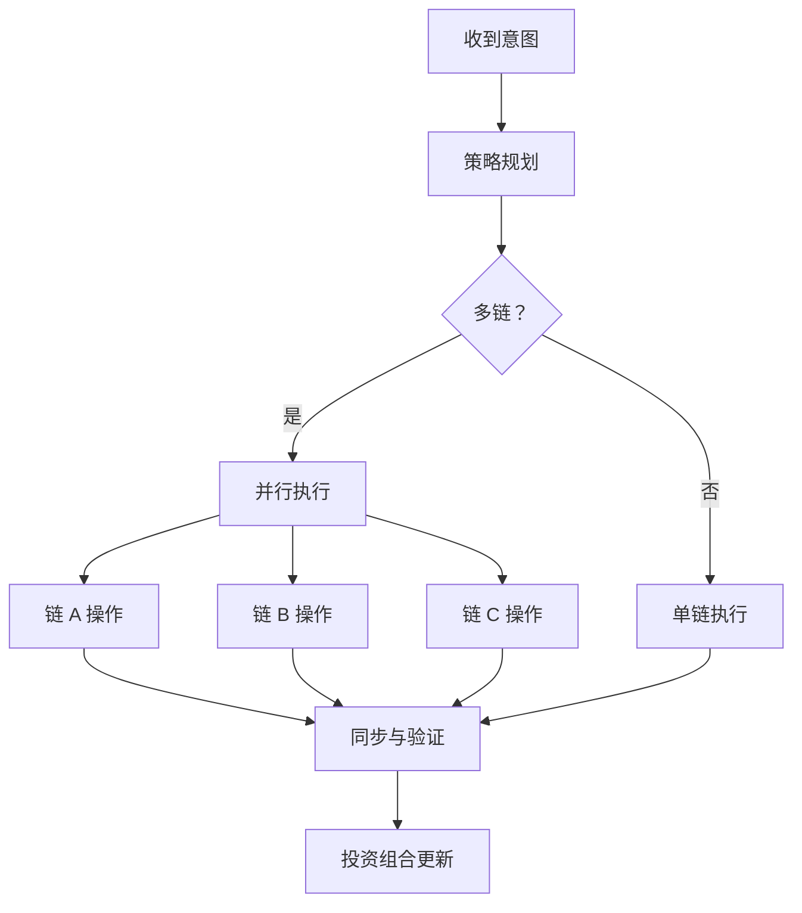

# 意图执行引擎

Zap Pilot 的核心是我们的意图执行引擎——一个复杂的系统，将用户意图转化为跨多个区块链的最佳 DeFi 操作。

## 🎯 理解意图

### 什么构成意图？

意图是您想要实现的目标的高层次表达，而不是如何实现它：

#### **传统 DeFi 方法：**

```
1. 将 USDC 从以太坊桥接到 Arbitrum
2. 在 Uniswap V3 上将 50% 的 USDC 兑换为 ETH
3. 将 USDC/ETH 流动性添加到池中
4. 在 Convex 中质押 LP 代币
5. 领取奖励并复利
```

#### **基于意图的方法：**

```
「我想要投资 1000 美元于 ETH/稳定币收益农场
并具有中等风险承受能力」
```

### 意图组件

每个意图都包含：

- **目标**：您想要实现的目标
- **约束**：风险限制、时间偏好
- **偏好**：链偏好、Gas 容忍度
- **上下文**：当前投资组合、市场状况

## ⚙️ 执行管道

### 1. 意图解析与验证

```typescript
interface UserIntent {
  objective: 'invest' | 'withdraw' | 'rebalance';
  amount: string;
  strategy: 'stablecoin' | 'index' | 'btc' | 'eth' | 'custom';
  riskTolerance: 'low' | 'medium' | 'high';
  timeHorizon: 'short' | 'medium' | 'long';
  constraints: {
    maxSlippage: number;
    gasLimit: string;
    chainPreferences: string[];
  };
}
```

### 2. 策略解析

我们的 AI 引擎根据以下内容分析您的意图：

- **当前市场状况**
- **可用收益机会**
- **您现有的投资组合**
- **风险回报优化**

### 3. 执行规划

规划器创建最佳执行序列：

#### **路径寻找**

- 识别所有可能的执行路径
- 计算每个路径的成本和风险
- 选择最佳路径，考虑：
  - 总 Gas 成本
  - 价格影响
  - 执行时间
  - 失败机率

#### **交易排序**

- 将复杂操作分解为原子步骤
- 规划每个步骤的故障恢复
- 在可能的情况下优化并行执行

### 4. 跨链协调

同时在多条链上执行操作：



## 🧠 AI 驱动的优化

### 市场情报

我们的系统不断从以下方面学习：

- 所有协议的**历史收益数据**
- 不同链上的 **Gas 价格模式**
- 随时间变化的**流动性深度**
- **协议风险事件**和响应

### 自适应策略

策略根据以下因素演变：

- **市场机制变化** (牛市/熊市/盘整)
- **您的行为模式**和偏好
- 过去执行的**绩效回馈**
- **新协议机会**

## 🔄 持续监控

### 即时投资组合追踪

执行后，我们监控：

- 所有协议的**头寸绩效**
- **风险指标变化** (相关性、波动性)
- **收益优化** 机会
- **再平衡触发** 条件

### 主动管理

自动操作包括：

- **奖励领取**和自动复利
- 当配置漂移超过 5% 时**再平衡**
- 在市场压力期间**风险关闭**
- **收益优化**切换到更好的费率

### 警报系统

收到以下通知：

- 头寸的**显著收益/损失**
- 符合您个人资料的**新收益机会**
- 您正在使用的协议的**风险警告**
- **再平衡**操作完成

## 🛠️ 高级功能

### 自订意图脚本

高级用户可以创建自订意图：

```javascript
// 范例：平均成本法意图
const dcaIntent = {
  objective: 'recurring_invest',
  amount: '500',
  frequency: 'weekly',
  strategy: 'index',
  duration: '12_months',
  conditions: {
    pauseIf: 'portfolio_loss > 20%',
    increaseIf: 'btc_price < 40000',
  },
};
```

### 批次意图处理

一次提交多个意图：

- 跨策略的**投资组合再平衡**
- 用于多元化的**多策略配置**
- 用于平均成本法和再平衡的**预定操作**

### 意图模板

常见策略的预建模板：

- **指数基金**：市值加权策略，类似 S&P-500 的策略
- **保守收入**：稳定币收益重点
- **激进增长**：高风险、高回报策略
- **市场中性**：Delta 中性策略

---

意图执行引擎是 Zap Pilot 的神奇之处——它将复杂性转化为简单性，同时保持 DeFi 的强大功能和灵活性。

👉 **[探索自動再平衡 →](./rebalancing)**
