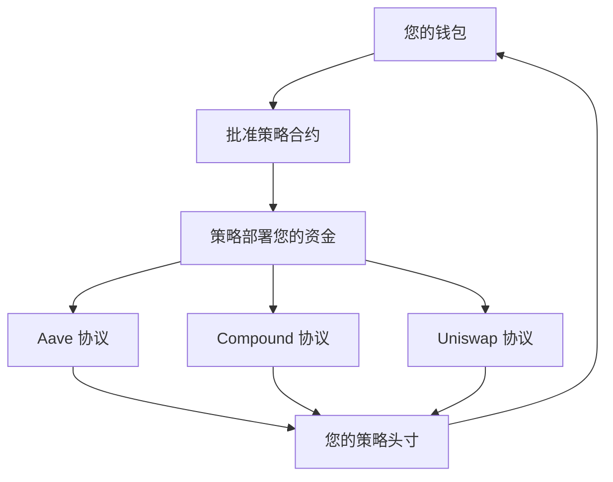

# 安全与保障概述

**您的资金，您的掌控——始终如一** 🛡️

安全是我们在 Zap
Pilot 所做一切的基础。了解我们如何保护您的投资，同时维护 DeFi 的核心原则：去中心化、透明度和用户控制。

## 🔐 非托管设计

### 您掌控您的资金

**最重要**：Zap Pilot 绝不托管您的资金。这意味著：

#### **您的私钥 = 您的掌控**

- 🔑 **您的钱包，您的金钥** - 我们从不查看或储存您的私钥
- 🏦 **无中心托管** - 资金从不存放在 Zap Pilot 帐户中
- 🚫 **我们无法冻结** 或没收您的资产
- ✅ **您可以随时退出** - 直接从协议中提款

#### **非托管如何运作**

您的资金直接从您的钱包流向 DeFi 协议，Zap Pilot 仅提供智能路由和管理。

### 智能合约架构

#### **不可变策略合约**

- 📋 **每个用户一个合约** - 您的策略是独立的
- 🔒 **仅由您升级** - 未经许可，我们无法更改您的策略
- 🚪 **紧急退出功能** - 即使我们的介面关闭，也始终可存取
- 🔍 **开源且经过审计** - 所有程式码均可公开验证

#### **权限结构**

Zap Pilot 可以做什么：

- ✅ 根据您的策略执行再平衡
- ✅ 自动复利奖励
- ✅ 提供分析和报告

Zap Pilot 不能做什么：

- ❌ 将资金提取到我们的帐户
- ❌ 未经批准更改您的策略
- ❌ 阻止您退出
- ❌ 如果您丢失钱包，则无法存取资金

## 🏗️ 多层安全架构

### 1. 智能合约安全

#### **专业审计**

- 🔬 **多个审计公司**：Trail of Bits、ConsenSys Diligence、Quantstamp
- 📊 **持续审计**：每次重大更新都会审查
- 🏆 **错误赏金计划**：50 万美元赏金用于发现漏洞
- 📈 **实战测试**：在主网上线前在测试网上部署数月

#### **形式化验证**

- 🧮 **关键功能的数学证明**
- 🔒 **不变式检查** - 某些条件始终保持
- 🎯 **属性测试** - 广泛的自动化测试
- 📝 **文件**：每个功能都经过彻底的文件化

#### **安全功能**

- ⏱️ 管理功能的**时间锁**
- 🛑 **紧急暂停**机制
- 🔄 所有外部呼叫的**重入保护**
- 💰 **头寸限制**以防止过度集中

### 2. 协议风险管理

#### **协议选择标准**

我们只整合符合严格标准的协议：

**最低要求：**

- ✅ **主网上线 6 个月以上**
- ✅ **持续超过 1 亿美元的 TVL**
- ✅ **信誉良好的公司进行安全审计**
- ✅ **积极维护错误赏金计划**
- ✅ **治理透明度**和去中心化

**持续监控：**

- 📊 **TVL 追踪** - 如果有大量资金流出则发出警报
- 🔍 **程式码变更**监控安全隐患
- 🏛️ **治理**监控有害提案
- 📰 **社群情绪**和专家意见

#### **风险评分系统**

每个协议都会获得一个风险评分 (1-100)：

- **90-100**：经过实战考验的协议 (Aave、Compound)
- **80-89**：具有良好记录的已建立协议
- **70-79**：具有强大安全实践的新协议
- **低于 70**：不符合纳入资格

### 3. 保险范围

#### **协议保险**

- 🏛️ **Nexus Mutual**：主要协议的智能合约保险
- 🛡️ **InsurAce**：额外的保险层
- 🔒 **Unslashed**：削减和技术风险保险
- 💰 **保险金额**：每个协议每个用户最高 100 万美元

#### **保险如何运作**

1. **风险评估**：保险公司评估协议安全性
2. **购买保险**：我们为用户资金购买保险
3. **索赔流程**：如果发生骇客攻击，自动提交索赔
4. **赔付**：用户获得承保损失的赔偿

#### **承保范围**

- ✅ 承保协议中的**智能合约漏洞**
- ✅ **预言机操纵**攻击
- ✅ 导致资金流失的**治理攻击**
- ✅ 导致资金损失的**技术故障**

#### **不承保范围**

- ❌ **市场价格波动**（不是保险，是投资）
- ❌ **用户错误**（发送到错误地址等）
- ❌ **未承保协议**（我们明确标示承保状态）
- ❌ 影响协议运作的**监管变更**

## 🚨 风险监控与响应

### 即时监控

#### **24/7 监控**

- 🖥️ **自动监控**所有整合协议
- 👥 我们安全团队的**人工监督**
- 🚨 异常活动的**警报系统**
- 📱 紧急情况的**行动警报**

#### **监控的关键指标**

- 💧 所有协议中的**流动性水平**
- 📊 **TVL 变化**和大量资金流出
- 🔄 **智能合约互动**的异常模式
- 📈 **预言机价格**的操纵尝试
- 🏛️ 可能影响安全的**治理提案**

### 紧急响应

#### **事件响应计划**

1. **检测**（自动警报 + 人工监控）
2. **评估**（确定严重性和范围）
3. **行动**（自动或手动响应）
4. **沟通**（立即通知用户）
5. **恢复**（安全恢复正常运作）

#### **自动保护**

- 🛑 **断路器**在检测到异常时停止运作
- 🏃 从受损协议**自动退出**
- 🔒 **头寸冻结**以防止进一步损害
- 💰 **资金保全**在最安全的可用协议中

#### **手动干预**

- 🎯 紧急决策的**紧急治理**
- 📞 主要问题的**直接用户联系**
- 🔧 避免风险的**策略调整**
- 💼 适用时立即提交**保险索赔**

## 🔍 透明度与可审计性

### 开源承诺

#### **公开程式码**

- 📂 **GitHub 储存库**，包含所有合约程式码
- 📝 每个功能和特性的**文件**
- 🔄 **版本控制**显示所有随时间的变更
- 👥 欢迎并奖励**社群贡献**

#### **即时数据**

- 🌐 所有操作的**链上验证**
- 📊 显示系统健康的**公开仪表板**
- 💰 任何人都可以查看的**协议头寸**
- 📈 即时更新的**绩效数据**

### 审计追踪

#### **完整的交易历史**

- 🔗 每个操作的**区块链记录**
- 📋 带有时间戳和原因的**策略变更**
- 💸 显示所有费用的**费用计算**
- 🔄 具有充分理由的**再平衡逻辑**

#### **治理透明度**

- 🗳️ **所有提案**在实施前公开可见
- 📊 显示社群决策的**投票记录**
- ⏱️ 提前通知用户变更的**时间锁**
- 🔄 显示确切变更的**实施日志**

## 🛡️ 用户安全最佳实践

### 钱包安全

#### **基本实践**

- 🔐 大额资金使用**硬体钱包** (Ledger、Trezor)
- 📝 在多个安全位置**备份助记词**
- 🔒 **强密码**和尽可能使用 2FA
- 🚫 **切勿分享**私钥或助记词

#### **网路钓鱼防护**

- 🌐 **将我们的官方网站加入书签** (zap-pilot.com)
- 🔍 连接钱包前**验证 URL**
- 📧 **检查电子邮件地址** - 我们只从 @zap-pilot.com 发送电子邮件
- 🚫 **切勿在任何网站上输入助记词**

### 交易安全

#### **每次交易前**

- ✅ **验证合约地址**与我们的官方文件匹配
- 💰 **仔细检查金额**和小数点
- ⛽ **审查 Gas 费** - 如果异常高则拒绝
- 🌐 **确认网路**与您的意图匹配

#### **需要注意的危险信号**

- 🚨 我们的介面发出的**意外交易请求**
- 💸 **异常高的 Gas 费**（可能表示复杂攻击）
- 🔗 与您的策略无关的**未知代币批准**
- 📧 要求立即采取行动的**紧急讯息**

## 📞 安全支援

### 报告安全问题

#### **错误赏金计划**

- 💰 针对关键漏洞**最高 500,000 美元**
- 🔒 **负责任的披露**流程
- 🏆 安全研究人员的**名人堂**
- 📧 **security@zap-pilot.com** 用于私人报告

#### **紧急联络**

- 🚨 **关键问题**：security@zap-pilot.com
- 📞 **24/7 热线**：适用于活跃头寸的用户
- 💬 **Discord #security**：用于一般安全问题
- 📱 **行动警报**：紧急事项的推播通知

### 安全教育

#### **资源**

- 📚 DeFi 初学者的**安全指南**
- 🎥 钱包安全的**影片教学**
- 📰 关于最新威胁和保护的**部落格文章**
- 🎓 与安全专家进行的**网路研讨会**

---

安全不仅仅是技术——它是透过透明度建立信任、赋予用户控制权，并在我们所做的一切中保持最高标准。

您的资金永远是您的。我们只是在这里帮助它们更智能地运作。
