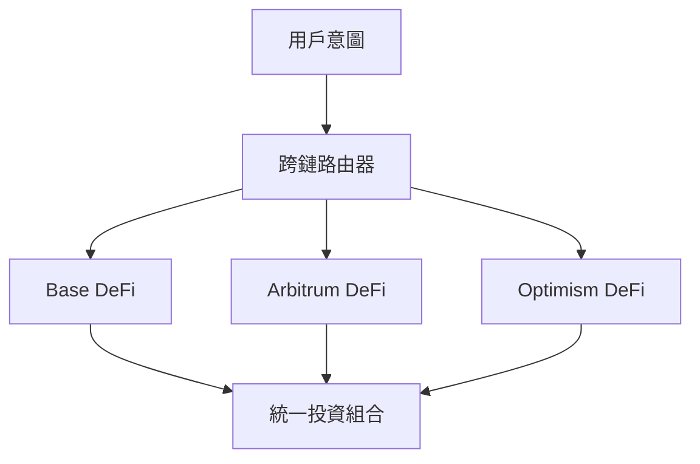

# 跨鏈操作

**Base、Arbitrum 和 Optimism 之間的無縫 DeFi** 🌐

Zap Pilot 的跨鏈功能讓您無需管理不同的錢包、代幣或橋接，即可在我們支援的 Layer
2 網路中存取最佳的 DeFi 機會。

## 🔗 多鏈架構

### 原生跨鏈設計

與其他將跨鏈視為事後諸葛的平台不同，Zap Pilot 從頭開始構建，以在我們支援的 Layer 2 網路中原生運作。

#### **統一流動性池**

您的投資會自動分散到我們支援的網路中，以尋找最佳機會，同時呈現為一個單一、統一的投資組合。

#### **智能鏈選擇**

我們的系統會根據以下因素自動為每個操作選擇最佳區塊鏈：

- **收益機會**：符合您風險概況的最高年化收益率
- **流動性深度**：足以滿足您交易規模的流動性
- **Gas 成本**：最低的總執行成本
- **安全等級**：適合交易價值的適當安全性
- **速度要求**：對時間敏感的操作進行最快執行

## 🌐 支援的網路

Zap Pilot 僅在三個精心選擇的 Layer 2 網路中運作，這些網路提供最佳的安全性、成本效益和 DeFi 機會：

### **Base** - Coinbase 的 L2 網路

- **優勢**：Coinbase 支持、對機構友好、不斷發展的生態系統
- **用例**：傳統金融橋接、受監管策略、新興 DeFi
- **主要協議**：Aerodrome、Moonwell、BaseSwap、Compound
- **優點**：監管清晰、機構信任、低費用
- **安全性**：繼承以太坊安全性、Coinbase 基礎設施

### **Arbitrum** - 以太坊領先的 L2

- **優勢**：完全 EVM 相容、最大的 L2 生態系統、經過驗證的記錄
- **用例**：高級 DeFi 策略、槓桿頭寸、已建立的協議
- **主要協議**：GMX、Camelot、Radiant、Uniswap V3、Aave
- **優點**：費用比以太坊低 95%、快速最終性、成熟的生態系統
- **安全性**：帶有欺詐證明的樂觀 Rollup、以太坊安全性

### **Optimism** - OP Stack 創新中心

- **優勢**：以太坊相容性、強大的開發者工具、治理創新
- **用例**：實驗性策略、OP 生態系統參與、治理代幣
- **主要協議**：Velodrome、Synthetix、Kwenta、Uniswap V3
- **優點**：不斷發展的生態系統、強大的治理、對開發者友好
- **安全性**：帶有故障證明的樂觀 Rollup、以太坊最終性

## ⚡ 跨鏈執行引擎

### 智能路由

#### **多路徑優化**

當您投資 10,000 美元於指數基金策略時，我們的系統可能會：

1. 在 Arbitrum 上**部署 4,000 美元**，用於已建立的 DeFi 協議和槓桿頭寸
2. 在 Base 上**部署 3,500 美元**，用於新興機會和機構級協議
3. 在 Optimism 上**部署 2,500 美元**，用於治理代幣和實驗性策略
4. **保留 1,000 美元**流動性，用於跨網路再平衡

#### **即時優化**

路由引擎考慮：

- **Gas 價格差異**：在 Gas 最便宜時執行
- **收益率變化**：轉移到有更好機會的鏈
- **流動性條件**：避免流動性不足的鏈
- **網路擁塞**：繞過擁塞的網路
- **橋接可用性**：確保可靠的跨鏈傳輸

### 橋接整合

#### **Across Protocol - 我們的獨家橋接合作夥伴**

我們獨家使用 Across Protocol 進行所有跨鏈操作，提供最佳的安全性、速度和成本效益：

| 橋接功能     | Across Protocol 優勢                      |
| ------------ | ----------------------------------------- |
| **支援路線** | Base、Arbitrum 和 Optimism 之間的無縫傳輸 |
| **安全模型** | 帶有經濟保證的樂觀驗證                    |
| **速度**     | 平均完成時間 1-4 分鐘                     |
| **成本**     | 主要橋接提供商中費用最低                  |
| **可靠性**   | 經過驗證的記錄，停機時間最短              |

#### **為何選擇 Across Protocol**

- **樂觀安全性**：使用樂觀驗證和經濟激勵來鼓勵誠實行為
- **資本效率**：最小的流動性要求降低成本
- **快速結算**：UMA 預言機系統的快速最終性
- **經過驗證的可靠性**：經過實戰考驗的基礎設施，具有強大的安全記錄
- **成本效益**：具有競爭力的費用，針對頻繁再平衡進行優化

### 故障處理

#### **強大的錯誤恢復**

跨鏈操作可能在多個點失敗。我們的系統處理：

**橋接故障：**

- **檢測**：即時監控橋接狀態
- **回退**：自動重試並使用替代橋接
- **恢復**：手動干預卡住的交易
- **通知**：向用戶發出警報並提供明確的後續步驟

**目標鏈問題：**

- **Gas 估計**：預測和處理 Gas 故障
- **滑點保護**：根據波動條件調整
- **超時處理**：自動重試並調整參數
- **緊急恢復**：手動交易救援程序

## 🎯 跨鏈策略優勢

### 收益優化

#### **網路特定機會**

我們支援的每個網路在不同領域表現出色：

**Base**：

- Coinbase 生態系統優勢和機構信任
- 監管友好的協議和合規性
- 不斷增長的機構 DeFi 採用
- 傳統金融整合機會
- 新興高品質協議

**Arbitrum**：

- 成熟的 DeFi 生態系統，具有經過驗證的協議
- 先進的交易基礎設施 (GMX, Camelot)
- 已建立的流動性池和收益機會
- 費用比以太坊低，安全性相同
- 精密的槓桿策略

**Optimism**：

- 新 DeFi 實驗的創新中心
- 強大的治理代幣生態系統
- 對開發者友好的環境
- 不斷增長的機構採用
- 獨特的協議機會 (Velodrome, Synthetix)

#### **收益套利**

我們的系統持續識別和捕捉套利機會：

- **協議費率差異**：相同協議，不同鏈
- **代幣價格差異**：橋接溢價/折價套利
- **激勵挖礦**：鏈特定流動性激勵
- **Gas 效率**：在成本效益最高的地方執行

### 風險多元化

#### **技術風險分佈**

跨鏈分散可降低：

- **單鏈風險**：不依賴單一鏈的正常運行時間
- **橋接風險**：多個橋接提供商降低交易對手風險
- **共識風險**：不同的共識機制
- **治理風險**：不受單一鏈的治理決策影響

#### **監管風險緩解**

- **管轄權多元化**：跨不同監管環境的協議
- **合規選擇性**：隨著法規演變轉移到合規鏈
- **抗審查性**：多鏈降低審查風險
- **營運連續性**：即使一條鏈出現問題也能繼續營運

## 🔄 跨鏈再平衡

### 智能再平衡

#### **跨鏈投資組合管理**

再平衡策略時，我們考慮：

- **當前配置**：資產目前所在位置
- **目標配置**：跨鏈的最佳分佈
- **再平衡成本**：橋接費用與優化效益
- **市場條件**：哪些鏈提供最佳機會

#### **範例：指數基金再平衡**

**當前狀態：**

- Arbitrum：投資組合的 50%
- Base：投資組合的 30%
- Optimism：投資組合的 20%

**市場變化：** Base 上出現新的高收益機會 **行動：** 在 2 天內使用 Across
Protocol 逐步將 15% 從 Arbitrum 轉移到 Base **考量：** 平衡橋接成本與收益效益，並維持多元化

### 成本優化

#### **再平衡效率**

- **批次操作**：合併多個再平衡操作
- **Gas 時機**：在最佳 Gas 價格窗口執行
- **路徑優化**：最小化所需的橋接數量
- **閾值管理**：僅在效益超過成本時才再平衡

#### **用戶成本節省**

與手動跨鏈管理相比：

- **Gas 成本降低 80%**：透過批次處理和優化
- **複雜性降低 90%**：自動化橋接選擇和執行
- **時間節省 100%**：設定後即可忘記的跨鏈操作
- **更高收益**：存取您可能錯過的機會

## 📊 跨鏈分析

### 統一投資組合視圖

#### **鏈無關報告**

您的儀表板顯示：

- **總投資組合價值**：所有鏈上的美元價值
- **鏈配置**：每個鏈上的價值
- **績效歸因**：哪些鏈對回報有貢獻
- **風險曝險**：集中度和多元化指標

#### **跨鏈績效追蹤**

- **收益比較**：每個鏈上賺取的年化收益率
- **成本分析**：按鏈劃分的橋接和 Gas 成本
- **效率指標**：每支付一美元費用獲得的回報
- **機會成本**：您可能在其他鏈上錯過了什麼

### 橋接成本追蹤

#### **完全成本透明度**

追蹤所有跨鏈成本：

- **橋接費用**：橋接協議收取的明確費用
- **Gas 成本**：橋接交易的 L1 和 L2 Gas 費用
- **滑點**：橋接操作的價格影響
- **機會成本**：橋接期間的時間價值

#### **投資回報分析**

對於每個跨鏈操作：

- **成本合理性**：為何此舉有利可圖
- **回本時間**：收回橋接成本所需的時間
- **替代分析**：如果沒有此舉會發生什麼
- **優化分數**：路由表現如何

## 🛡️ 跨鏈安全

### 安全模型

#### **多層安全**

- **橋接安全**：僅使用經過審計、經過驗證的橋接
- **鏈安全**：優先選擇更安全的鏈以處理較大金額
- **多元化**：將風險分散到多個鏈和橋接
- **監控**：所有鏈上的即時安全監控

#### **橋接風險管理**

- **橋接限制**：每個橋接提供商的最大曝險
- **安全評分**：橋接健康的即時評估
- **事件響應**：對橋接安全事件立即採取行動
- **保險覆蓋**：針對橋接故障提供保護（如果可用）

### 緊急程序

#### **跨鏈緊急響應**

如果發生安全問題：

1. **立即暫停**：停止所有跨鏈操作
2. **資產評估**：識別安全與有風險的頭寸
3. **緊急退出**：快速提款到安全鏈
4. **用戶溝通**：清晰地更新情況和行動
5. **恢復規劃**：系統性恢復和恢復

---

跨鏈操作是 Zap
Pilot 真正強大的地方——在為用戶保持簡單的同時，存取整個 DeFi 宇宙。您無需單獨管理所有鏈，即可獲得所有鏈的好處。

👉 **[了解自動再平衡 →](./automated-rebalancing)** 👉 **[探索策略執行 →](./intent-execution)** 👉
**[查看支援的網路 →](../security)**
