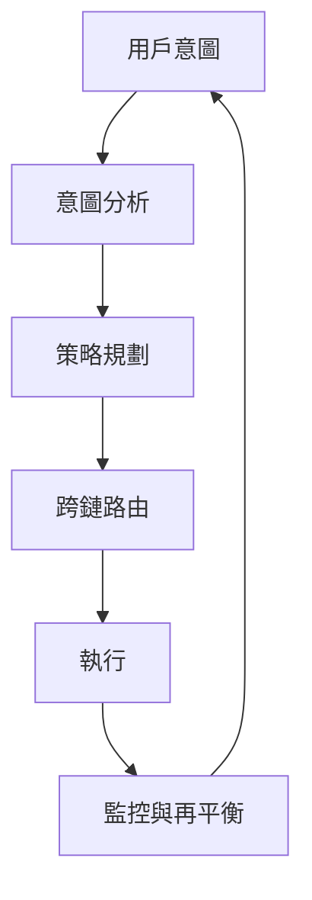

# Zap Pilot 如何運作

Zap Pilot 透過我們的意圖型執行引擎，將複雜的 DeFi 操作轉化為簡單的一鍵式體驗。以下是魔法發生的方式：

## 🧠 意圖型執行

### 什麼是意圖？

您無需指定**如何**執行交易，只需告訴我們您想**達成什麼**：

```
意圖：「投資 500 美元於保守的穩定幣策略」

傳統 DeFi：跨 3 條鏈的 12+ 筆交易
Zap Pilot：1 次點擊，完全自動化
```

### 意圖生命週期



## ⚡ 3 步驟流程

### 1. **表達您的意圖**

- 選擇投資金額
- 選擇策略類型
- 設定風險偏好
- 定義時間範圍

### 2. **AI 驅動的規劃**

- 分析當前市場狀況
- 識別最佳協議和鏈
- 計算最佳執行路徑
- 規劃 Gas 效率高的交易

### 3. **自動化執行**

- 同時在多條鏈上執行
- 優化以獲得最低費用和最佳費率
- 即時監控
- 根據需要自動再平衡

## 🔗 跨鏈智能

### 原生多鏈支援

Zap Pilot 不僅僅是橋接資產 — 我們原生理解並在多條鏈上運作，包括領先的 Layer 2、以太坊和 Solana。

### 智能路由

我們的路由引擎考慮：

- 所有鏈上的 **Gas 成本**
- 不同資金池中的 **流動性深度**
- 每個網路上的 **收益機會**
- **橋接安全性** 和速度
- **當前網路擁塞**

## 🎯 策略執行

### 自動化投資組合管理

一旦您的策略上線，Zap Pilot 會持續：

#### **監控績效**

- 追蹤所有頭寸的收益
- 即時監控風險指標
- 觀察策略漂移

#### **優化配置**

- 當目標漂移超過 5% 時再平衡
- 將資產轉移到更高收益的機會

#### **管理風險**

- 自動跨協議多元化

### 智能再平衡

我們基於凱利準則的分配系統：

- 計算最佳頭寸規模
- 考慮資產之間的相關性
- 最大程度地降低交易成本
- 最大化風險調整後的回報

## 🛡️ 帳戶抽象整合

### 使用帳戶抽象的無 Gas 體驗

透過 ThirdWeb 的智能錢包基礎設施：

- 透過付費主為符合條件的交易提供 **Gas 贊助**
- 使用社交錢包選項**簡化用戶註冊**
- **批次操作**以減少交易數量
- **多鏈支援**提供統一體驗

### 增強安全性

- 為機構用戶提供**多重簽名支援**
- **社交恢復** 選項
- **支出限制** 和控制
- 為自動化策略提供**會話金鑰**

## 📊 即時智能

### 市場分析

- 24/7 **收益監控** 跨 100 多個協議
- DeFi 協議的 **風險評估**
- **流動性分析** 以實現最佳執行

### 投資組合分析

- **績效歸因** - 了解是什麼推動了回報 (即將推出)
- **風險分解** - 了解您的曝險
- **情境分析** - 對您的投資組合進行壓力測試
- **稅務優化** - 最大程度地減少應稅事件

## 🔄 持續優化

### 動態策略調整

您的策略會隨著市場條件而演變：

#### **市場機制檢測**

- 牛市：增加風險曝險
- 熊市：保值
- 盤整：專注於收益生成

#### **協議健康監控**

- 追蹤 TVL 變化
- 監控治理風險
- 觀察漏洞警告
- 需要時自動風險關閉

## 🏗️ 基礎設施

### 為規模而建

- **模組化架構** 以實現快速協議整合
- **事件驅動系統** 以實現即時響應
- **冗餘執行** 以防止交易失敗
- **高可用性**，99.9% 正常運行時間 SLA

### 整合合作夥伴

- **20+ DEX 聚合器** 以獲得最佳兌換率
- **50+ 收益協議** 以獲得多樣化機會
- **10+ 橋接提供商** 以實現可靠的跨鏈
- **5+ 保險提供商** 以實現風險覆蓋

---

準備好親身體驗了嗎？

👉 **[開始使用 →](../getting-started)** 👉 **[查看策略 →](../strategies)**
