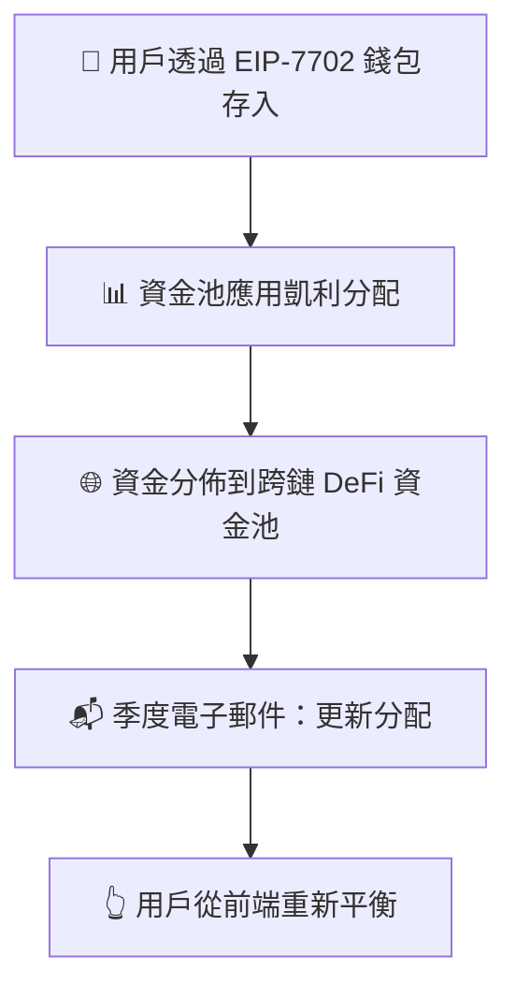

# 🚀 Zap Pilot 運作方式

## 🧠 協議機制

Zap Pilot 是一個**非託管、算法投資組合自動駕駛系統** ✨  
您透過自己的**智能 EOA 錢包**（由 EIP-7702 提供）完全控制資金。  
我們幫助您**優化**、**重新平衡**和**路由資金**，只需一鍵 —  
無託管。無鎖定。只有策略建議和執行。

### 關鍵原則

- **完全用戶控制**：您的錢包，您的金鑰
- **高級分配**：數學優化策略
- **透明執行**：一鍵優化

---

## 1️⃣ 用戶存入

👜 您直接從**智能 EOA 錢包**（由 EIP-7702 提供）存入。  
💡 資金進入**策略資金池** — 跨鏈精心挑選的 DeFi 機會組合。

**另請參閱：** [入門指南](../getting-started)

---

## 2️⃣ 資金池策略

每個資金池代表特定的投資策略，例如：

- 💵 **穩定幣收益耕作**
- 🔗 **流動性質押**
- 🌉 **跨鏈收益追蹤**

您的資金分佈在資金池內，  
**根據表現和風險動態調整權重**。 📊

**了解更多：** [投資策略概述](../strategies)

---

## 3️⃣ 📐 凱利分配策略

### 什麼是凱利準則？

凱利準則是一種數學公式，用於確定一系列投注的最佳規模。在我們的背景下，它幫助我們在不同 DeFi 協議中分配資金，以在管理風險的同時最大化長期增長。

#### 簡化公式：

`分配 ∝ 預期回報 / 方差`

🧮 主要優勢：

- 📈 對低波動、高回報的資金池分配更高權重
- 🛡️ 降低對任何單一協議的過度暴露風險
- 🔄 每季重新計算以反映市場變化

**詳細解釋：** [凱利準則深入解析](../strategies/kelly-criterion)

---

## 4️⃣ ♻️ 重新平衡（用戶驅動）

由於您的資產**永遠不會離開您的錢包**，  
我們無法自動重新平衡 — 但我們讓它**非常簡單**：

- 📬 **季度**：個性化重新平衡建議
- 👆 **一鍵重新平衡**：從您的錢包執行策略更新

**為什麼是用戶驅動？** 我們優先考慮您的控制和透明度。

---

## 5️⃣ 🗺️ 資產流動概覽

---

## 🔒 安全與透明度

- **非託管**：您的資金始終保留在您的錢包中
- **鏈上執行**：所有交易都是透明的
- **用戶控制**：您批准每一步移動

**安全詳情：** [安全事件與透明度](../security)

Zap、重新平衡、優化 — 不到 30 秒。您的加密貨幣，您的金鑰，我們的策略。

👉 **[開始使用 →](https://app.zap-pilot.org/)**

### 相關資源

- [入門指南](../getting-started)
- [投資策略](../strategies)
- [凱利準則解釋](../strategies/kelly-criterion) EOF < /dev/null
