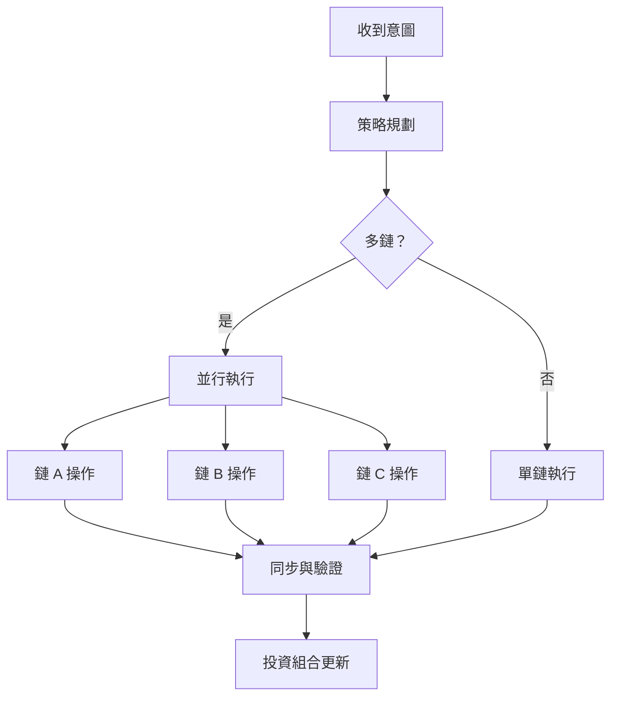

# 意圖執行引擎

Zap Pilot 的核心是我們的意圖執行引擎——一個複雜的系統，將用戶意圖轉化為跨多個區塊鏈的最佳 DeFi 操作。

## 🎯 理解意圖

### 什麼構成意圖？

意圖是您想要實現的目標的高層次表達，而不是如何實現它：

#### **傳統 DeFi 方法：**

```
1. 將 USDC 從以太坊橋接到 Arbitrum
2. 在 Uniswap V3 上將 50% 的 USDC 兌換為 ETH
3. 將 USDC/ETH 流動性添加到池中
4. 在 Convex 中質押 LP 代幣
5. 領取獎勵並複利
```

#### **基於意圖的方法：**

```
「我想要投資 1000 美元於 ETH/穩定幣收益農場
並具有中等風險承受能力」
```

### 意圖組件

每個意圖都包含：

- **目標**：您想要實現的目標
- **約束**：風險限制、時間偏好
- **偏好**：鏈偏好、Gas 容忍度
- **上下文**：當前投資組合、市場狀況

## ⚙️ 執行管道

### 1. 意圖解析與驗證

```typescript
interface UserIntent {
  objective: 'invest' | 'withdraw' | 'rebalance';
  amount: string;
  strategy: 'stablecoin' | 'index' | 'btc' | 'eth' | 'custom';
  riskTolerance: 'low' | 'medium' | 'high';
  timeHorizon: 'short' | 'medium' | 'long';
  constraints: {
    maxSlippage: number;
    gasLimit: string;
    chainPreferences: string[];
  };
}
```

### 2. 策略解析

我們的 AI 引擎根據以下內容分析您的意圖：

- **當前市場狀況**
- **可用收益機會**
- **您現有的投資組合**
- **風險回報優化**

### 3. 執行規劃

規劃器創建最佳執行序列：

#### **路徑尋找**

- 識別所有可能的執行路徑
- 計算每個路徑的成本和風險
- 選擇最佳路徑，考慮：
  - 總 Gas 成本
  - 價格影響
  - 執行時間
  - 失敗機率

#### **交易排序**

- 將複雜操作分解為原子步驟
- 規劃每個步驟的故障恢復
- 在可能的情況下優化並行執行

### 4. 跨鏈協調

同時在多條鏈上執行操作：



## 🧠 AI 驅動的優化

### 市場情報

我們的系統不斷從以下方面學習：

- 所有協議的**歷史收益數據**
- 不同鏈上的 **Gas 價格模式**
- 隨時間變化的**流動性深度**
- **協議風險事件**和響應

### 自適應策略

策略根據以下因素演變：

- **市場機制變化** (牛市/熊市/盤整)
- **您的行為模式**和偏好
- 過去執行的**績效回饋**
- **新協議機會**

## 🔄 持續監控

### 即時投資組合追蹤

執行後，我們監控：

- 所有協議的**頭寸績效**
- **風險指標變化** (相關性、波動性)
- **收益優化** 機會
- **再平衡觸發** 條件

### 主動管理

自動操作包括：

- **獎勵領取**和自動複利
- 當配置漂移超過 5% 時**再平衡**
- 在市場壓力期間**風險關閉**
- **收益優化**切換到更好的費率

### 警報系統

收到以下通知：

- 頭寸的**顯著收益/損失**
- 符合您個人資料的**新收益機會**
- 您正在使用的協議的**風險警告**
- **再平衡**操作完成

## 🛠️ 高級功能

### 自訂意圖腳本

高級用戶可以創建自訂意圖：

```javascript
// 範例：平均成本法意圖
const dcaIntent = {
  objective: 'recurring_invest',
  amount: '500',
  frequency: 'weekly',
  strategy: 'index',
  duration: '12_months',
  conditions: {
    pauseIf: 'portfolio_loss > 20%',
    increaseIf: 'btc_price < 40000',
  },
};
```

### 批次意圖處理

一次提交多個意圖：

- 跨策略的**投資組合再平衡**
- 用於多元化的**多策略配置**
- 用於平均成本法和再平衡的**預定操作**

### 意圖模板

常見策略的預建模板：

- **指數基金**：市值加權策略，類似 S&P-500 的策略
- **保守收入**：穩定幣收益重點
- **激進增長**：高風險、高回報策略
- **市場中性**：Delta 中性策略

---

意圖執行引擎是 Zap Pilot 的神奇之處——它將複雜性轉化為簡單性，同時保持 DeFi 的強大功能和靈活性。

👉 **[了解跨鏈操作 →](./cross-chain-operations)** 👉 **[探索自動再平衡 →](./rebalancing)**
