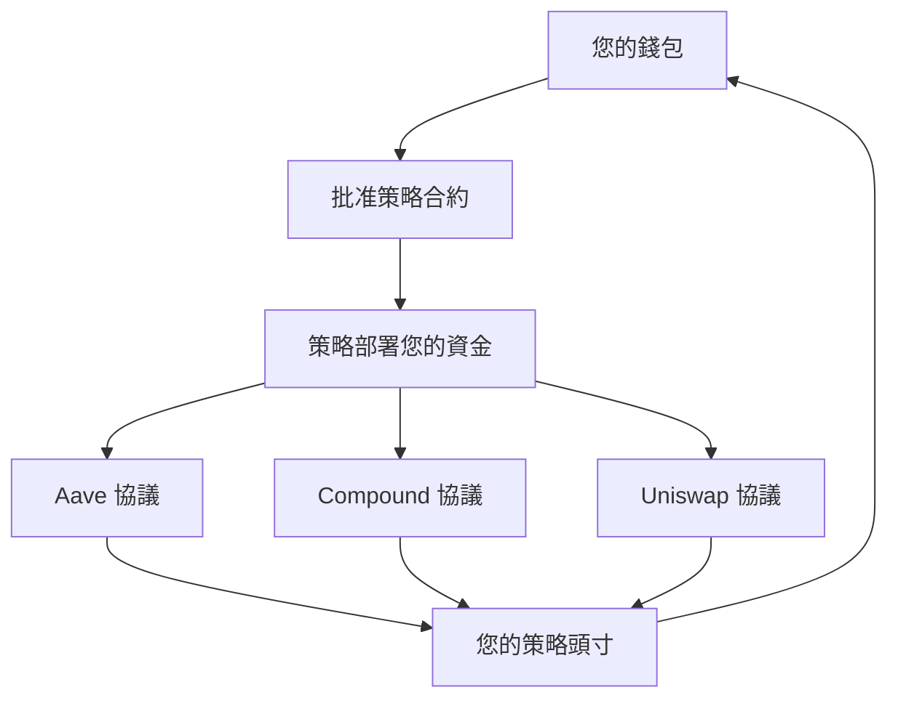

# 安全與保障概述

**您的資金，您的掌控——始終如一** 🛡️

安全是我們在 Zap
Pilot 所做一切的基礎。了解我們如何保護您的投資，同時維護 DeFi 的核心原則：去中心化、透明度和用戶控制。

## 🔐 非託管設計

### 您掌控您的資金

**最重要**：Zap Pilot 絕不託管您的資金。這意味著：

#### **您的私鑰 = 您的掌控**

- 🔑 **您的錢包，您的金鑰** - 我們從不查看或儲存您的私鑰
- 🏦 **無中心託管** - 資金從不存放在 Zap Pilot 帳戶中
- 🚫 **我們無法凍結** 或沒收您的資產
- ✅ **您可以隨時退出** - 直接從協議中提款

#### **非託管如何運作**

您的資金直接從您的錢包流向 DeFi 協議，Zap Pilot 僅提供智能路由和管理。

### 智能合約架構

#### **不可變策略合約**

- 📋 **每個用戶一個合約** - 您的策略是獨立的
- 🔒 **僅由您升級** - 未經許可，我們無法更改您的策略
- 🚪 **緊急退出功能** - 即使我們的介面關閉，也始終可存取
- 🔍 **開源且經過審計** - 所有程式碼均可公開驗證

#### **權限結構**

Zap Pilot 可以做什麼：

- ✅ 根據您的策略執行再平衡
- ✅ 自動複利獎勵
- ✅ 提供分析和報告

Zap Pilot 不能做什麼：

- ❌ 將資金提取到我們的帳戶
- ❌ 未經批准更改您的策略
- ❌ 阻止您退出
- ❌ 如果您丟失錢包，則無法存取資金

## 🏗️ 多層安全架構

### 1. 智能合約安全

#### **專業審計**

- 🔬 **多個審計公司**：Trail of Bits、ConsenSys Diligence、Quantstamp
- 📊 **持續審計**：每次重大更新都會審查
- 🏆 **錯誤賞金計畫**：50 萬美元賞金用於發現漏洞
- 📈 **實戰測試**：在主網上線前在測試網上部署數月

#### **形式化驗證**

- 🧮 **關鍵功能的數學證明**
- 🔒 **不變式檢查** - 某些條件始終保持
- 🎯 **屬性測試** - 廣泛的自動化測試
- 📝 **文件**：每個功能都經過徹底的文件化

#### **安全功能**

- ⏱️ 管理功能的**時間鎖**
- 🛑 **緊急暫停**機制
- 🔄 所有外部呼叫的**重入保護**
- 💰 **頭寸限制**以防止過度集中

### 2. 協議風險管理

#### **協議選擇標準**

我們只整合符合嚴格標準的協議：

**最低要求：**

- ✅ **主網上線 6 個月以上**
- ✅ **持續超過 1 億美元的 TVL**
- ✅ **信譽良好的公司進行安全審計**
- ✅ **積極維護錯誤賞金計畫**
- ✅ **治理透明度**和去中心化

**持續監控：**

- 📊 **TVL 追蹤** - 如果有大量資金流出則發出警報
- 🔍 **程式碼變更**監控安全隱患
- 🏛️ **治理**監控有害提案
- 📰 **社群情緒**和專家意見

#### **風險評分系統**

每個協議都會獲得一個風險評分 (1-100)：

- **90-100**：經過實戰考驗的協議 (Aave、Compound)
- **80-89**：具有良好記錄的已建立協議
- **70-79**：具有強大安全實踐的新協議
- **低於 70**：不符合納入資格

### 3. 保險範圍

#### **協議保險**

- 🏛️ **Nexus Mutual**：主要協議的智能合約保險
- 🛡️ **InsurAce**：額外的保險層
- 🔒 **Unslashed**：削減和技術風險保險
- 💰 **保險金額**：每個協議每個用戶最高 100 萬美元

#### **保險如何運作**

1. **風險評估**：保險公司評估協議安全性
2. **購買保險**：我們為用戶資金購買保險
3. **索賠流程**：如果發生駭客攻擊，自動提交索賠
4. **賠付**：用戶獲得承保損失的賠償

#### **承保範圍**

- ✅ 承保協議中的**智能合約漏洞**
- ✅ **預言機操縱**攻擊
- ✅ 導致資金流失的**治理攻擊**
- ✅ 導致資金損失的**技術故障**

#### **不承保範圍**

- ❌ **市場價格波動**（不是保險，是投資）
- ❌ **用戶錯誤**（發送到錯誤地址等）
- ❌ **未承保協議**（我們明確標示承保狀態）
- ❌ 影響協議運作的**監管變更**

## 🚨 風險監控與響應

### 即時監控

#### **24/7 監控**

- 🖥️ **自動監控**所有整合協議
- 👥 我們安全團隊的**人工監督**
- 🚨 異常活動的**警報系統**
- 📱 緊急情況的**行動警報**

#### **監控的關鍵指標**

- 💧 所有協議中的**流動性水平**
- 📊 **TVL 變化**和大量資金流出
- 🔄 **智能合約互動**的異常模式
- 📈 **預言機價格**的操縱嘗試
- 🏛️ 可能影響安全的**治理提案**

### 緊急響應

#### **事件響應計畫**

1. **檢測**（自動警報 + 人工監控）
2. **評估**（確定嚴重性和範圍）
3. **行動**（自動或手動響應）
4. **溝通**（立即通知用戶）
5. **恢復**（安全恢復正常運作）

#### **自動保護**

- 🛑 **斷路器**在檢測到異常時停止運作
- 🏃 從受損協議**自動退出**
- 🔒 **頭寸凍結**以防止進一步損害
- 💰 **資金保全**在最安全的可用協議中

#### **手動干預**

- 🎯 緊急決策的**緊急治理**
- 📞 主要問題的**直接用戶聯繫**
- 🔧 避免風險的**策略調整**
- 💼 適用時立即提交**保險索賠**

## 🔍 透明度與可審計性

### 開源承諾

#### **公開程式碼**

- 📂 **GitHub 儲存庫**，包含所有合約程式碼
- 📝 每個功能和特性的**文件**
- 🔄 **版本控制**顯示所有隨時間的變更
- 👥 歡迎並獎勵**社群貢獻**

#### **即時數據**

- 🌐 所有操作的**鏈上驗證**
- 📊 顯示系統健康的**公開儀表板**
- 💰 任何人都可以查看的**協議頭寸**
- 📈 即時更新的**績效數據**

### 審計追蹤

#### **完整的交易歷史**

- 🔗 每個操作的**區塊鏈記錄**
- 📋 帶有時間戳和原因的**策略變更**
- 💸 顯示所有費用的**費用計算**
- 🔄 具有充分理由的**再平衡邏輯**

#### **治理透明度**

- 🗳️ **所有提案**在實施前公開可見
- 📊 顯示社群決策的**投票記錄**
- ⏱️ 提前通知用戶變更的**時間鎖**
- 🔄 顯示確切變更的**實施日誌**

## 🛡️ 用戶安全最佳實踐

### 錢包安全

#### **基本實踐**

- 🔐 大額資金使用**硬體錢包** (Ledger、Trezor)
- 📝 在多個安全位置**備份助記詞**
- 🔒 **強密碼**和盡可能使用 2FA
- 🚫 **切勿分享**私鑰或助記詞

#### **網路釣魚防護**

- 🌐 **將我們的官方網站加入書籤** (zap-pilot.com)
- 🔍 連接錢包前**驗證 URL**
- 📧 **檢查電子郵件地址** - 我們只從 @zap-pilot.com 發送電子郵件
- 🚫 **切勿在任何網站上輸入助記詞**

### 交易安全

#### **每次交易前**

- ✅ **驗證合約地址**與我們的官方文件匹配
- 💰 **仔細檢查金額**和小數點
- ⛽ **審查 Gas 費** - 如果異常高則拒絕
- 🌐 **確認網路**與您的意圖匹配

#### **需要注意的危險信號**

- 🚨 我們的介面發出的**意外交易請求**
- 💸 **異常高的 Gas 費**（可能表示複雜攻擊）
- 🔗 與您的策略無關的**未知代幣批准**
- 📧 要求立即採取行動的**緊急訊息**

## 📞 安全支援

### 報告安全問題

#### **錯誤賞金計畫**

- 💰 針對關鍵漏洞**最高 500,000 美元**
- 🔒 **負責任的披露**流程
- 🏆 安全研究人員的**名人堂**
- 📧 **security@zap-pilot.com** 用於私人報告

#### **緊急聯絡**

- 🚨 **關鍵問題**：security@zap-pilot.com
- 📞 **24/7 熱線**：適用於活躍頭寸的用戶
- 💬 **Discord #security**：用於一般安全問題
- 📱 **行動警報**：緊急事項的推播通知

### 安全教育

#### **資源**

- 📚 DeFi 初學者的**安全指南**
- 🎥 錢包安全的**影片教學**
- 📰 關於最新威脅和保護的**部落格文章**
- 🎓 與安全專家進行的**網路研討會**

---

安全不僅僅是技術——它是透過透明度建立信任、賦予用戶控制權，並在我們所做的一切中保持最高標準。

您的資金永遠是您的。我們只是在這裡幫助它們更智能地運作。
